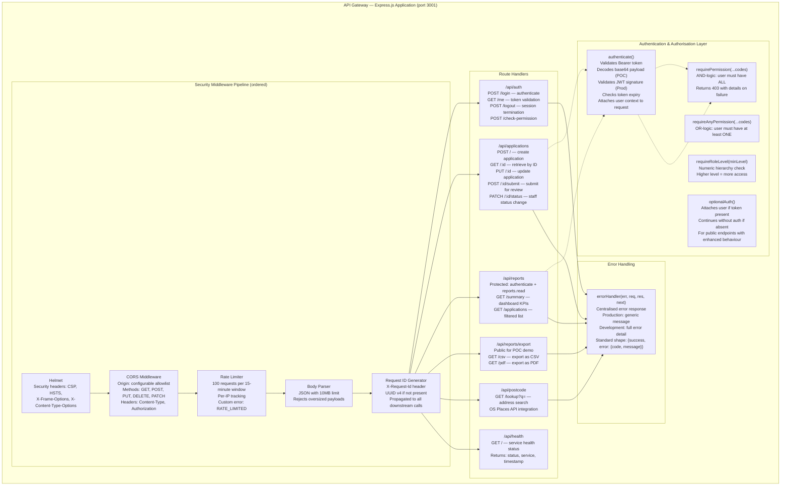
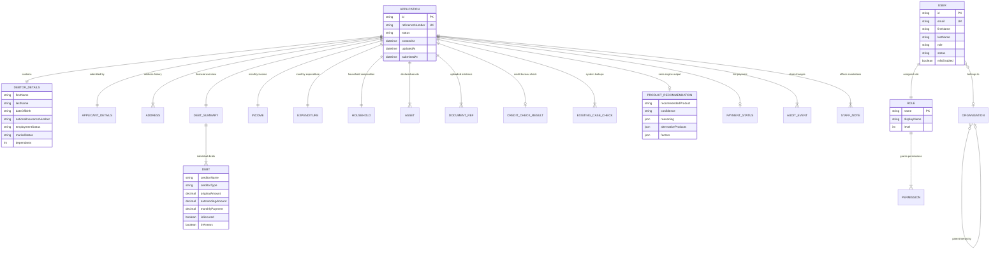
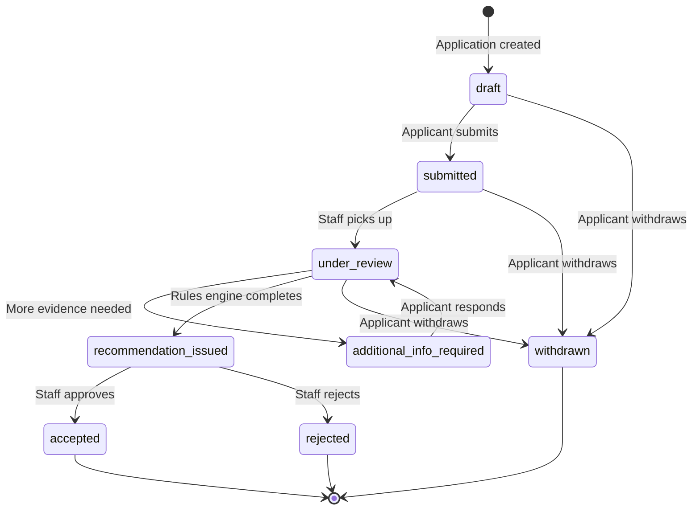
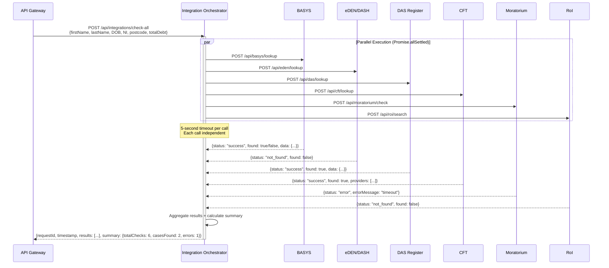
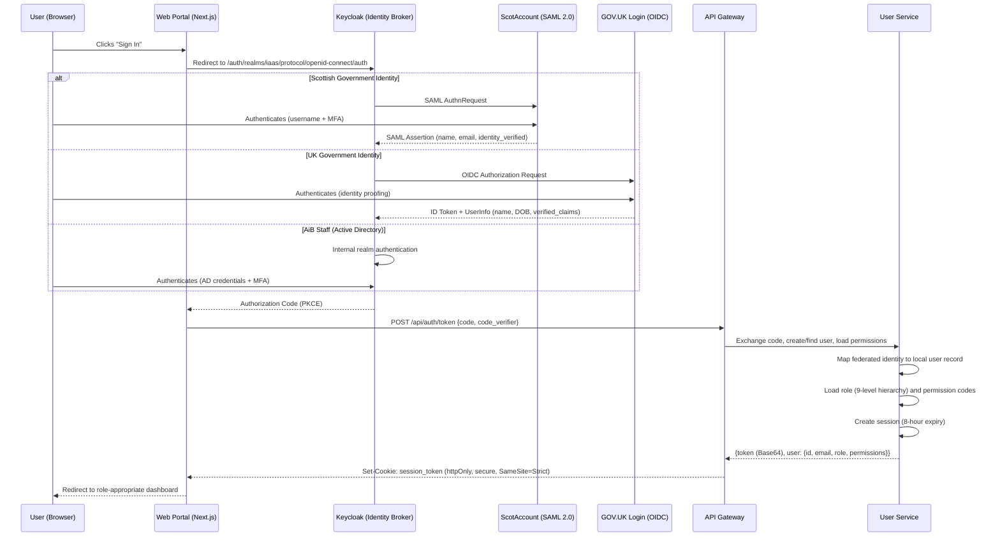
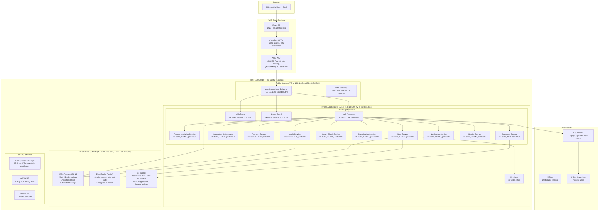
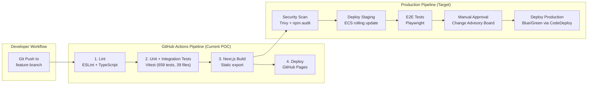

# AiB IAAS — Solution Architecture Document

**Document Version:** 2.0  
**Classification:** OFFICIAL  
**Author:** Solution Architecture Team  
**Last Updated:** August 2026  
**Status:** Approved for POC  
**Audience:** Technical stakeholders, delivery leads, security assurance  

---

## 1. Architecture Overview

### 1.1 Purpose

The Initial Application Advice Service (IAAS) is the Accountant in Bankruptcy's unified digital gateway for debt solution applications in Scotland. It replaces the existing product-centric silos with a single user-centric entry point. Citizens, money advisers, and creditors interact with one portal that assesses financial circumstances, runs cross-system background checks, calculates rules-based product recommendations with confidence scoring, and manages the full application lifecycle from draft through to submission and decision.

### 1.2 Architecture Principles

| # | Principle | Rationale |
|---|-----------|-----------|
| 1 | **Cloud-Native** | Containerised, stateless services deployable to any cloud provider; designed for horizontal scaling and infrastructure-as-code provisioning via Terraform |
| 2 | **API-First** | All capabilities exposed as versioned REST APIs; enables future channel expansion (mobile, third-party integrations, open banking) |
| 3 | **Microservices** | Bounded contexts decomposed into 12 independently deployable services; enables team autonomy, technology flexibility, and targeted scaling |
| 4 | **Event-Driven** | Audit events, notifications, and integration results flow asynchronously; reduces coupling and enables eventual consistency where appropriate |
| 5 | **12-Factor App** | Configuration via environment variables, stateless processes, disposable containers, declarative dependencies, strict dev/prod parity |
| 6 | **Defence in Depth** | Security at every layer — network, transport, application, data — with zero-trust principles and principle of least privilege |
| 7 | **Progressive Enhancement** | Core journeys accessible without JavaScript; enhanced experience with client-side rendering; GOV.UK Design System compliance |
| 8 | **Data Sovereignty** | All citizen data processed and stored within UK jurisdiction (AWS eu-west-2 London); no cross-border data flows |
| 9 | **Auditable** | Every state change and data access logged immutably with actor, timestamp, action, and context |
| 10 | **Integration-Ready** | Clear contracts per external system; mock-to-production migration path documented for all integrations |

### 1.3 Architecture Style

IAAS adopts a **Backend-for-Frontend (BFF) microservices** architecture. The API Gateway serves as the BFF layer, aggregating responses from domain-specific microservices and presenting a unified API surface to the frontend applications. This pattern provides:

- Optimised data payloads per frontend requirement
- Centralised authentication and authorisation enforcement
- Rate limiting and circuit-breaking at the edge
- Request correlation and distributed tracing via `X-Request-Id`
- Decoupling of frontend evolution from backend service decomposition

---

## 2. C4 Model — Context Diagram

The system context diagram shows IAAS in relation to its users and external systems.

```mermaid
C4Context
    title IAAS System Context Diagram

    Person(citizen, "Citizens / Debtors", "Individuals seeking debt advice and applying for statutory solutions")
    Person(adviser, "Money Advisers", "Approved professionals assisting debtors with applications")
    Person(staff, "AiB Staff", "Officers reviewing, processing, and approving applications")
    Person(creditor, "Creditors / Trustees", "Organisations owed money, receiving notifications and dividend information")

    System(iaas, "IAAS Platform", "Unified applications gateway for Scottish statutory debt solutions")

    System_Ext(basys, "BASYS", "Bankruptcy Administration System — sequestration case records")
    System_Ext(astra, "ASTRA", "AiB internal case management and workflow system")
    System_Ext(eden, "eDEN / DASH", "DAS electronic system and payment distribution hub")
    System_Ext(das, "DAS Register", "Debt Arrangement Scheme programme records")
    System_Ext(cft, "CFT", "Creditor, Trustee and Provider registry")
    System_Ext(roi, "RoI", "Register of Insolvencies — public register of all Scottish insolvency cases")
    System_Ext(moratorium, "Moratorium Register", "Breathing space registrations — 6-week protection from diligence")

    System_Ext(scotaccount, "ScotAccount", "Scottish Government single sign-on identity provider (SAML 2.0)")
    System_Ext(govuk, "GOV.UK Login", "UK Government identity verification service (OpenID Connect)")
    System_Ext(experian, "Experian / Equifax", "Credit Reference Agencies — credit score, defaults, CCJs")
    System_Ext(payment, "Payment Provider", "Card/Apple Pay/Google Pay gateway for application fees")

    Rel(citizen, iaas, "Applies for debt solutions", "HTTPS")
    Rel(adviser, iaas, "Submits applications on behalf of debtors", "HTTPS")
    Rel(staff, iaas, "Reviews and processes applications", "HTTPS")
    Rel(creditor, iaas, "Views case information and dividends", "HTTPS")

    Rel(iaas, basys, "Checks existing sequestration cases", "REST/mTLS")
    Rel(iaas, astra, "Submits processed applications for case creation", "REST/mTLS")
    Rel(iaas, eden, "Checks DAS arrangements and payment status", "REST/mTLS")
    Rel(iaas, das, "Checks DAS programmes and applications", "REST/mTLS")
    Rel(iaas, cft, "Validates registered providers and trustees", "REST/mTLS")
    Rel(iaas, roi, "Searches public insolvency register", "REST/mTLS")
    Rel(iaas, moratorium, "Checks and registers moratoriums", "REST/mTLS")

    Rel(iaas, scotaccount, "Authenticates Scottish citizens", "SAML 2.0")
    Rel(iaas, govuk, "Verifies identity claims", "OpenID Connect")
    Rel(iaas, experian, "Runs credit checks with consent", "REST/API Key + mTLS")
    Rel(iaas, payment, "Processes application fees", "PCI-DSS REST")
```



---

## 3. C4 Model — Container Diagram

The container diagram decomposes IAAS into its deployable units — applications, services, databases, and infrastructure components.

```mermaid
C4Container
    title IAAS Container Diagram

    Person(user, "User", "Citizen, Adviser, Staff, or Creditor")

    System_Boundary(iaas, "IAAS Platform") {
        Container(web, "Web Portal", "Next.js 15, React 18, Tailwind CSS, port 3000", "Public-facing multi-step application journey for citizens and advisers")
        Container(admin, "Admin Portal", "Next.js 15, React 18, Tailwind CSS, port 3010", "Internal portal for AiB staff — case review, decisions, reporting")

        Container(gateway, "API Gateway", "Express.js, TypeScript, port 3001", "BFF layer — authentication, RBAC, rate limiting, request routing, response aggregation")

        Container(recommendation, "Recommendation Service", "Express.js, TypeScript, port 3002", "Rules engine with confidence scoring — evaluates financial data against product criteria")
        Container(document, "Document Service", "Express.js, TypeScript, port 3003", "Document upload, ClamAV virus scanning, storage lifecycle management")
        Container(orchestrator, "Integration Orchestrator", "Express.js, TypeScript, port 3004", "Parallel fan-out execution of external system checks via Promise.allSettled")
        Container(mock, "Mock Integrations", "Express.js, TypeScript, port 3005", "Simulates all external systems with configurable latency (100-500ms) and failure rates (5%)")
        Container(payment, "Payment Service", "Express.js, TypeScript, port 3006", "Payment initiation, status tracking, refund handling — Apple Pay, Google Pay, Card")
        Container(audit, "Audit Service", "Express.js, TypeScript, port 3007", "Immutable event log for all system actions — write-only append model")
        Container(credit, "Credit Check Service", "Express.js, TypeScript, port 3008", "Credit bureau interface with consent management and synthetic data generation")
        Container(org, "Organisation Service", "Express.js, TypeScript, port 3009", "Organisation hierarchy, parent-child relationships, provider registration")
        Container(userSvc, "User Service", "Express.js, TypeScript, port 3011", "Authentication, session management, 9-role RBAC with 23+ permissions")
        Container(notification, "Notification Service", "Express.js, TypeScript, port 3012", "Email, SMS, and in-app notification delivery with subscription management")
        Container(identity, "Identity Service", "Express.js, TypeScript, port 3013", "Identity federation orchestration — ScotAccount, GOV.UK Login, MFA enforcement")

        ContainerDb(appDb, "Application Database", "SQLite (POC) / PostgreSQL 15 (Prod)", "Applications, debtor records, financial data, recommendations, payments")
        ContainerDb(auditDb, "Audit Database", "SQLite (POC) / PostgreSQL 15 (Prod)", "Immutable append-only audit event log")
        ContainerDb(userDb, "User Database", "SQLite (POC) / PostgreSQL 15 (Prod)", "Users, roles, permissions, sessions, organisations")
        Container(storage, "Document Storage", "Local FS (POC) / S3 (Prod)", "Uploaded documents — identification, proof of address, income/debt evidence")
    }

    Rel(user, web, "Accesses", "HTTPS/443")
    Rel(user, admin, "Accesses", "HTTPS/443")
    Rel(web, gateway, "API calls", "HTTP/REST")
    Rel(admin, gateway, "API calls", "HTTP/REST")

    Rel(gateway, recommendation, "POST /api/recommend", "HTTP")
    Rel(gateway, document, "POST /api/documents", "HTTP")
    Rel(gateway, orchestrator, "POST /api/integrations/check-all", "HTTP")
    Rel(gateway, payment, "POST /api/payments", "HTTP")
    Rel(gateway, audit, "POST /api/audit/events", "HTTP")
    Rel(gateway, credit, "POST /api/credit-check/run", "HTTP")
    Rel(gateway, userSvc, "POST /api/auth/login", "HTTP")
    Rel(gateway, notification, "POST /api/notifications/send", "HTTP")
    Rel(gateway, identity, "POST /api/identity/verify", "HTTP")
    Rel(gateway, org, "GET /api/organisations", "HTTP")

    Rel(orchestrator, mock, "Parallel checks (6 systems)", "HTTP")

    Rel(gateway, appDb, "Reads/Writes applications", "SQL")
    Rel(audit, auditDb, "Append-only writes", "SQL")
    Rel(userSvc, userDb, "User/role CRUD", "SQL")
    Rel(document, storage, "Store/retrieve files", "FS/S3")
```



---

## 4. C4 Model — Component Diagram (API Gateway)

The API Gateway is the most architecturally significant container. This component diagram details its internal structure and middleware pipeline.



---

## 5. Application Architecture

### 5.1 Frontend Architecture

Both the Web Portal and Admin Portal are built on **Next.js 15** with the App Router pattern:

| Capability | Implementation | Rationale |
|------------|----------------|-----------|
| Server-Side Rendering (SSR) | Dynamic pages rendered per-request | SEO, performance, personalisation |
| Static Site Generation (SSG) | Informational pages pre-rendered at build | CDN caching, instant load |
| App Router | File-system routing with layouts, loading states, error boundaries | Co-location, streaming, React Server Components |
| Styling | Tailwind CSS with GOV.UK Design System patterns | Utility-first, accessibility, Scottish Government compliance |
| Accessibility | WCAG 2.1 AA, progressive enhancement | Legal requirement, inclusivity |
| Forms | Multi-step wizard with per-section validation, auto-save, session persistence | Complex data collection without user frustration |
| State | React Server Components + client-side state for interactivity | Minimal JavaScript shipped to client |
| Export (POC) | Static export to GitHub Pages for stakeholder demos | Zero-infrastructure review |

**Application Journey (9 Sections):**

1. Personal Details and Aliases (identity verification, other names used)
2. Address History (5-year history with postcode lookup)
3. Debts (repeatable creditor entries with type classification)
4. Income and Expenditure (monthly breakdown, disposable income calculation)
5. Assets (property, vehicles, savings, investments)
6. Documents (upload with ClamAV scanning, category classification)
7. System Checks (cross-system integration — parallel execution)
8. Recommendation (rules engine output with confidence scoring and reasoning)
9. Payment and Submit (Apple Pay, Google Pay, Card — fees where applicable)

### 5.2 Backend Architecture

All 12 backend services follow a consistent Express.js + TypeScript pattern:

```
service/
├── src/
│   ├── index.ts              # Express app setup, middleware registration, server start
│   ├── db/
│   │   └── index.ts          # Database initialisation, schema creation, seed data
│   ├── routes/
│   │   └── *.ts              # Route handlers (thin controllers, business logic delegated)
│   ├── engine/               # (where applicable) Domain logic — rules, scoring
│   ├── middleware/
│   │   └── *.ts              # Cross-cutting concerns (auth, logging, latency simulation)
│   └── __tests__/
│       └── *.test.ts         # Unit and integration tests (Vitest)
├── package.json
└── tsconfig.json
```

**Service Communication:** Synchronous REST over HTTP within the service mesh. The API Gateway orchestrates all calls to downstream services. Services do not call each other directly — this enforces a star topology centred on the gateway, simplifying observability, security enforcement, and failure isolation.

**Shared Packages:**

| Package | Purpose | Consumers |
|---------|---------|-----------|
| `@aib-iaas/shared-types` | TypeScript interfaces: Application, Debtor, Financial, Integration, RBAC | All services + frontends |
| `@aib-iaas/validation` | Zod schemas — single source of truth for input validation | API Gateway, Web Portal |
| `@aib-iaas/ui-components` | GOV.UK-style React components: StatusBadge, KpiCard, Panel, Input | Web Portal, Admin Portal |
| `@aib-iaas/test-data` | Synthetic data generators, persona presets, seeding utilities | Tests, database seeding |
| `@aib-iaas/database` | Repository pattern data access layer (ApplicationRepository, AuditRepository, UserRepository); works with SQLite (local) and PostgreSQL (Docker/production) | All services requiring persistence |
| `@aib-iaas/integration-contracts` | Factory pattern for integrations — `createBasysClient()`, `createEdenClient()`, etc. return mock or live implementations based on `INTEGRATION_MODE` env var | Integration Orchestrator, services requiring external system access |

---

## 6. Data Architecture

### 6.1 Domain Model

The core domain model comprises the following entities and their relationships:



### 6.2 Application Status Lifecycle



### 6.3 Database Strategy

| Environment | Technology | Justification |
|-------------|-----------|---------------|
| Local Development | SQLite via `better-sqlite3` (or `:memory:` in CI) | Zero-configuration, embedded, single-file database; enables instant project startup and portable demo |
| Docker Compose (Full Stack) | PostgreSQL 15 (container on port 5432) | Full production parity with concurrent access; used alongside Keycloak and ClamAV |
| Staging / Production | PostgreSQL 15+ via AWS RDS | ACID compliance, concurrent access, connection pooling (PgBouncer), mature replication, managed backups |

**Data Access Layer — `@aib-iaas/database` Package:**

The `@aib-iaas/database` package provides a repository pattern abstraction that works identically across SQLite and PostgreSQL. Services import repository classes (ApplicationRepository, AuditRepository, UserRepository) and never interact with raw SQL or database drivers directly. The active database is determined by the `DATABASE_PATH` environment variable:

- `DATABASE_PATH=:memory:` — in-memory SQLite for CI tests (fast, ephemeral)
- `DATABASE_PATH=./data/app.db` — file-based SQLite for local development
- `DATABASE_URL=postgresql://...` — PostgreSQL for Docker Compose and production

**Migration Path:**

The repository pattern eliminates manual migration effort. The same repository interfaces work with both engines:

1. Schema creation handled by repository initialisation (auto-detects engine)
2. Connection pool configuration (`pg-pool` with PgBouncer for production)
3. UUID generation (PostgreSQL `gen_random_uuid()` replacing application-side `uuid()`)
4. Index optimisation (B-tree indexes on `referenceNumber`, `status`, `createdAt`)
5. Partitioning strategy for audit tables (time-based partitioning for retention)
6. Seed data: `npx tsx packages/database/src/seed.ts`

### 6.4 Data Classification

| Classification | Examples | Storage Requirements |
|----------------|----------|---------------------|
| OFFICIAL-SENSITIVE | NI numbers, credit scores, financial data, addresses | Encrypted at rest (AES-256-GCM via KMS), column-level access control, access-logged |
| OFFICIAL | Application status, case references, staff notes | Standard encryption at rest, role-based access |
| PUBLIC | Service availability, guidance content, product descriptions | No special handling required |

---

## 7. Integration Architecture

### 7.1 Orchestration Pattern

The Integration Orchestrator implements a **parallel fan-out** pattern using `Promise.allSettled()`. This ensures that the failure of any single external system does not block the overall assessment:



### 7.2 Resilience Strategies

| Strategy | Implementation | Purpose |
|----------|----------------|---------|
| Per-call Timeout | 5-second Axios timeout on every integration call | Prevent indefinite blocking |
| Parallel Execution | `Promise.allSettled()` — all calls fire simultaneously | One slow/failed system cannot block others |
| Partial Success | Results include per-system `status` field (success/not_found/error) | Frontend displays partial results gracefully |
| Configurable Latency | `MOCK_LATENCY_MIN_MS` (100ms) / `MOCK_LATENCY_MAX_MS` (500ms) | Realistic simulation for testing |
| Configurable Failure | `MOCK_FAILURE_RATE` (5% default) — random 503 responses | Validates resilience patterns |
| Health Monitoring | `GET /api/integrations/health` aggregates all system statuses | Real-time availability dashboard |
| Request Correlation | `X-Request-Id` propagated to all downstream calls | End-to-end tracing |

### 7.3 Integration Response Contract

All integration responses follow a consistent envelope:

```typescript
interface IntegrationResponse {
  requestId: string;          // UUID for correlation
  system: string;             // 'BASYS' | 'eDEN' | 'DAS' | 'CFT' | 'Moratorium' | 'RoI'
  status: 'success' | 'not_found' | 'error' | 'timeout';
  data?: {
    found: boolean;
    // System-specific fields
  };
  errorMessage?: string;
  timestamp: string;          // ISO 8601
}
```

### 7.4 Integration Abstraction — `@aib-iaas/integration-contracts`

The `@aib-iaas/integration-contracts` package implements a **factory pattern** for all external system integrations. Each integration is accessed through a factory function that returns either a mock or live client based on the `INTEGRATION_MODE` environment variable:

```typescript
// Usage in services
import { createBasysClient } from '@aib-iaas/integration-contracts';

const basys = createBasysClient(); // returns mock or live based on INTEGRATION_MODE

// Factory behaviour
// INTEGRATION_MODE=mock (default) → returns mock client with synthetic data
// INTEGRATION_MODE=live           → returns client configured with real API credentials
```

**Available Factories:**

| Factory Function | System | Mock Behaviour |
|-----------------|--------|----------------|
| `createBasysClient()` | BASYS | NI ending "A" or surname "SMITH" triggers match |
| `createEdenClient()` | eDEN/DASH | Surname starting "M" triggers DAS arrangement |
| `createDasClient()` | DAS Register | Debt £5k-£20k triggers existing application |
| `createCftClient()` | CFT | Always returns 3 registered providers |
| `createMoratoriumClient()` | Moratorium | Postcode "EH*" triggers active moratorium |
| `createRoiClient()` | RoI | Surname containing "TEST" triggers entry |

This pattern ensures:
- Zero code changes when transitioning from mocks to live integrations
- Consistent interface contracts enforced by TypeScript
- Easy testing via dependency injection of mock clients
- Production credentials managed via AWS Secrets Manager (live mode only)

---

## 8. Security Architecture

### 8.1 Identity and Access Management

IAAS implements a federated identity model supporting multiple identity providers through Keycloak 25.0 as the central identity broker. In the POC, Keycloak runs in Docker Compose with a pre-configured `aib-iaas` realm containing 10 users across 10 roles, MFA enforcement, and SAML/OIDC federation placeholders for ScotAccount and GOV.UK Login. Admin console available at `localhost:8080` (credentials: admin/admin).



### 8.2 Role-Based Access Control (RBAC)

IAAS implements a 10-role hierarchy with fine-grained permission codes:

Levels and permission grants below are the seeded values, from
`packages/database/src/seed-data/roles.json` and the role-permission mappings in
`packages/database/src/seed-data/role-permissions.json` (applied by
`packages/database/src/rbac.ts`). Permission codes are those in
`packages/database/src/seed-data/permissions.json` — 20 codes, all unscoped.

| Role | Level | Scope | Seeded Permissions |
|------|-------|-------|---------------------|
| `system_admin` | 100 | Full system | All 20 permissions |
| `aib_senior_officer` | 80 | All applications | `applications.read`, `.update`, `.approve`, `.reject`, `.assign`, `.export`, `users.create`, `.read`, `.update`, `organisations.read`, `audit.read`, `.export`, `reports.read`, `.export` |
| `cyberops_analyst` | 70 | Security monitoring | `users.read`, `organisations.read`, `audit.read`, `.export`, `reports.read` |
| `aib_officer` | 60 | Assigned applications | `applications.read`, `.update`, `.assign`, `users.read`, `organisations.read`, `audit.read`, `reports.read` |
| `money_adviser` | 50 | Own organisation cases | `applications.create`, `.read`, `.update`, `.submit`, `organisations.read`, `audit.read` |
| `statistician` | 45 | Anonymised reporting | `organisations.read`, `reports.read`, `.export` |
| `supplier` | 40 | Provider operations | `applications.read`, `.update`, `organisations.read` |
| `creditor` | 30 | Relevant cases | `applications.read`, `organisations.read` |
| `aib_readonly` | 20 | Read-only | `applications.read`, `organisations.read`, `audit.read`, `reports.read` |
| `debtor` | 10 | Own applications | `applications.create`, `.read`, `.update`, `.submit` |

**Permission Code Convention:** `{resource}.{action}`
- `applications.read` — View applications
- `applications.submit` — Submit completed applications
- `reports.read` — Access reporting dashboards
- `reports.export` — Export report data (CSV/PDF)

> 🎯 **TARGET — record-level scoping.** A scoped convention (`{resource}.{action}.{scope}`, e.g.
> `applications.read.own` / `.org` / `.all`) is the intended design, and the "Scope" column above
> describes intent rather than anything the permission model expresses. **Not implemented.** All
> seeded codes are unscoped, and no ownership or organisation predicate is applied when resolving
> a record — see GAP-005 in `docs/security-known-gaps.md`.

> 🎯 **TARGET — creditor claims.** The `creditor` role's stated purpose in `roles.json` is "View
> cases, submit claims", but **there is no `claims` resource and no `claims.*` permission anywhere
> in `permissions.json`**, so the claim-submission half of that purpose has no permission backing
> it. **Not implemented.** The `/creditor-portal` claim form is a placeholder (see F-66 in
> `docs/feature-catalogue.md`).

**Enforcement Chain:** Every protected endpoint passes through:
1. `authenticate()` — validates token, attaches user context
2. `requirePermission('code')` or `requireAnyPermission('code1', 'code2')` — checks permission array
3. Route handler — business logic executes only if all middleware passes

### 8.3 Security Controls Summary

| Layer | Control | Implementation |
|-------|---------|----------------|
| Network | VPC isolation | Private subnets for services and data; public only for ALB |
| Edge | WAF | AWS WAF with OWASP Top 10 managed rules |
| Transport | TLS 1.3 | Enforced at ALB; inter-service TLS in production |
| Headers | Helmet.js | CSP, HSTS (1 year), X-Frame-Options: DENY, X-Content-Type-Options: nosniff |
| Origin | CORS | Explicit origin allowlist via `CORS_ORIGIN` environment variable |
| Rate Limiting | express-rate-limit | 100 requests per 15-minute window per IP; custom RATE_LIMITED error |
| Input Size | Body parser limit | 10MB maximum JSON payload |
| Input Validation | Zod schemas | Shared validation between frontend and backend; reject-early pattern |
| File Upload | ClamAV | Real-time virus scanning; quarantine on detection |
| Authentication | Bearer tokens | Base64-encoded payload with `exp` claim (POC); RS256 JWT (production) |
| Authorisation | Middleware chain | `authenticate` → `requirePermission` → handler |
| Session | 8-hour expiry | Stored in database; invalidated on logout |
| Audit | Immutable log | Every state change logged: actor, timestamp, action, resource, details |
| Correlation | X-Request-Id | UUID propagated across all service-to-service calls |
| Secrets | Environment variables (POC) / AWS Secrets Manager (prod) | No secrets in code or config files |

---

## 9. Deployment Architecture

### 9.1 POC Deployment Modes

The POC operates in three modes to serve different stakeholder needs:

1. **Static Demo (GitHub Pages):** Next.js static export deployed via GitHub Actions CI/CD (`.github/workflows/deploy-pages.yml`); pre-rendered pages for stakeholder review, calling the hosted API at `NEXT_PUBLIC_API_URL`
2. **Full Stack (Docker Compose):** All 12 services + 2 frontends + PostgreSQL + Keycloak 25.0 + ClamAV orchestrated via Docker Compose; complete feature demonstration with production-grade identity and persistence
3. **Hosted API (Render free tier):** `render.yaml` deploys two web services — `iaas-api` (Node, Docker, 1GB persistent disk at `/data` for SQLite) and `iaas-dotnet-api` (.NET 9). The Node service runs `services/consolidated-api`, which mounts the routers from all 12 logical services into a single Express app on port 3001

**Logical decomposition vs deployed topology.** The container diagram in §3 is the *logical* view: 12 independently deployable services, each with its own port, tests and `package.json`, all runnable separately via `npm run dev:services`. The hosted POC deliberately collapses them into one container because Render's free plan spins an idle service down after 15 minutes — twelve free services would mean twelve independent cold starts during a demo, and always-on would cost 12 × the Starter plan. `services/consolidated-api` contains no business logic (it is excluded from coverage in `vitest.config.ts` for that reason); splitting back out means deleting that file and pointing the gateway at service URLs. The production target in §9.2 does exactly that: one ECS Fargate service per logical service.

`services/` therefore contains 14 directories: the 12 logical services, plus `consolidated-api` (deployment shim) and `dotnet-api` (an alternative implementation of the same API surface in .NET 9 with MediatR + CQS, which de-risks migration to AiB's primary backend stack — the frontend switches backends by changing `NEXT_PUBLIC_API_URL`).

### 9.2 Production Target Architecture (AWS)



### 9.3 CI/CD Pipeline

The current POC CI/CD pipeline deploys static frontends to GitHub Pages and validates all code with automated testing:



**POC Deployment (Current):**
- GitHub Actions runs Vitest (659 tests across 39 files — 519 backend under node, 140 frontend under jsdom)
- Next.js static export builds the web frontend
- Deploys to GitHub Pages for stakeholder review
- Full stack available via `docker-compose up` (PostgreSQL + Keycloak + ClamAV + all services)
- CI uses `DATABASE_PATH=:memory:` for fast ephemeral test databases

**Production Deployment Strategy (Target):**
- Blue/Green deployment via ECS with CodeDeploy
- Database migrations executed as pre-deployment step
- Health check validation before traffic cutover
- Automatic rollback on health check failure
- Feature flags for progressive rollout (LaunchDarkly pattern)

---

## 10. Network Architecture

### 10.1 VPC Design

| Component | CIDR | Purpose |
|-----------|------|---------|
| VPC | 10.0.0.0/16 | IAAS production network (65,536 addresses) |
| Public Subnet AZ-a | 10.0.1.0/24 | ALB endpoint, NAT Gateway |
| Public Subnet AZ-b | 10.0.2.0/24 | ALB endpoint (redundant), NAT Gateway |
| Private App Subnet AZ-a | 10.0.10.0/24 | ECS Fargate tasks (primary) |
| Private App Subnet AZ-b | 10.0.11.0/24 | ECS Fargate tasks (secondary) |
| Private Data Subnet AZ-a | 10.0.20.0/24 | RDS primary, ElastiCache |
| Private Data Subnet AZ-b | 10.0.21.0/24 | RDS standby (Multi-AZ failover) |

### 10.2 Security Groups

| Security Group | Inbound Rules | Outbound Rules | Attached To |
|----------------|---------------|----------------|-------------|
| `sg-alb` | TCP 443 from 0.0.0.0/0 (via WAF) | All traffic to `sg-ecs-app` | Application Load Balancer |
| `sg-ecs-app` | TCP 3000-3013 from `sg-alb` only | TCP 5432 to `sg-rds`; TCP 6379 to `sg-redis`; TCP 443 to 0.0.0.0/0 (via NAT) | ECS Fargate Tasks |
| `sg-rds` | TCP 5432 from `sg-ecs-app` only | None (no egress required) | RDS PostgreSQL |
| `sg-redis` | TCP 6379 from `sg-ecs-app` only | None | ElastiCache Redis |
| `sg-keycloak` | TCP 8080 from `sg-ecs-app` only | TCP 5432 to `sg-rds`; TCP 443 to 0.0.0.0/0 (federation) | Keycloak Tasks |

### 10.3 External Connectivity

| Destination | Mechanism | Security |
|-------------|-----------|----------|
| AWS Services (S3, Secrets Manager, CloudWatch, ECR) | VPC Endpoints (Gateway + Interface) | No internet traversal |
| AiB Internal Systems (BASYS, eDEN, DAS, RoI) | AWS Site-to-Site VPN or Direct Connect | mTLS, IP allowlisting |
| Credit Reference Agencies (Experian, Equifax) | NAT Gateway → Internet | mTLS + API Key, IP allowlisting at CRA |
| Payment Provider | NAT Gateway → Internet | PCI-DSS compliant, tokenisation |
| Identity Providers (ScotAccount, GOV.UK Login) | NAT Gateway → Internet | OpenID Connect / SAML 2.0, certificate pinning |

---

## 11. Operational Architecture

### 11.1 Monitoring and Observability

| Pillar | Tool | Configuration |
|--------|------|---------------|
| Metrics | CloudWatch Metrics | CPU, memory, request count, error rate, latency (p50/p95/p99) per service |
| Logs | CloudWatch Logs | Structured JSON, 30-day hot retention, S3 archive for 7 years |
| Traces | AWS X-Ray | Distributed request tracing with sampling (5% normal, 100% on error) |
| Alerts | CloudWatch Alarms → SNS → PagerDuty | P1/P2 severity routing |
| Dashboards | CloudWatch Dashboards | Service health, integration status, application throughput, error budgets |
| Uptime | Route 53 Health Checks | External monitoring from multiple regions |

### 11.2 Health Checks

Every service exposes `GET /api/health` returning a standard response:

```json
{
  "status": "healthy",
  "service": "api-gateway",
  "timestamp": "2026-08-21T10:30:00.000Z"
}
```

The ALB performs health checks every 30 seconds with a 5-second timeout. Two consecutive failures mark a task unhealthy; ECS drains connections and launches a replacement task. The Integration Orchestrator additionally exposes `GET /api/integrations/health` which aggregates the health status of all downstream systems.

### 11.3 Structured Logging

All services emit structured JSON logs with consistent fields:

```json
{
  "timestamp": "2026-08-21T10:30:00.000Z",
  "level": "info",
  "service": "api-gateway",
  "requestId": "550e8400-e29b-41d4-a716-446655440000",
  "method": "POST",
  "path": "/api/applications",
  "statusCode": 201,
  "duration": 142,
  "userId": "usr-001",
  "message": "Application created successfully"
}
```

### 11.4 Incident Response

| Severity | Criteria | Response Time | Resolution Target |
|----------|----------|---------------|-------------------|
| P1 — Critical | Service fully unavailable; data loss risk | 15 minutes | 1 hour |
| P2 — High | Degraded service; users unable to submit applications | 30 minutes | 4 hours |
| P3 — Medium | Non-critical feature impacted; workaround available | 2 hours | 24 hours |
| P4 — Low | Cosmetic issue; minor defect | Next business day | 5 business days |

### 11.5 Backup and Recovery

| Component | Backup Method | Frequency | Retention |
|-----------|---------------|-----------|-----------|
| RDS PostgreSQL | Automated snapshots + WAL archiving | Daily snapshots, continuous WAL | 35 days (snapshots), 7 days (PITR) |
| S3 Documents | Cross-region replication | Continuous | Indefinite (lifecycle to Glacier after 1 year) |
| Secrets Manager | Built-in replication | Automatic | N/A (managed service) |
| Configuration | Terraform state (S3 + DynamoDB lock) | On every apply | Versioned indefinitely |

---

## 12. Technology Stack

| Layer | Technology | Version | Justification |
|-------|-----------|---------|---------------|
| **Frontend Framework** | Next.js | 15 | SSR/SSG hybrid, App Router, React Server Components, streaming, GOV.UK pattern compatibility |
| **UI Library** | React | 18 | Mature component model, concurrent features, extensive ecosystem, TypeScript-first |
| **Styling** | Tailwind CSS | 3 | Utility-first, design token enforcement, small production bundle via purging |
| **Backend Framework** | Express.js | 4 | Minimal footprint, well-understood middleware model, extensive middleware ecosystem |
| **Language** | TypeScript | 5 | Full-stack type safety, shared type packages, superior IDE tooling, compile-time error detection |
| **Database (POC)** | SQLite | 3 (better-sqlite3) | Zero-config embedded DB, synchronous API for simplicity, portable single-file |
| **Database (Prod)** | PostgreSQL | 15+ | ACID, concurrent access, RDS managed, read replicas, proven at government scale |
| **Validation** | Zod | 3 | Runtime + compile-time validation, TypeScript type inference from schemas, shared FE/BE |
| **HTTP Client** | Axios | 1 | Configurable timeouts, request/response interceptors, automatic JSON parsing |
| **Security Headers** | Helmet | 7 | Best-practice security headers with single middleware call |
| **Rate Limiting** | express-rate-limit | 7 | Configurable per-route, sliding window, custom key generation |
| **Identity Broker** | Keycloak | 25.0 | OpenID Connect + SAML 2.0, social login, MFA, admin UI, Docker Compose with pre-configured realm (10 users, 10 roles) |
| **Testing** | Vitest | 1 | ESM-native, Jest-compatible API, fast execution, built-in coverage |
| **Containerisation** | Docker | 24+ | Multi-stage builds, distroless runtime images, consistent environments |
| **Orchestration (Dev)** | Docker Compose | 2 | Single-command local environment, service dependency management |
| **Orchestration (Prod)** | ECS Fargate | — | Serverless containers, no EC2 management, task-level IAM |
| **Infrastructure** | Terraform | 1.6+ | Declarative IaC, state management, module ecosystem, multi-environment |
| **CI/CD** | GitHub Actions | — | Native VCS integration, matrix builds, environment protection rules, OIDC for AWS |
| **CDN** | CloudFront | — | Global edge caching, TLS termination, cache invalidation on deploy |
| **Virus Scanning** | ClamAV | — | Open-source, container-deployable, real-time file scanning, signature updates |
| **DNS** | Route 53 | — | Health check routing, failover, latency-based routing |

---

## 13. Architecture Decision Records

### ADR-001: Microservices over Monolith

**Status:** Accepted  
**Decision:** Decompose IAAS into 12 independently deployable services with clear bounded contexts.  
**Context:** AiB requires independent scaling of integration-heavy workloads, parallel team development, and the ability to deploy recommendation logic changes without full system redeployment.  
**Consequences:** Increased operational complexity (monitoring, deployment coordination). Mitigated by BFF pattern, consistent service templates, and comprehensive health checking.

### ADR-002: Backend for Frontend (BFF) Pattern

**Status:** Accepted  
**Decision:** API Gateway acts as the single BFF, aggregating all downstream service responses for both frontends.  
**Context:** Direct browser-to-microservice calls would expose internal topology, complicate authentication enforcement, and require CORS configuration per service.  
**Consequences:** Gateway becomes a coordination point and potential bottleneck. Mitigated by keeping it stateless, horizontally scalable (3+ tasks), and offloading compute-heavy operations to domain services.

### ADR-003: SQLite for POC, PostgreSQL for Production

**Status:** Accepted  
**Decision:** Use SQLite during POC development; design the data access layer for zero-effort PostgreSQL migration.  
**Context:** POC requires instant startup with no database server; production requires concurrent access, connection pooling, replication, and managed backups.  
**Consequences:** Must avoid SQLite-specific features (window functions differ slightly). Parameterised queries kept portable; migration tooling prepared.

### ADR-004: Promise.allSettled for Integration Orchestration

**Status:** Accepted  
**Decision:** Execute all 6 system checks in parallel via `Promise.allSettled()` with 5-second per-call timeouts.  
**Context:** Sequential execution would incur 600ms-3000ms cumulative latency. Individual system unavailability must not block the overall assessment.  
**Consequences:** Partial results are normal; frontend must handle mixed success/error states per system. Response aggregation adds complexity.

### ADR-005: Federated Identity via Keycloak

**Status:** Accepted  
**Decision:** Deploy Keycloak as the identity broker, federating ScotAccount (SAML 2.0) and GOV.UK Login (OIDC).  
**Context:** Citizens hold either Scottish Government or UK Government credentials. Staff authenticate via Active Directory. A single identity broker provides protocol translation, unified session management, and MFA enforcement.  
**Consequences:** Additional infrastructure component. Mitigated by containerised deployment, Terraform-managed configuration, and HA mode (2+ replicas).

### ADR-006: Zod for Shared Validation

**Status:** Accepted  
**Decision:** Define all input validation schemas using Zod in a shared package consumed by both frontend and backend.  
**Context:** Validation rules duplicated between client and server inevitably drift, causing inconsistent user experience and security gaps.  
**Consequences:** Shared package version management required. All consumers must upgrade together or maintain backwards compatibility.

### ADR-007: GOV.UK Design System Patterns

**Status:** Accepted  
**Decision:** Adopt GOV.UK Design System patterns with Scottish Government adaptations for all user interfaces.  
**Context:** IAAS is a public-sector Scottish digital service. Compliance with Digital Scotland Service Standard mandates accessibility (WCAG 2.1 AA), progressive enhancement, and pattern familiarity for citizens.  
**Consequences:** Limited custom UI freedom; all components must follow GDS patterns. Benefits: proven accessibility, citizen familiarity, reduced research burden.

### ADR-008: Express.js over NestJS/Fastify

**Status:** Accepted  
**Decision:** Use Express.js as the backend framework for all microservices.  
**Context:** Express provides the minimal footprint needed for POC velocity, is universally understood by Node.js developers, and has the largest middleware ecosystem. NestJS adds abstraction overhead; Fastify gains marginal performance not needed at POC scale.  
**Consequences:** No built-in dependency injection or module system. Services kept small enough that manual composition remains manageable.

---

## 14. Non-Functional Requirements

### 14.1 Performance

| Metric | Target | Measurement Method |
|--------|--------|-------------------|
| Page Load (Largest Contentful Paint) | < 2.5 seconds | Core Web Vitals (Lighthouse, RUM) |
| First Input Delay | < 100ms | Core Web Vitals |
| Cumulative Layout Shift | < 0.1 | Core Web Vitals |
| API Response (p95, excluding integrations) | < 500ms | CloudWatch percentile metrics |
| Integration Orchestration (p95, all 6 checks) | < 3 seconds | End-to-end timer in orchestrator |
| Static Asset Load (via CDN) | < 200ms | CloudFront latency metrics |
| Database Query (p95) | < 50ms | RDS Performance Insights |

### 14.2 Scalability

| Dimension | Approach | Trigger |
|-----------|----------|---------|
| Horizontal (compute) | ECS task auto-scaling | CPU > 70% or request count > 1000/min |
| Database (read) | RDS read replicas for reporting queries | Reporting load exceeds 30% of primary capacity |
| Database (write) | Connection pooling via PgBouncer | Connection count > 80% of max |
| Storage | S3 with effectively unlimited capacity | N/A — scales automatically |
| CDN | CloudFront with regional edge caches | Automatic based on demand |
| Cache | ElastiCache Redis cluster mode | Memory utilisation > 75% |

### 14.3 Availability

| Tier | Component | Target | Strategy |
|------|-----------|--------|----------|
| Tier 1 | Web Portal, API Gateway | 99.9% (8.7h/year downtime) | Multi-AZ, 3+ tasks, rolling deployment, health checks |
| Tier 1 | User Service, Identity Service | 99.9% | Multi-AZ, session cache failover |
| Tier 2 | Recommendation, Audit, Notification | 99.5% (43.8h/year) | Multi-AZ, 2 tasks, auto-recovery |
| Tier 3 | Integration Orchestrator, Mock Services | Best-effort | Partial degradation acceptable; manual fallback process |
| Data | RDS PostgreSQL | 99.95% | Multi-AZ with automatic failover (< 60s) |

### 14.4 Disaster Recovery

| Metric | Target | Implementation |
|--------|--------|----------------|
| Recovery Time Objective (RTO) | 4 hours | Terraform re-provision in DR region; pre-built AMIs |
| Recovery Point Objective (RPO) | 1 hour | RDS continuous backup (WAL archiving), cross-region replication |
| Backup Frequency | Continuous (WAL) + Daily (snapshot) | Automated via RDS; S3 cross-region replication |
| DR Region | eu-west-1 (Ireland) | Warm standby: infrastructure defined, data replicated, not running |
| Failover Testing | Quarterly | GameDay exercises with documented runbook |

### 14.5 Capacity Planning

| Resource | POC | Production (Year 1) | Production (Year 3) |
|----------|-----|---------------------|---------------------|
| Applications/month | 50 (synthetic test) | 2,000 | 5,000 |
| Peak concurrent users | 5 | 100 | 300 |
| Document storage | 1 GB | 50 GB | 200 GB |
| Database size | 100 MB | 5 GB | 20 GB |
| Audit events/day | 500 | 50,000 | 150,000 |
| API calls/day | 1,000 | 200,000 | 600,000 |

---

## Appendix A: Service Port Allocation

| # | Service | Port | Health Endpoint |
|---|---------|------|-----------------|
| 1 | Web Portal | 3000 | GET /api/health |
| 2 | API Gateway | 3001 | GET /api/health |
| 3 | Recommendation Service | 3002 | GET /api/health |
| 4 | Document Service | 3003 | GET /api/health |
| 5 | Integration Orchestrator | 3004 | GET /api/health |
| 6 | Mock Integrations | 3005 | GET /api/mock/health |
| 7 | Payment Service | 3006 | GET /api/health |
| 8 | Audit Service | 3007 | GET /api/health |
| 9 | Credit Check Service | 3008 | GET /api/health |
| 10 | Organisation Service | 3009 | GET /api/health |
| 11 | Admin Portal | 3010 | GET /api/health |
| 12 | User Service | 3011 | GET /api/health |
| 13 | Notification Service | 3012 | GET /api/health |
| 14 | Identity Service | 3013 | GET /api/health |
| 15 | PostgreSQL | 5432 | TCP connection |
| 16 | Keycloak | 8080 | GET /health |
| 17 | ClamAV | 3310 | TCP connection |

---

## Appendix B: Key API Interfaces

| Interface | Method | Path | Auth Required | Permission |
|-----------|--------|------|---------------|------------|
| Create Application | POST | /api/applications | Yes | `application.create` |
| Get Application | GET | /api/applications/:id | Yes | `application.read.own` or `.all` |
| Update Application | PUT | /api/applications/:id | Yes | `application.update` |
| Submit Application | POST | /api/applications/:id/submit | Yes | `application.submit` |
| Run All Checks | POST | /api/integrations/check-all | Yes | `integration.execute` |
| Run Single Check | POST | /api/integrations/check/:system | Yes | `integration.execute` |
| Get Recommendation | POST | /api/recommend | Yes | `recommendation.request` |
| Upload Document | POST | /api/documents | Yes | `document.upload` |
| Process Payment | POST | /api/payments | Yes | `payment.initiate` |
| Login | POST | /api/auth/login | No | — |
| Validate Token | GET | /api/auth/me | Yes | — |
| View Reports | GET | /api/reports | Yes | `reports.read` |
| Export Reports | GET | /api/reports/export | Yes | `reports.export` |
| Integration Health | GET | /api/integrations/health | No | — |
| Service Health | GET | /api/health | No | — |

---

## Appendix C: Environment Configuration

| Variable | POC Default | Production | Purpose |
|----------|-------------|------------|---------|
| `PORT` | Per-service (3001-3013) | Per-service | Service listen port |
| `CORS_ORIGIN` | `*` | Explicit origin list | Allowed CORS origins |
| `NODE_ENV` | `development` | `production` | Runtime mode (controls error verbosity) |
| `MOCK_INTEGRATIONS_URL` | `http://localhost:3005` | N/A (direct integration) | Mock service base URL |
| `MOCK_LATENCY_MIN_MS` | `100` | N/A | Minimum simulated latency |
| `MOCK_LATENCY_MAX_MS` | `500` | N/A | Maximum simulated latency |
| `MOCK_FAILURE_RATE` | `0.05` | N/A | Probability of simulated failure |
| `DATABASE_URL` | `./data/app.db` (SQLite) | RDS connection string | Database connection |
| `SESSION_SECRET` | Random | Secrets Manager | Session signing key |
| `KEYCLOAK_URL` | `http://localhost:8080` | Internal ALB endpoint | Identity broker URL |
