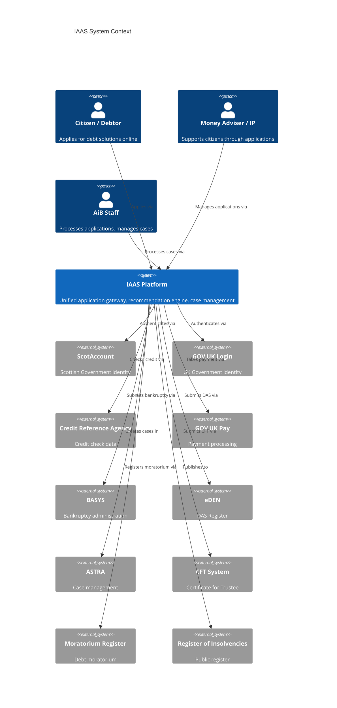

# IAAS — Executive Summary

**Initial Application Advice Service | Proof of Concept**

*Accountant in Bankruptcy, Scottish Government*

---

## Vision Statement

> One login. One work queue. One search. One platform.

The Initial Application Advice Service (IAAS) establishes a unified digital gateway for Scotland's insolvency landscape — replacing fragmented legacy systems with a single, citizen-facing platform that guides debtors, representatives, and advisers through the correct statutory debt solution while providing AiB staff with a consolidated operational view across all case types.

---

## Business Problem

AiB currently operates through multiple disconnected systems built over two decades:

| System | Function | Limitation |
|--------|----------|------------|
| BASYS | Bankruptcy administration | No public-facing channel; manual data entry |
| ASTRA | Case management | Siloed from other products; no cross-system search |
| eDEN | Debt Arrangement Scheme register | Separate login, separate identity, no link to bankruptcy |
| DAS Register | Public DAS applications | Limited integration with BASYS |
| CFT | Certificate for Trustee | Paper-based application process |
| RoI | Register of Insolvencies | Read-only; no operational linkage |

**The consequences are measurable:**

- No single debtor view — staff must search 3+ systems to understand a citizen's full position
- No digital application channel — citizens cannot self-serve online for bankruptcy or protected trust deeds
- Manual document triage — all postal correspondence requires human sorting, scanning, and routing
- Duplicate data entry — the same debtor information is keyed into multiple systems
- No recommendation capability — citizens receive no structured guidance on which product suits their circumstances
- Limited management information — no unified dashboard across all insolvency products

---

## Solution Overview

IAAS provides three core capabilities:

1. **Application Gateway** — A guided, multi-step digital journey that collects debtor circumstances (income, expenditure, assets, debts) and routes them to the appropriate statutory solution (bankruptcy, DAS, trust deed, moratorium, or MAP).

2. **Recommendation Engine** — A rules-based engine with confidence scoring that analyses financial circumstances against legislative criteria and recommends the most appropriate debt solution, with full transparency on why.

3. **Unified Portal** — A single operational interface for AiB staff providing cross-system search, unified work queue, case timeline, document management, and management dashboards.

---

## Strategic Alignment

| Strategy | Alignment |
|----------|-----------|
| **AiB Digital Strategy 2026–2030** | Directly delivers on "digital first applications" and "single platform" objectives |
| **Scottish Government Digital Strategy** | Citizen self-service, once-only data collection, cloud-first, accessibility |
| **GDS Service Standard** | User-centred design, accessibility, iterative delivery, open standards |
| **Scottish Approach to Service Design** | Collaborative, evidence-based, outcomes-focused |
| **Cyber Resilience Strategy** | Defence in depth, zero trust principles, MFA, role-based access |

---

## Key Capabilities Demonstrated

The POC demonstrates the following capabilities in working code — **50+ pages, 28 admin features, 12+ AI capabilities, delivered across 10 sprints at £0/month hosting cost** on a live deployment:

1. **Citizen self-service application journey** — Multi-step form with save/resume, validation, and progress tracking
2. **Identity verification federation** — ScotAccount, GOV.UK Login, and SAML integration patterns
3. **Single Sign-On (SSO)** — One authentication event across all AiB services
4. **Multi-Factor Authentication (MFA)** — TOTP and SMS second-factor options
5. **Multi-role RBAC** — Nine distinct roles (Debtor, Money Adviser, Insolvency Practitioner, AiB Case Officer, Senior Case Officer, Team Leader, Compliance Officer, System Administrator, Executive)
6. **Cross-system integration** — Orchestrated calls to six legacy systems via adapters
7. **Credit check integration** — Automated credit reference agency lookup with synthetic data
8. **Document upload with malware scanning** — ClamAV integration for uploaded files
9. **Recommendation engine** — Rules-based product recommendation with confidence scoring and explainability
10. **Payment processing** — GOV.UK Pay-pattern payment simulation
11. **Case management** — Unified case view with status tracking and assignment
12. **Unified work queue** — Single prioritised queue spanning all product types
13. **Fuzzy cross-system search** — Find debtors across all legacy systems with approximate matching
14. **Operational dashboard** — Real-time metrics on application volumes, processing times, and backlogs
15. **Security Operations Centre** — Authentication events, threat detection, Sophos/Tenable feeds, anomaly monitoring
16. **Statistics dashboard** — Product distribution, geographic analysis, trend data with live animation
17. **Enterprise architecture visualisation** — Interactive system map showing integrations and data flows
18. **Digital Mailroom** — AI-powered OCR and Named Entity Recognition pipeline for postal correspondence
19. **AI Governance dashboard** — Model monitoring, bias detection, explainability metrics, and human-in-the-loop controls
20. **Rules Management Console** — Business-user interface for managing recommendation rules without code changes
21. **Policy Simulation Tool** — Test impact of legislative or policy changes before deployment
22. **Knowledge Hub / CMS** — Content management for guidance, templates, and procedural documentation
23. **Case timeline audit trail** — Full chronological record of all actions against a case
24. **Notification service** — Email/SMS notifications with role-specific subscription management
25. **Rate limiting and abuse protection** — Defence against automated attacks and misuse
26. **AI Chatbot** — Floating FAQ assistant with natural language pattern matching (12+ topics)
27. **AI Case Summary** — Auto-generated natural language synthesis from case data
28. **Anomaly Detection** — Income discrepancies, duplicate applications, SLA warnings surfaced proactively
29. **AI Quality Check** — 6 automated pre-decision checks (documents, income, conflicts, confidence, identity, credit)
30. **Predictive Case Outcomes** — Historical pattern-based approval likelihood scoring
31. **Real-time Eligibility Prediction** — Live product suitability as applicant enters data
32. **Debtor Risk Scoring** — Composite score from credit, debt-to-income, and existing cases
33. **Automated Case Prioritisation** — AI-determined urgency ranking for staff work queues
34. **28-feature Admin Hub** — Comprehensive administration portal with rules, governance, compliance, monitoring, and operations

---

## Business Outcomes

| Outcome | Current State | Target State |
|---------|--------------|--------------|
| Application submission time | Not available (paper only) | < 30 minutes online |
| Staff time per application | ~45 minutes manual processing | ~15 minutes with automation |
| Document triage | 100% manual sorting | 80% automated routing via Digital Mailroom |
| Cross-system search | 3+ separate searches required | Single search, unified results |
| Time to recommendation | Days (adviser appointment required) | Immediate (rules engine) |
| Management information | Manual spreadsheet compilation | Real-time dashboards |
| Citizen channel availability | Office hours, postal | 24/7 digital self-service |

---

## Architecture Summary

**Architecture principles:**

- **Microservices** — Independently deployable services with clear bounded contexts
- **API-first** — All capabilities exposed via versioned REST APIs
- **Event-driven** — Audit trail and inter-service communication via event bus pattern
- **Cloud-native** — Containerised (Docker), orchestrated, infrastructure-as-code (Terraform)
- **Technology agnostic** — Adapters isolate legacy system protocols from business logic

---

## Security & Compliance

| Domain | Approach |
|--------|----------|
| **Authentication** | Federated identity (ScotAccount, GOV.UK Login), MFA, session management |
| **Authorisation** | Role-Based Access Control with 9 roles and granular permissions |
| **Data protection** | GDPR by design; data minimisation; purpose limitation; encryption at rest and in transit |
| **Network security** | Defence in depth; zero trust alignment; mTLS between services |
| **Application security** | Input validation (Zod schemas), output encoding, CSRF protection, security headers (Helmet) |
| **Infrastructure** | Cyber Essentials Plus alignment; WAF; DDoS protection; secrets management |
| **Audit** | Immutable audit trail; all state changes logged with actor, timestamp, and context |
| **Vulnerability management** | Dependency scanning, container scanning, SAST/DAST in CI pipeline |

---

## AI & Innovation

### Recommendation Engine
A transparent, rules-based engine that evaluates debtor circumstances against statutory criteria for each product type. Produces confidence scores and plain-English explanations of why each product is or is not suitable. Designed for auditability — every recommendation can be traced to specific rules and input data.

### Digital Mailroom
An AI-powered pipeline for postal correspondence: OCR extracts text from scanned documents, Named Entity Recognition identifies case references, debtor names, and document types, and automated routing directs documents to the correct case and work queue without manual triage.

### AI Governance Dashboard
Monitoring and oversight tooling that tracks model performance, detects bias in recommendations, provides explainability metrics, and ensures human-in-the-loop review for high-impact decisions. Designed to meet emerging public sector AI ethics frameworks.

### Policy Simulation
A sandbox environment where policy analysts can model the impact of legislative or rule changes before deployment — for example, simulating how a change to the Minimal Asset Process threshold would affect application volumes and eligibility.

---

## Scope

### In Scope (POC)
- End-to-end application journey (citizen-facing)
- Recommendation engine with rules for all product types
- Staff portal with unified search and work queue
- Integration patterns for all six legacy systems (mock adapters)
- Document upload and virus scanning
- Payment simulation
- Identity federation patterns
- Full role-based access control
- Management dashboards
- Digital Mailroom concept
- AI Governance and Policy Simulation concepts

### Out of Scope (POC)
- Live integration with production legacy systems
- Real payment processing
- Real identity provider connections
- Production data (all data is synthetic)
- Performance testing at scale
- Formal accessibility audit (WCAG 2.2 AA)
- Penetration testing
- Live service support model

---

## Assumptions & Constraints

| # | Assumption / Constraint |
|---|------------------------|
| 1 | All data used is synthetic — no real personal data is processed |
| 2 | Legacy system integrations use mock adapters that simulate real API contracts |
| 3 | Identity providers are simulated; real federation requires ScotAccount onboarding |
| 4 | SQLite is used for local development; production would require PostgreSQL or equivalent |
| 5 | The POC runs on local infrastructure; production deployment requires cloud hosting (AWS/Azure) |
| 6 | Payment processing is simulated; production requires GOV.UK Pay integration |
| 7 | Document scanning uses ClamAV in development; production requires managed antivirus service |
| 8 | The recommendation engine rules are illustrative; production rules require legal review |

---

## Success Criteria

| Criterion | Measure | Target |
|-----------|---------|--------|
| Citizen journey completable | End-to-end application submission | 100% of happy paths |
| Recommendation accuracy | Correct product suggested for test scenarios | > 90% alignment with expert judgement |
| Cross-system search | Debtor found across all legacy system mocks | < 3 seconds response |
| Staff workflow | Case can be actioned from unified queue | All product types supported |
| Security controls | RBAC enforced; audit trail complete | Zero unauthorised access in testing |
| Integration patterns | All 6 legacy systems callable | Adapter pattern proven for each |
| Documentation quality | Architecture, API, and operational docs | Sufficient for implementation team handover |

---

## Next Steps

### Alpha (3 months)
- Connect to real ScotAccount identity provider (test environment)
- Integrate with BASYS and eDEN test APIs
- User research with debtors and money advisers
- Accessibility audit against WCAG 2.2 AA
- Security assessment and penetration testing
- Refine recommendation rules with policy team

### Beta (6 months)
- Private beta with selected money advice agencies
- All legacy system integrations live (test environment)
- GOV.UK Pay integration
- Performance testing and optimisation
- Operational support model established
- Staff training programme

### Live (12 months)
- Public beta with phased rollout
- Full production integrations
- Monitoring and alerting
- Continuous improvement based on analytics
- Legacy system decommissioning planning

---

*Document prepared: August 2026*
*Classification: OFFICIAL*
*Owner: AiB Digital Delivery*
