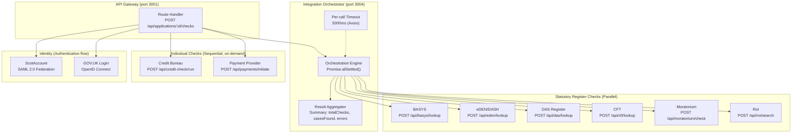
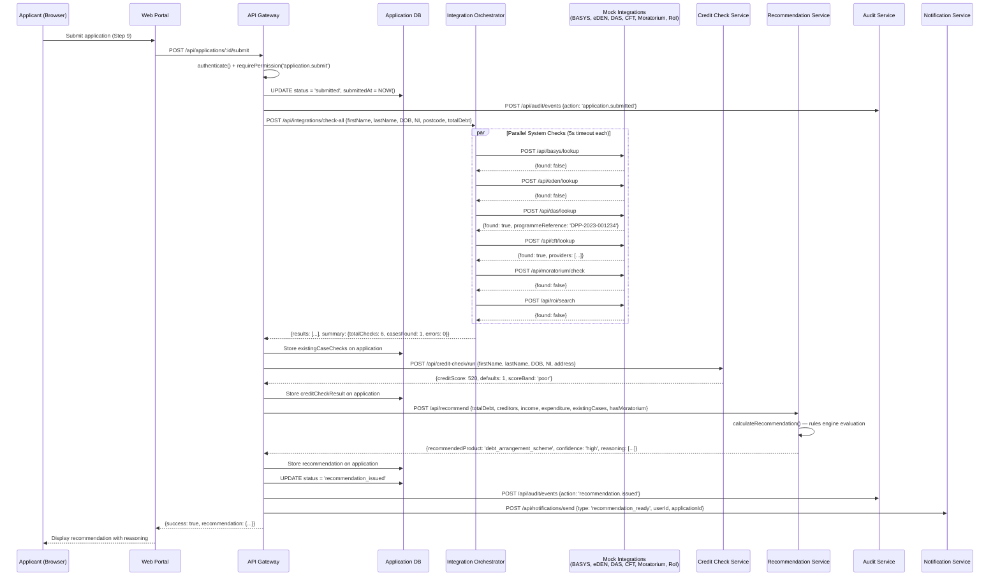
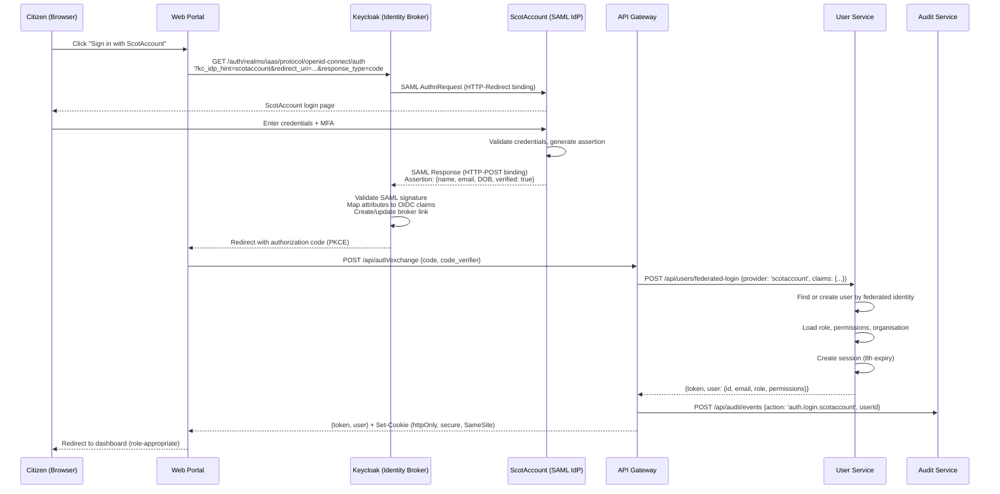
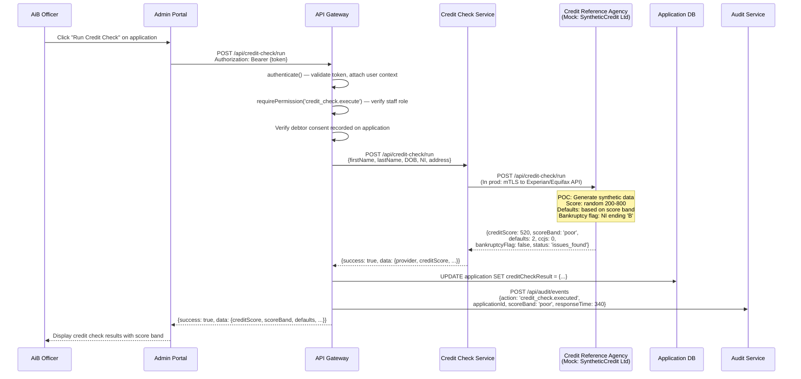

# AiB IAAS — Integration Documentation

**Document Version:** 2.0  
**Classification:** OFFICIAL  
**Author:** Solution Architecture Team  
**Last Updated:** August 2026  
**Status:** Approved for POC  
**Audience:** Technical stakeholders, integration leads, security assurance, operations  

---

## 1. Integration Pattern Overview

IAAS integrates with 10 external systems across four categories: statutory registers (6), identity providers (2), financial services (1), and payment processing (1). In the POC, all integrations are serviced by the Mock Integrations service with synthetic data. This document specifies the contract, behaviour, and production migration path for each integration.

### 1.1 Orchestration Architecture

The Integration Orchestrator implements a parallel fan-out pattern. All statutory register checks execute simultaneously via `Promise.allSettled()`, ensuring that the failure or timeout of any individual system does not block the overall assessment.



### 1.2 Common Integration Contract

All integration responses follow a standard envelope regardless of the downstream system:

```typescript
interface IntegrationResponse {
  requestId: string;              // UUID v4 for correlation
  system: string;                 // System identifier
  status: 'success' | 'not_found' | 'error' | 'timeout';
  data?: {
    found: boolean;               // Whether a matching record exists
    [key: string]: unknown;       // System-specific payload
  };
  errorMessage?: string;          // Human-readable error (on failure)
  timestamp: string;              // ISO 8601 response timestamp
}
```

### 1.3 Common Request Payload

All statutory register lookups accept a common input shape:

```typescript
interface CheckAllRequest {
  firstName: string;
  lastName: string;
  dateOfBirth: string;            // ISO 8601 (YYYY-MM-DD)
  nationalInsuranceNumber?: string;
  postcode?: string;
  totalDebt?: number;             // Used by DAS eligibility logic
}
```

---

## 2. Integration Specifications

---

### 2.1 BASYS (Bankruptcy Administration System)

**Purpose:** Check whether the applicant has existing or historic sequestration (bankruptcy) cases in Scotland. A found case significantly impacts the recommendation — active cases prevent new applications; discharged cases inform risk assessment.

**Data Exchanged:**

| Direction | Fields |
|-----------|--------|
| Request (IN) | `firstName`, `lastName`, `dateOfBirth`, `nationalInsuranceNumber` |
| Response (OUT) | `found`, `caseReference`, `caseType` (sequestration), `debtorName`, `dateAwarded`, `dateOfDischarge`, `status` (active/discharged), `trustee`, `totalDebt`, `dividendPaid` |

**Authentication:**
- POC: None (internal mock service)
- Production: Mutual TLS (mTLS) with client certificate issued by AiB PKI + API key in `X-API-Key` header

**Authorisation:** Only triggered by users with `integration.execute` permission (AiB Staff, System). Debtor consent required and recorded in audit trail before execution.

**Endpoints:**
- `POST /api/basys/lookup` — Search by person details
- `GET /api/basys/case/:caseId` — Retrieve full case detail

**Failure Handling:**
- Timeout: 5 seconds (Axios `timeout` configuration)
- On timeout: Returns `{status: 'error', errorMessage: 'timeout'}` — does not block other checks
- On 503 (simulated at 5% rate): Returns error status; application continues with partial results
- Retry: No automatic retry in POC; production will implement exponential backoff (max 3 attempts)
- Fallback: Manual lookup available to AiB staff via BASYS desktop application

**Audit Requirements:**
- Event logged: `integration.basys.lookup` with actor, applicationId, timestamp, result summary (found/not_found/error), response time
- No raw personal data stored in audit log (only case reference if found)

**SLA (Production Target):**
- Response time: < 2 seconds (p95)
- Availability: 99.5% during business hours (Mon-Fri 08:00-18:00)
- Maintenance window: Saturdays 02:00-06:00

**Future Enhancements:**
- Replace mock with secure mTLS connection to production BASYS API
- Implement circuit breaker (5 failures → 30s open → half-open probe)
- Add webhook subscription for case status changes (push model)
- Real-time notification when a BASYS case is discharged

---

### 2.2 eDEN/DASH (DAS Electronic System / Payment Distribution)

**Purpose:** Check for existing Debt Arrangement Scheme arrangements managed through eDEN. Identifies active payment distributions via DASH. An active DAS arrangement typically precludes parallel insolvency applications.

**Data Exchanged:**

| Direction | Fields |
|-----------|--------|
| Request (IN) | `firstName`, `lastName`, `dateOfBirth`, `nationalInsuranceNumber` |
| Response (OUT) | `found`, `arrangementReference`, `status` (active/completed/revoked), `approvedDate`, `totalDebt`, `monthlyPayment`, `paymentDistributor`, `creditorCount`, `completionDate`, `paymentsRemaining` |

**Authentication:**
- POC: None
- Production: OAuth 2.0 Client Credentials flow; token issued by eDEN authorisation server; refresh before expiry

**Authorisation:** `integration.execute` permission. Money Advisers can trigger for their own clients with client consent. AiB Staff can trigger for any applicant.

**Endpoints:**
- `POST /api/eden/lookup` — Search by person details
- `GET /api/eden/arrangement/:id` — Full arrangement detail including creditor breakdown

**Failure Handling:**
- Timeout: 5 seconds
- On failure: Graceful degradation; application marked with `eDEN check unavailable`
- Retry: Single retry after 2-second delay (production)
- Fallback: Manual check via eDEN desktop portal

**Audit Requirements:**
- Event: `integration.eden.lookup` — actor, applicationId, result (found/not_found/error), response time
- If found: arrangement reference stored on application record for cross-referencing

**SLA (Production Target):**
- Response time: < 3 seconds (p95)
- Availability: 99.0% (planned maintenance windows communicated 48h in advance)

**Future Enhancements:**
- Bidirectional sync: IAAS notifies eDEN when a DAS applicant applies for alternative solution
- Payment history retrieval for affordability assessment
- Real-time arrangement status subscription (event-driven)

---

### 2.3 DAS Register (Debt Arrangement Scheme Programme Records)

**Purpose:** Check for existing DAS applications in progress or active Debt Payment Programmes (DPPs). Identifies whether the applicant already has a structured repayment plan, which may affect eligibility for other solutions.

**Data Exchanged:**

| Direction | Fields |
|-----------|--------|
| Request (IN) | `firstName`, `lastName`, `dateOfBirth`, `nationalInsuranceNumber`, `totalDebt` |
| Response (OUT) | `found`, `programmeReference`, `programmeStatus` (application_in_progress/active/completed/revoked), `applicationDate`, `approvedMoneyAdviser`, `totalDebtDeclared`, `proposedPayment` |

**Authentication:**
- POC: None
- Production: mTLS + signed request headers (HMAC-SHA256)

**Authorisation:** `integration.execute` permission. Approved Money Advisers (registered in CFT) have direct access for their own clients.

**Endpoints:**
- `POST /api/das/lookup` — Search for existing programmes
- `GET /api/das/programme/:id` — Full programme detail

**Failure Handling:**
- Timeout: 5 seconds
- Retry: No retry (idempotent lookup; failure acceptable for parallel check)
- Fallback: DAS Administrator manual lookup

**Audit Requirements:**
- Event: `integration.das.lookup` — actor, applicationId, result, response time, programme reference if found

**SLA (Production Target):**
- Response time: < 2 seconds (p95)
- Availability: 99.5% during business hours

**Future Enhancements:**
- Direct DAS application submission from IAAS (eliminating separate DAS portal)
- Programme amendment requests routed through IAAS
- Automated payment affordability comparison (DAS vs MAP vs Bankruptcy)

---

### 2.4 CFT (Creditor, Trustee and Provider Registry)

**Purpose:** Validate registered providers (insolvency practitioners, trustees, money advisers) and retrieve creditor information. CFT is a reference data service — it always returns data (provider listings) rather than person-specific searches.

**Data Exchanged:**

| Direction | Fields |
|-----------|--------|
| Request (IN) | (No person-specific input required for lookup — returns available providers) |
| Response (OUT) | `found: true`, `providers[]`: `{id, name, registrationNumber, status, type (insolvency_practitioner/trustee/money_adviser), contactEmail, contactPhone, address}` |

**Authentication:**
- POC: None
- Production: API key in `X-API-Key` header; key rotated quarterly

**Authorisation:** Read access open to all authenticated IAAS users. Write access (provider registration) restricted to `system_admin` role.

**Endpoints:**
- `POST /api/cft/lookup` — List registered providers (filterable)
- `GET /api/cft/provider/:id` — Single provider detail including case history

**Failure Handling:**
- Timeout: 5 seconds
- Fallback: Cached provider list (refreshed daily) served when CFT unavailable
- Impact of failure: Low — reference data, not blocking for application submission

**Audit Requirements:**
- Event: `integration.cft.lookup` — minimal logging (no sensitive data); response time only

**SLA (Production Target):**
- Response time: < 1 second (p95) — reference data, should be fast
- Availability: 99.0% (degraded mode acceptable with cached data)

**Future Enhancements:**
- Real-time provider status updates (suspended/revoked notifications)
- Provider capacity tracking (how many cases each can accept)
- Automated trustee assignment based on geography and capacity

---

### 2.5 Moratorium Register

**Purpose:** Check whether the applicant has an active Moratorium on Diligence (6-week breathing space). An active moratorium pauses creditor enforcement actions and gives the debtor time to seek advice. Also supports new moratorium registration.

**Data Exchanged:**

| Direction | Fields |
|-----------|--------|
| Request — Check (IN) | `firstName`, `lastName`, `dateOfBirth`, `postcode`, `nationalInsuranceNumber` |
| Response — Check (OUT) | `found`, `moratoriumReference`, `startDate`, `endDate`, `status` (active/expired), `weeksRemaining`, `registeredBy`, `debtorPostcode` |
| Request — Register (IN) | Full debtor details + adviser details |
| Response — Register (OUT) | `moratoriumReference`, `startDate`, `endDate`, `status: registered` |

**Authentication:**
- POC: None
- Production: mTLS (AiB internal service); OAuth 2.0 for external money advisers

**Authorisation:**
- Check: `integration.execute` permission
- Register: `moratorium.register` permission (Money Advisers and AiB Staff only)

**Endpoints:**
- `POST /api/moratorium/check` — Search for active moratoriums
- `POST /api/moratorium/register` — Register new moratorium (6-week duration, auto-calculates end date)

**Failure Handling:**
- Timeout: 5 seconds for check; 10 seconds for registration (write operation)
- Registration failure: Returns error; adviser instructed to retry or contact AiB
- Check failure: Application continues; moratorium status marked as `unable_to_check`

**Audit Requirements:**
- Check: `integration.moratorium.check` — standard audit fields
- Registration: `moratorium.registered` — full event with reference, dates, registering adviser, debtor identifier

**SLA (Production Target):**
- Response time: < 2 seconds (p95)
- Availability: 99.9% (moratorium registration is legally time-sensitive)

**Future Enhancements:**
- Automated creditor notification on moratorium registration (letter + email)
- Expiry warning notifications (7 days before end)
- Extension request workflow (additional 6 weeks in certain circumstances)
- Integration with Court of Session for moratorium-linked proceedings

---

### 2.6 RoI (Register of Insolvencies)

**Purpose:** Search the publicly accessible Register of Insolvencies for any existing entries relating to the applicant. The RoI is the authoritative public record of all insolvency cases in Scotland (sequestrations, trust deeds, DAS, moratoriums).

**Data Exchanged:**

| Direction | Fields |
|-----------|--------|
| Request (IN) | `firstName`, `lastName`, `dateOfBirth`, `postcode` |
| Response (OUT) | `found`, `entries[]`: `{entryId, entryType (sequestration/trust_deed/das/moratorium), debtorName, dateRegistered, dateOfDischarge, status, linkedCaseReference, trustee}` |

**Authentication:**
- POC: None
- Production: Public search API (no auth for read); mTLS for bulk/privileged access

**Authorisation:** Public read access (the RoI is a public register). IAAS uses the same public API with rate limiting.

**Endpoints:**
- `POST /api/roi/search` — Search by person details
- `GET /api/roi/entry/:id` — Full entry detail including court reference and trustee

**Failure Handling:**
- Timeout: 5 seconds
- On failure: Non-blocking; application continues (RoI is supplementary to BASYS)
- Fallback: Public web search at roi.aib.gov.uk

**Audit Requirements:**
- Event: `integration.roi.search` — standard fields; note that RoI is public data so lower sensitivity

**SLA (Production Target):**
- Response time: < 2 seconds (p95)
- Availability: 99.0% (public service with known maintenance windows)

**Future Enhancements:**
- Automatic RoI entry creation when IAAS applications are approved
- Change notification subscription (new entries matching watched criteria)
- Historical trend analysis for AiB reporting

---

### 2.7 Credit Bureau (Experian / Equifax)

**Purpose:** Run a credit check against a Credit Reference Agency with the applicant's explicit consent. Returns credit score, defaults, CCJs, bankruptcy flags, and active credit accounts. Used by the recommendation engine to assess financial position.

**Data Exchanged:**

| Direction | Fields |
|-----------|--------|
| Request (IN) | `firstName`, `lastName`, `dateOfBirth`, `nationalInsuranceNumber`, `address: {line1, postcode}` |
| Response (OUT) | `provider`, `creditScore`, `scoreRange: {min, max}`, `scoreBand` (excellent/fair/poor/very_poor), `defaults`, `ccjs`, `bankruptcyFlag`, `ivaFlag`, `activeCreditAccounts`, `totalCreditLimit`, `status` (clear/issues_found) |

**Authentication:**
- POC: None (synthetic random data generated locally)
- Production: mTLS + API key; data sharing agreement with CRA; ICO registration for credit data processing

**Authorisation:** Requires explicit debtor consent (recorded in audit). Triggered only by `credit_check.execute` permission. Consent timestamp and method stored on application.

**Endpoints:**
- `POST /api/credit-check/run` — Execute credit check (single call, not part of parallel fan-out)

**Failure Handling:**
- Timeout: 10 seconds (CRAs can be slow)
- Retry: Single retry after 3-second delay
- Fallback: Application proceeds without credit check; marked as `unable_to_check`; recommendation confidence downgraded to `low`

**Audit Requirements:**
- Event: `credit_check.executed` — actor, applicationId, consent reference, provider, score band (NOT raw score in audit), response time
- Data retention: Credit check results retained for 6 months then purged (ICO requirement)

**SLA (Production Target):**
- Response time: < 5 seconds (p95)
- Availability: 99.9% (contractual SLA with CRA)

**Future Enhancements:**
- Multi-provider: query Experian AND Equifax, take median score
- Consent management: granular opt-in/opt-out per CRA
- Soft search option (no credit footprint) for initial screening
- Historical credit data trend for affordability assessment

---

### 2.8 Payment Provider

**Purpose:** Process application fees where required. Supports Apple Pay, Google Pay, and card payments. Not all debt solutions require a fee — Minimal Asset Process (MAP) has a fee; DAS does not.

**Data Exchanged:**

| Direction | Fields |
|-----------|--------|
| Request (IN) | `applicationId`, `amount`, `currency` (GBP), `method` (apple_pay/google_pay/card), `returnUrl` |
| Response (OUT) | `transactionReference`, `status` (pending/processing/completed/failed), `gatewayReference`, `paidAt` |

**Authentication:**
- POC: None (always succeeds with synthetic reference)
- Production: PCI-DSS Level 1 compliant integration; server-to-server with API key; payment tokenisation (no card data touches IAAS)

**Authorisation:** `payment.initiate` permission. Only the applicant or their authorised adviser can initiate payment.

**Endpoints:**
- `POST /api/payments/initiate` — Start payment
- `GET /api/payments/:id/status` — Poll payment status
- `POST /api/payments/:id/refund` — Initiate refund (staff only)
- Webhook: `POST /api/payments/webhook` — Payment provider callback

**Failure Handling:**
- Timeout: 30 seconds (payment processing can be slow)
- On failure: Application saved as `payment_pending`; retry available
- Duplicate prevention: Idempotency key based on applicationId + amount
- Retry: Manual retry by user; no automatic retry for payments

**Audit Requirements:**
- Event: `payment.initiated`, `payment.completed`, `payment.failed`, `payment.refunded`
- Full transaction record: amount, method, reference, timestamp, actor
- PCI-DSS: No card numbers logged anywhere in the system

**SLA (Production Target):**
- Response time: < 10 seconds (end-to-end including 3DS challenge)
- Availability: 99.99% (payment provider contractual SLA)

**Future Enhancements:**
- Direct Debit for instalment payments
- GOV.UK Pay integration (government payment platform)
- Fee waiver workflow for applicants meeting hardship criteria
- Automated refund on application withdrawal within 14 days

---

### 2.9 ScotAccount (Scottish Government Identity)

**Purpose:** Authenticate Scottish citizens via the Scottish Government's single sign-on identity provider. Provides verified identity claims (name, date of birth, email) without IAAS needing to manage citizen credentials.

**Data Exchanged:**

| Direction | Fields |
|-----------|--------|
| Request (OUT to ScotAccount) | SAML AuthnRequest with requested attributes |
| Response (IN from ScotAccount) | SAML Assertion: `firstName`, `lastName`, `email`, `dateOfBirth`, `identityVerified` (boolean), `verificationLevel` (basic/standard/enhanced) |

**Authentication:**
- Protocol: SAML 2.0 (ScotAccount is a SAML Identity Provider)
- Keycloak acts as Service Provider, translating SAML to OIDC for IAAS consumption
- SP certificate registered with ScotAccount; signed assertions validated

**Authorisation:** Any unauthenticated user can initiate ScotAccount login. Upon successful authentication, user is mapped to the `debtor` role (or existing role if previously registered).

**Endpoints:**
- Keycloak SAML SP: `POST /auth/realms/iaas/broker/scotaccount/endpoint` (assertion consumer)
- ScotAccount IdP: `https://account.gov.scot/saml/sso` (redirect target)

**Failure Handling:**
- Timeout: 30 seconds (user interaction involved)
- On ScotAccount unavailability: Display friendly error with alternative login options (GOV.UK Login)
- On assertion validation failure: Reject login; log security event

**Audit Requirements:**
- Event: `auth.login.scotaccount` — userId, email (hashed), verification level, login timestamp
- Failed attempts: `auth.login.failed` — IP address, attempted identifier (hashed), reason

**SLA (Production Target):**
- Availability: 99.9% (Scottish Government managed service)
- Response time: N/A (user-interactive flow)

**Future Enhancements:**
- Step-up authentication: require enhanced verification for high-value applications
- Attribute release expansion: address data from ScotAccount to pre-fill forms
- Single Logout: terminate IAAS session when ScotAccount session ends

---

### 2.10 GOV.UK Login

**Purpose:** Alternative identity verification for citizens who do not have a ScotAccount. GOV.UK Login provides identity proofing to various confidence levels, suitable for applicants who need to verify their identity for the first time.

**Data Exchanged:**

| Direction | Fields |
|-----------|--------|
| Request (OUT to GOV.UK Login) | OIDC Authorization Request with `scope: openid email profile` and `vtr: [Cl.Cm]` (medium confidence) |
| Response (IN from GOV.UK Login) | ID Token: `sub`, `email`, `email_verified`, `phone_number`, `given_name`, `family_name`; UserInfo: `birthdate`, `address`, `https://vocab.account.gov.uk/v1/coreIdentityJWT` |

**Authentication:**
- Protocol: OpenID Connect 1.0 (Authorization Code flow with PKCE)
- Client registered with GOV.UK Login; client_id + client_secret in Keycloak configuration
- Token validation: RS256 signature verification against GOV.UK Login JWKS endpoint

**Authorisation:** Any unauthenticated user can initiate. Mapped to `debtor` role on first login. Identity proofing level stored on user record.

**Endpoints:**
- Keycloak OIDC broker: `/auth/realms/iaas/broker/govuk-login/endpoint`
- GOV.UK Login authorize: `https://signin.account.gov.uk/authorize`
- GOV.UK Login token: `https://signin.account.gov.uk/token`
- GOV.UK Login userinfo: `https://signin.account.gov.uk/userinfo`

**Failure Handling:**
- On GOV.UK Login unavailability: Offer ScotAccount as alternative
- On token validation failure: Reject; log security event
- On identity proofing failure: User informed they cannot proceed until identity is verified

**Audit Requirements:**
- Event: `auth.login.govuk` — userId, email (hashed), identity confidence level, timestamp
- Identity proofing result stored: `identity.verified` / `identity.not_verified`

**SLA (Production Target):**
- Availability: 99.9% (GDS managed service with published status page)
- Response time: N/A (user-interactive flow including identity proofing which may take days)

**Future Enhancements:**
- Verified credential caching: avoid re-verification within 90 days
- Cross-government identity sharing: accept credentials from other departments
- Biometric verification for high-risk applications

---

## 3. End-to-End Data Flow

### 3.1 Application Submission Flow

This sequence diagram shows the complete flow from application submission through all integration checks to recommendation generation:



### 3.2 Identity Verification Flow



### 3.3 Credit Check Flow



---

## 4. Integration Health Dashboard

### 4.1 Health Check Architecture

The Integration Orchestrator exposes a health aggregation endpoint:

```
GET /api/integrations/health
```

Response:

```json
{
  "status": "healthy",
  "service": "mock-integrations",
  "version": "0.1.0",
  "timestamp": "2026-08-21T10:30:00.000Z",
  "systems": [
    { "system": "BASYS", "status": "healthy", "description": "Bankruptcy Administration System" },
    { "system": "eDEN", "status": "healthy", "description": "DAS Electronic System" },
    { "system": "DASH", "status": "healthy", "description": "DAS Payment Distribution" },
    { "system": "DAS", "status": "healthy", "description": "Debt Arrangement Scheme" },
    { "system": "CFT", "status": "healthy", "description": "Creditor/Trustee/Provider Information" },
    { "system": "Moratorium", "status": "healthy", "description": "Moratorium Register" },
    { "system": "RoI", "status": "healthy", "description": "Register of Insolvencies" },
    { "system": "CreditCheck", "status": "healthy", "description": "Credit Reference Agency" }
  ],
  "config": {
    "latencyMinMs": 100,
    "latencyMaxMs": 500,
    "failureRate": 0.05
  }
}
```

### 4.2 Monitoring Metrics (Production)

| Metric | Alarm Threshold | Action |
|--------|----------------|--------|
| Integration response time (p95) | > 4 seconds | Page on-call engineer |
| Integration error rate | > 10% over 5 minutes | Page on-call engineer |
| Individual system error rate | > 50% over 5 minutes | Alert integration team |
| Health check failures | 3 consecutive failures | Mark system degraded, alert |
| Timeout rate | > 5% over 15 minutes | Investigate; consider timeout increase |
| Total orchestration time | > 8 seconds | Alert; investigate slowest system |

### 4.3 Dashboard Panels

The operations dashboard includes:
1. **System Status Grid** — Green/amber/red per integration system
2. **Response Time Heatmap** — p50/p95/p99 per system over 24 hours
3. **Error Rate Timeline** — Stacked area chart showing errors per system
4. **Request Volume** — Throughput per system per hour
5. **Latency Distribution** — Histogram per system
6. **Circuit Breaker State** — Open/closed/half-open per system

---

## 5. Error Taxonomy

### 5.1 Error Categories

| Category | Code | HTTP Status | Meaning | User Impact |
|----------|------|-------------|---------|-------------|
| Timeout | `INTEGRATION_TIMEOUT` | 504 | System did not respond within 5 seconds | Partial results shown; retry available |
| Connection Refused | `INTEGRATION_UNREACHABLE` | 502 | Cannot establish TCP connection | System marked unavailable |
| Service Error | `INTEGRATION_ERROR` | 502 | System returned 5xx | System temporarily unavailable |
| Invalid Response | `INTEGRATION_INVALID_RESPONSE` | 502 | Response does not match expected schema | Logged for investigation |
| Rate Limited | `INTEGRATION_RATE_LIMITED` | 429 | Too many requests to external system | Backoff and retry |
| Authentication Failure | `INTEGRATION_AUTH_FAILED` | 502 | mTLS or API key rejected | Alert security team immediately |
| Data Not Found | N/A (success) | 200 | No matching record in system | Normal flow; `found: false` |

### 5.2 Error Handling Strategy

```
For each integration call:
  1. Set timeout (5 seconds)
  2. Execute HTTP request
  3. If success:
     - Validate response schema
     - Return normalized result {system, status, found, data}
  4. If timeout:
     - Return {system, status: 'error', errorMessage: 'timeout', responseTime}
  5. If connection error:
     - Return {system, status: 'error', errorMessage, responseTime}
  6. If 5xx response:
     - Return {system, status: 'error', errorMessage: 'service unavailable', responseTime}
  7. Log all outcomes to audit service
  8. Never throw — always return a result object (Promise.allSettled guarantees this)
```

### 5.3 Degraded Mode Behaviour

When one or more integrations fail, IAAS operates in degraded mode:

| Systems Available | Behaviour |
|-------------------|-----------|
| All 6 systems respond | Full recommendation with `high` confidence |
| 4-5 systems respond | Recommendation issued with `medium` confidence; missing checks noted |
| 2-3 systems respond | Recommendation issued with `low` confidence; manual review recommended |
| 0-1 systems respond | No automated recommendation; application queued for manual assessment |
| Credit check fails | Recommendation issued without credit data; confidence downgraded one level |

---

## 6. Production Migration Notes

### 6.1 Migration Checklist (Per Integration)

For each of the 10 integrations, the following steps transform mock to production:

| # | Step | Detail |
|---|------|--------|
| 1 | **API Contract Finalisation** | OpenAPI 3.0 specification agreed with system owner; request/response schemas locked |
| 2 | **Authentication Setup** | Generate and register certificates (mTLS); obtain API keys; configure OAuth clients |
| 3 | **Network Path** | Establish VPN/PrivateLink connectivity; IP allowlisting; firewall rules |
| 4 | **Adapter Implementation** | Replace mock URL with production URL; implement auth header injection |
| 5 | **Error Handling Enhancement** | Circuit breaker implementation (opossum library); retry with exponential backoff |
| 6 | **Monitoring Configuration** | CloudWatch custom metrics per system; alarm thresholds; dashboard panels |
| 7 | **Data Mapping** | Map production response fields to IAAS internal model; handle schema differences |
| 8 | **Consent Management** | Implement consent recording and verification before data sharing |
| 9 | **Fallback Behaviour** | Define and implement graceful degradation per system |
| 10 | **Performance Testing** | Load test integration path; verify timeout behaviour under load |
| 11 | **Security Review** | Penetration test integration endpoints; validate TLS configuration |
| 12 | **Operational Runbook** | Document troubleshooting steps, escalation contacts, credential rotation |

### 6.2 Code Changes Required

The architecture is designed for minimal code change during migration:

```typescript
// Current (POC):
const MOCK_URL = process.env.MOCK_INTEGRATIONS_URL || 'http://localhost:3005';
const response = await axios.post(`${MOCK_URL}/api/basys/lookup`, data, { timeout: 5000 });

// Production:
const BASYS_URL = process.env.BASYS_API_URL;  // From Secrets Manager
const response = await axios.post(`${BASYS_URL}/api/v1/lookup`, data, {
  timeout: 5000,
  httpsAgent: mtlsAgent,           // mTLS certificate
  headers: { 'X-API-Key': apiKey } // From Secrets Manager
});
```

### 6.3 Environment Variable Changes

| Variable | POC Value | Production Value |
|----------|-----------|------------------|
| `MOCK_INTEGRATIONS_URL` | `http://localhost:3005` | _(removed — individual URLs per system)_ |
| `BASYS_API_URL` | N/A | `https://basys-api.internal.aib.gov.uk` |
| `EDEN_API_URL` | N/A | `https://eden-api.internal.aib.gov.uk` |
| `DAS_API_URL` | N/A | `https://das-api.internal.aib.gov.uk` |
| `CFT_API_URL` | N/A | `https://cft-api.internal.aib.gov.uk` |
| `MORATORIUM_API_URL` | N/A | `https://moratorium-api.internal.aib.gov.uk` |
| `ROI_API_URL` | N/A | `https://roi-api.internal.aib.gov.uk` |
| `CREDIT_CHECK_API_URL` | N/A | `https://api.experian.co.uk/v2` |
| `PAYMENT_GATEWAY_URL` | N/A | `https://api.worldpay.com/payments/v1` |
| `MOCK_LATENCY_MIN_MS` | `100` | _(removed)_ |
| `MOCK_LATENCY_MAX_MS` | `500` | _(removed)_ |
| `MOCK_FAILURE_RATE` | `0.05` | _(removed)_ |

### 6.4 Circuit Breaker Configuration (Production)

| Parameter | Value | Rationale |
|-----------|-------|-----------|
| Failure threshold | 5 consecutive failures | Prevents cascading failure |
| Reset timeout | 30 seconds | Time before attempting recovery |
| Half-open max requests | 1 | Single probe before re-opening |
| Timeout per call | 5 seconds (registers) / 10 seconds (CRA/payment) | Based on expected response times |
| Total orchestration timeout | 15 seconds | Hard upper bound for user experience |
| Volume threshold | 10 requests | Minimum sample before circuit can open |

### 6.5 Data Sharing Agreements

| Integration | Agreement Type | Data Shared | Legal Basis |
|-------------|----------------|-------------|-------------|
| BASYS | Internal (AiB own system) | Full debtor details | Statutory function |
| eDEN/DASH | Internal (AiB managed) | Debtor name, DOB, NI | Statutory function |
| DAS | Internal (AiB managed) | Debtor name, DOB, NI, debt amount | Statutory function |
| CFT | Internal (AiB managed) | Provider queries only | Public register |
| Moratorium | Internal (AiB managed) | Debtor name, DOB, postcode | Statutory function |
| RoI | Public | Name, DOB (search only) | Public register |
| Credit Bureau | Data Sharing Agreement | Name, DOB, NI, address | Legitimate interest + consent |
| Payment | PCI-DSS contract | Tokenised payment data only | Contract |
| ScotAccount | Federation agreement | Verified identity claims | Consent |
| GOV.UK Login | Federation agreement | Verified identity claims | Consent |

---

## 7. Appendix: Mock Trigger Conditions

For testing and demonstration purposes, the mock integrations use deterministic trigger conditions:

| System | Trigger Condition | Result |
|--------|-------------------|--------|
| BASYS | NI number ends with 'A' OR surname = 'SMITH' | Discharged sequestration case found |
| eDEN | Surname starts with 'M' | Active DAS arrangement found |
| DAS | Total debt between £5,000 and £20,000 | Application in progress found |
| CFT | Always | Returns list of registered providers |
| Moratorium | Postcode starts with 'EH' | Active moratorium (4 weeks remaining) |
| RoI | Surname contains 'TEST' | Discharged sequestration entry |
| Credit Check | Random (200-800 score); NI ending 'B' = bankruptcy flag | Score-dependent results |
| All systems | 5% random chance | 503 Service Unavailable (latency middleware) |
| All systems | Configurable | 100-500ms artificial latency |
