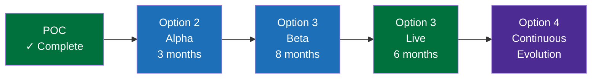

# Options Analysis — IAAS Platform Development

## Purpose

This document presents four strategic options for the future development of AiB's digital insolvency capability, evaluating each against scope, benefits, risks, cost, complexity, and strategic value. A recommended approach is provided.

---

## Background

The IAAS POC has demonstrated that a modern, unified digital insolvency platform is technically feasible and strategically valuable. The question is: **how far should AiB invest, and at what pace?**

The options range from minimal enhancement of the POC through to a full enterprise transformation platform.

---

## Option 1: Current POC (Baseline)

### Description
Retain the POC in its current form as a demonstration/reference artefact. No further development investment. Use for bid evidence, stakeholder engagement, and architectural reference only.

### Scope
- Static demonstration site (GitHub Pages)
- No live integrations
- No real user access
- Documentation suite only

### Benefits
- Zero additional cost
- Immediate availability
- Useful as bid evidence
- Demonstrates architectural thinking

### Risks
- No operational value
- Cannot process real applications
- Becomes outdated quickly
- Competitor solutions may overtake

### Cost Estimate
£0 (already delivered)

### Complexity
None

### Implementation Effort
N/A

### Strategic Value
⭐☆☆☆☆ — Demonstration only, no operational benefit.

---

## Option 2: Enhanced Rules Platform

### Description
Evolve the POC into a working application gateway focused on the recommendation engine, connected to 2-3 real AiB systems. Citizen-facing with basic case management. Essentially: "Option 1 + real integrations + live deployment."

### Scope
- Live application journey (citizen self-service)
- Real identity verification (ScotAccount)
- Real credit checks (Experian sandbox → live)
- 2-3 live system integrations (BASYS, eDEN)
- Production recommendation engine with rules management
- Basic case officer review workflow
- Document upload with real virus scanning
- Deployed on AWS (ECS/RDS/S3)

### Benefits
- Operational value — can process real applications
- Validates the technology approach in production
- Reduces manual processing for DAS/MAP applications
- Provides evidence for further investment
- Citizen self-service channel (first for AiB)

### Risks
- Limited scope may disappoint stakeholders expecting full platform
- Integration dependencies on BASYS/eDEN team availability
- Security accreditation required (ITHC, DPIA)
- Change management for staff adopting new workflows

### Cost Estimate
£250k–£400k (6-month Alpha/Beta delivery)

### Complexity
Medium — Known technology, limited integrations, manageable scope.

### Implementation Effort
- Team: 1 Tech Lead, 2 Developers, 1 BA, 1 Tester, 0.5 UX, 0.5 DevOps
- Duration: 6 months (Alpha 3m + Private Beta 3m)
- Approach: Agile Scrum, 2-week sprints

### Strategic Value
⭐⭐⭐☆☆ — Delivers citizen self-service but doesn't address fragmentation.

---

## Option 3: Full Digital Gateway

### Description
Build the complete IAAS vision: unified application gateway with all integrations, full case management, digital mailroom, multi-channel correspondence, and comprehensive analytics. Replaces the need for citizens/advisers to interact with individual systems.

### Scope
Everything in Option 2, plus:
- All 6 AiB system integrations (BASYS, eDEN, DAS, CFT, Moratorium, RoI)
- Complete case management workflow (assign, review, decide, appeal)
- Digital Mailroom (Azure Document Intelligence for OCR, NER, auto-routing)
- Unified staff portal / work queue
- Correspondence management (GOV.UK Notify)
- Payment processing (GOV.UK Pay)
- Full analytics and reporting (Power BI)
- Money Adviser portal
- Creditor self-service
- AI Governance dashboard
- Mobile-responsive design
- Accessibility compliant (WCAG 2.1 AA)

### Benefits
- Full citizen self-service across all debt solutions
- Single staff login for all systems ("one login, one queue, one search")
- 60% reduction in application processing time
- 80% reduction in manual document triage
- Cross-system debtor visibility (prevents fraud, enables holistic advice)
- Real-time operational analytics
- Platform for future innovation (AI, ML, mobile)

### Risks
- Larger investment with longer time to value
- Integration complexity across 6 legacy systems
- Organisational change management at scale
- Dependency on multiple AiB teams for integration access
- Requires robust programme governance

### Cost Estimate
£800k–£1.2M (18-month delivery: Alpha 4m + Beta 8m + Live 6m)

### Complexity
High — Multiple integrations, organisational change, security accreditation.

### Implementation Effort
- Team: 1 Delivery Manager, 1 Tech Lead, 3-4 Developers, 1 BA, 1-2 Testers, 1 UX, 1 DevOps, 0.5 Security
- Duration: 18 months (phased delivery with quarterly value drops)
- Approach: Scaled Agile (SAFe lite), quarterly PI Planning

### Strategic Value
⭐⭐⭐⭐☆ — Transforms citizen experience and staff productivity. Solves fragmentation.

---

## Option 4: Enterprise Insolvency Platform

### Description
Full digital transformation: IAAS becomes the strategic platform that progressively replaces or wraps all AiB systems. Event-driven architecture, data lake, AI/ML capabilities, open API ecosystem, mobile apps, and third-party partner integrations.

### Scope
Everything in Option 3, plus:
- Event-driven architecture (AWS EventBridge)
- Data lake and advanced analytics
- Machine learning recommendations (trained on historical outcomes)
- NLP-powered document intelligence
- Mobile native applications (iOS/Android)
- Open Banking integration (automated income verification)
- Partner API ecosystem (debt charities, creditor systems)
- Real-time collaboration tools
- Predictive analytics (volume forecasting, risk scoring)
- Digital assistant / chatbot for citizen guidance
- Cross-border insolvency support (UK-wide)
- Workflow designer (low-code process automation)

### Benefits
- All Option 3 benefits, plus:
- Positions AiB as a digital leader in public insolvency
- Predictive capabilities enable proactive intervention
- Open API enables ecosystem of third-party services
- ML improves recommendation accuracy over time
- Mobile access increases citizen reach
- Platform economics (build once, extend many times)

### Risks
- Significant investment (multi-year, multi-million)
- Technology maturity risks (ML, NLP require sufficient data)
- Organisational readiness for enterprise-scale transformation
- Dependency on Scottish Government cloud strategy
- Requires sustained political/executive sponsorship over 3+ years

### Cost Estimate
£2.5M–£4M (36-month delivery with continuous release)

### Complexity
Very High — Enterprise transformation, multiple workstreams, significant change management.

### Implementation Effort
- Team: Programme Manager, 2 Delivery Managers, 2 Tech Leads, 8-10 Developers, 2 BAs, 3 Testers, 2 UX, 2 DevOps, 1 Security Architect, 1 Data Engineer
- Duration: 36 months (quarterly releases, continuous delivery)
- Approach: SAFe or Spotify model, product-oriented teams

### Strategic Value
⭐⭐⭐⭐⭐ — Full digital transformation. AiB becomes a modern digital service.

---

## Comparison Matrix

| Criterion | Option 1 | Option 2 | Option 3 | Option 4 |
|-----------|----------|----------|----------|----------|
| **Scope** | Demo only | Application gateway | Full digital gateway | Enterprise platform |
| **Cost** | £0 | £250k-£400k | £800k-£1.2M | £2.5M-£4M |
| **Duration** | Done | 6 months | 18 months | 36 months |
| **Team Size** | 0 | 6-7 | 10-12 | 18-22 |
| **Citizen Self-Service** | ✗ | ✓ Basic | ✓ Full | ✓ Advanced |
| **Real Integrations** | ✗ | 2-3 | All 6 | All + partners |
| **Digital Mailroom** | ✗ | ✗ | ✓ | ✓ Advanced (ML) |
| **AI/ML** | ✗ | Rules only | Rules + governance | Full ML pipeline |
| **Mobile** | ✗ | Responsive | Responsive | Native apps |
| **Risk Level** | None | Low-Medium | Medium-High | High |
| **Strategic Value** | ⭐ | ⭐⭐⭐ | ⭐⭐⭐⭐ | ⭐⭐⭐⭐⭐ |

---

## Recommendation

### **Recommended: Option 3 (Full Digital Gateway)** with a staged delivery approach that creates a pathway to Option 4.

### Rationale

1. **Best value-to-risk ratio** — Option 3 delivers transformational benefits (citizen self-service, unified portal, cross-system search, digital mailroom) without the technology risk of full ML/AI (Option 4).

2. **Addresses the core problem** — Staff fragmentation across 6 systems is AiB's biggest operational pain point. Option 3 solves this completely. Option 2 only partially addresses it.

3. **Builds toward Option 4** — The microservices architecture, API-first design, and event hooks in Option 3 create a natural platform for Option 4 capabilities to be added incrementally. No rewrite needed.

4. **De-risked by the POC** — The IAAS POC has already validated the architectural approach, technology choices, and integration patterns. Option 3 is an evolution, not a leap of faith.

5. **Deliverable in existing programme timescales** — 18 months aligns with typical Scottish Government programme cycles and funding windows.

### Suggested Phasing

This approach starts with Option 2 scope (Alpha), expands to Option 3 (Beta/Live), and evolves toward Option 4 capabilities as data and maturity allow — all within a single programme with quarterly value delivery.

---

## Related Documents

- [Executive Summary](./executive-summary.md)
- [Business Requirements](./business-requirements.md)
- [Architecture](./architecture.md)
- [Roadmap](./roadmap.md)
- [Bid Positioning](./bid-positioning.md)
