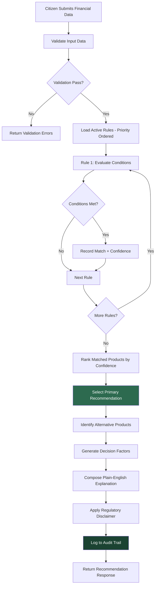

# Recommendation Engine Documentation

## AiB IAAS — Initial Application Advice Service

**Version:** 1.0
**Classification:** OFFICIAL
**Date:** August 2026
**Author:** AiB Digital Services

---

## 1. Business Purpose

The IAAS Recommendation Engine exists to provide citizens with consistent, auditable, and explainable guidance on which insolvency product best suits their financial circumstances. Prior to this system, citizens relied on disparate information sources and inconsistent advice pathways, leading to:

- Citizens entering inappropriate insolvency products, resulting in failed arrangements
- Inconsistent advice depending on which adviser or channel was used
- No audit trail of how recommendations were derived
- Difficulty for AiB in understanding recommendation patterns at a population level

The engine addresses these issues by applying a deterministic, rules-based approach that ensures every citizen with the same financial profile receives the same recommendation, with full transparency into the reasoning. The engine does not make decisions — it provides non-binding guidance that supports, rather than replaces, professional money advice and human judgement.

---

## 2. Decision Process



---

## 3. Rules Engine

The recommendation engine operates on a pure rules-based architecture with no machine learning components. This design choice ensures:

- **Determinism** — Same inputs always produce the same output
- **Explainability** — Every recommendation can be traced to specific rule conditions
- **Auditability** — Rules are versioned and changes require approval
- **Testability** — Rules can be validated against known scenarios before activation

### Rule Inventory

| Rule ID | Name | Priority | Status | Description |
|---------|------|----------|--------|-------------|
| R001 | Minimal Asset Process (MAP) | 1 | Active | Low debt, minimal assets, no surplus income |
| R002 | Full Administration Bankruptcy | 2 | Active | Higher debt or assets exceeding MAP thresholds |
| R003 | Protected Trust Deed | 3 | Active | Regular income, ability to make contributions |
| R004 | Debt Arrangement Scheme (DAS) | 4 | Active | Sustainable repayment capacity over extended period |
| R005 | Moratorium on Diligence | 5 | Active | Temporary breathing space while options assessed |
| R006 | Debt Payment Programme (DPP) | 6 | Active | Specific DAS sub-route for structured repayment |
| R007 | Signpost to Money Advice | 7 | Active | Insufficient data or borderline cases requiring human guidance |
| R008 | Enhanced MAP Assessment | 8 | Draft | Proposed expansion of MAP eligibility criteria |
| R009 | Composite Debt Solution | 9 | Draft | Multi-product recommendation for complex cases |

### Rule Structure

Each rule comprises:

- **Priority** — Integer determining evaluation order (lower = evaluated first)
- **Conditions** — Boolean expressions evaluated against input data
- **Actions** — Product assignment, confidence level, factor weighting
- **Version** — Semantic version with change history
- **Effective Date** — When the rule became/becomes active
- **Approval** — Senior officer sign-off required for activation

### Condition Evaluation

Rules are evaluated in strict priority order. All active rules are evaluated (not short-circuited) to enable alternative product identification. Conditions use standard comparison operators against validated input fields:

- Debt threshold comparisons (total debt above/below specified amounts)
- Income surplus calculations (income minus essential expenditure)
- Asset value assessments (property equity, vehicle value, savings)
- Employment status checks (employed, self-employed, unemployed, retired)
- Existing case checks (active moratorium, previous bankruptcy)
- Creditor count thresholds

---

## 4. Input Data

The engine requires the following data categories to generate a recommendation:

| Category | Fields | Required | Source |
|----------|--------|----------|--------|
| **Debt Profile** | Total unsecured debt, total secured debt, creditor count, debt types | Yes | Citizen declaration |
| **Income** | Employment income, benefits, other income, household income | Yes | Citizen declaration |
| **Expenditure** | Essential costs, discretionary spend, existing debt payments | Yes | Citizen declaration |
| **Assets** | Property (equity), vehicles, savings, investments, other assets | Yes | Citizen declaration |
| **Employment** | Status, duration, stability indicator | Yes | Citizen declaration |
| **Existing Cases** | Active moratorium, previous sequestration, active DAS | Yes | Integration checks (BASYS, DAS Register) |
| **Moratorium** | Active moratorium status, remaining duration | Conditional | Moratorium Register |

All input data is validated against Zod schemas shared between frontend and backend, ensuring type safety and constraint enforcement before the engine processes any data.

---

## 5. Output Data

The recommendation engine returns a structured response containing:

```json
{
  "recommendation": {
    "productId": "protected-trust-deed",
    "productName": "Protected Trust Deed",
    "confidence": 0.85,
    "confidenceLevel": "high"
  },
  "alternatives": [
    {
      "productId": "das-dpp",
      "productName": "Debt Arrangement Scheme",
      "confidence": 0.62,
      "confidenceLevel": "medium",
      "reason": "Repayment capacity exists but trust deed offers faster resolution"
    }
  ],
  "factors": [...],
  "explanation": "Based on your financial situation...",
  "evidenceSources": ["debt-profile", "income-assessment", "asset-valuation"],
  "disclaimer": "This recommendation is for guidance only...",
  "metadata": {
    "engineVersion": "1.4.2",
    "rulesEvaluated": 7,
    "evaluationTimeMs": 23,
    "timestamp": "2026-08-19T14:30:00.000Z"
  }
}
```

---

## 6. Confidence Scoring

Confidence scores indicate the engine's certainty that a product is appropriate for the citizen's circumstances. Scores are derived from how strongly the citizen's data matches the rule conditions and how many conditions are satisfied versus borderline.

| Confidence Level | Score Range | Interpretation | Typical Scenario |
|-----------------|-------------|----------------|------------------|
| **High** | 85–97% | Strong match; data clearly aligns with product criteria | All conditions met with significant margin |
| **Medium** | 55–75% | Reasonable match; some conditions borderline | Most conditions met; one or two near threshold |
| **Low** | 30–50% | Weak match; professional review strongly advised | Conditions barely met; significant uncertainty |

### Confidence Calculation

Confidence is calculated as a weighted average of condition-match strengths:

1. Each condition evaluates to a match strength (0.0 to 1.0) based on how far the actual value exceeds/meets the threshold
2. Conditions are weighted by their discriminatory importance for the product
3. The weighted average is scaled to the confidence band for the rule's priority

A recommendation is only surfaced if confidence exceeds 30%. Below this threshold, the "Signpost to Money Advice" fallback is triggered.

---

## 7. Alternative Products

The engine always identifies alternatives alongside the primary recommendation. This serves several purposes:

- Citizens understand the landscape of options available to them
- Money advisers can discuss alternatives during consultation
- If circumstances change slightly, the citizen knows what else may apply
- Transparency in the decision process builds trust

### Alternative Ranking

Alternatives are ranked by their confidence score (descending). A product appears as an alternative if:

1. Its confidence score is at least 30%
2. It is not the primary recommendation
3. It is a genuinely different product (not a sub-variant of the primary)

Each alternative includes a brief reason explaining why it was not the primary recommendation (e.g., "Repayment capacity exists but trust deed offers faster resolution").

---

## 8. Decision Factors

Six decision factors are evaluated and presented to explain the recommendation:

| Factor | Description | Weight | Impact Direction |
|--------|-------------|--------|-----------------|
| **Debt-to-Income Ratio** | Total debt relative to annual income | High | Higher ratio favours write-off products |
| **Surplus Income** | Monthly income minus essential expenditure | High | Positive surplus favours repayment products |
| **Asset Position** | Total realisable asset value | Medium | Higher assets may favour sequestration route |
| **Creditor Complexity** | Number and type of creditors | Medium | More creditors favour formal arrangements |
| **Employment Stability** | Job security and income reliability | Medium | Stable employment favours repayment products |
| **Existing Arrangements** | Active moratorium or previous insolvency | Low | Constrains which products are available |

Each factor is presented to the citizen with:
- A plain-English label
- Their specific value
- How it influenced the recommendation
- Whether it pushed toward or away from the recommended product

---

## 9. Explainability

The recommendation engine prioritises human-readable explanations. The "hero page" presented to citizens after recommendation generation includes:

### Citizen-Facing Explanation

- **What we recommend** — Product name in plain English with a one-sentence summary
- **Why this suits you** — 3-4 bullet points linking their specific data to the recommendation
- **What this means** — Practical implications (duration, payments, credit impact)
- **Other options** — Alternative products with brief suitability notes
- **What to do next** — Clear call to action (speak to adviser, proceed with application)

### Staff-Facing Explanation

Case officers and money advisers see an enhanced view including:
- Full factor breakdown with numerical scores
- Rule trace showing which rules fired and which did not
- Confidence calculation breakdown
- Historical comparison (how often this profile receives this recommendation)
- Override capability with mandatory reason recording

---

## 10. AI Governance

Although the engine uses rules rather than ML, it is governed under AiB's AI governance framework to ensure accountability and oversight.

### Oversight Dashboard

The AI governance dashboard provides:

- **Recommendation distribution** — Breakdown of recommendations by product, time period, and demographic
- **Bias monitoring** — Statistical analysis for demographic skew (age, region, gender where available)
- **Acceptance tracking** — Rate at which citizens proceed with recommendations vs. choose alternatives
- **Override audit** — All staff overrides with reasons, patterns, and frequency analysis
- **Confidence distribution** — Histogram of confidence scores to identify calibration drift

### Bias Monitoring

The system monitors for unintended bias by tracking recommendation distributions across:
- Geographic region (postcode area)
- Age band
- Referral source
- Time of day/week

Statistically significant deviations trigger alerts for human review. No automated remediation is applied without senior officer approval.

---

## 11. Rules Management

### Version Control

Every rule change is version-controlled with:
- Semantic versioning (major.minor.patch)
- Change description and justification
- Author and approver identity
- Effective date and optional expiry date
- Rollback capability to any previous version

### Change Approval Workflow

1. **Draft** — Rule author creates or modifies a rule (status: draft)
2. **Test** — Rule is validated against synthetic test scenarios
3. **Review** — Senior officer reviews change, impact assessment, and test results
4. **Approve** — Senior officer approves activation (or requests amendments)
5. **Activate** — Rule becomes active at specified effective date
6. **Monitor** — Post-activation monitoring for unexpected impact

### Interactive Rule Tester

The admin portal includes a rule testing interface where:
- Staff can input hypothetical scenarios and see which rules fire
- Impact of rule changes can be assessed against historical application data
- Edge cases can be explored without affecting live recommendations

---

## 12. Policy Simulation

### What-If Analysis

The platform supports policy simulation to assess the impact of proposed rule changes before activation:

- **Threshold adjustment** — "What if MAP debt limit increased from £25,000 to £30,000?"
- **New rule introduction** — "How many current applications would match the proposed composite debt rule?"
- **Rule removal** — "If we deactivate Rule R005, where do those citizens get redirected?"

### Impact Assessment

Policy simulations generate reports showing:
- Number of applications affected (historical data replay)
- Shift in recommendation distribution
- Confidence score changes for affected applications
- Potential operational impact (caseload redistribution)

---

## 13. Audit Trail

Every recommendation is logged with complete context for regulatory compliance and dispute resolution:

- Full input data snapshot (as provided at time of recommendation)
- Rules version set active at time of evaluation
- Every rule evaluated with pass/fail result and confidence contribution
- Final recommendation and alternatives
- Engine version and configuration
- Timestamp and correlation identifiers

Audit records are immutable and retained for 7 years. They enable complete reconstruction of any recommendation at any point in history, even if rules have since changed.

---

## 14. Regulatory Compliance

### Non-Binding Nature

Every recommendation carries a mandatory disclaimer:

> *"This recommendation is provided for guidance only and does not constitute financial or legal advice. It is based on the information you have provided and may not account for all aspects of your financial situation. You are strongly encouraged to speak with a qualified money adviser before making any decision about debt solutions. The Accountant in Bankruptcy does not guarantee the suitability of any product for your individual circumstances."*

### Human Review Requirement

- All recommendations are explicitly labelled as guidance, not decisions
- Citizens are directed to money advisers for professional consultation
- Staff override capability ensures human judgement can always prevail
- No automated action is taken based solely on a recommendation (e.g., no automatic application submission)

### Transparency Obligation

Under Scottish Government digital principles, the platform must:
- Explain how recommendations are derived (addressed via explainability features)
- Allow citizens to challenge recommendations (addressed via adviser referral)
- Maintain records of all automated decisions (addressed via audit trail)
- Demonstrate absence of discriminatory bias (addressed via governance dashboard)

---

## 15. Future AI Enhancements

Post-POC phases may introduce supervised machine learning capabilities, subject to full governance review:

1. **Predictive Analytics** — ML models trained on historical outcomes to predict arrangement completion likelihood, informing (not replacing) recommendations
2. **Natural Language Processing** — Automated analysis of uploaded financial documents to pre-populate application forms, reducing citizen burden
3. **Anomaly Detection** — ML-based identification of unusual application patterns that may indicate fraud or vulnerability
4. **Outcome Feedback Loop** — Tracking recommendation outcomes (did the arrangement succeed?) to inform rule refinement
5. **Conversational AI** — Guided chatbot for initial triage, helping citizens understand which information they need before starting an application
6. **Sentiment Analysis** — Monitoring citizen feedback and adviser notes to identify systemic issues with recommendations

All ML enhancements would operate under the same governance framework, with additional requirements for model explainability, bias testing, and human override capability.

---

*Document Control: This document is reviewed quarterly and updated following any rule change or engine modification.*
