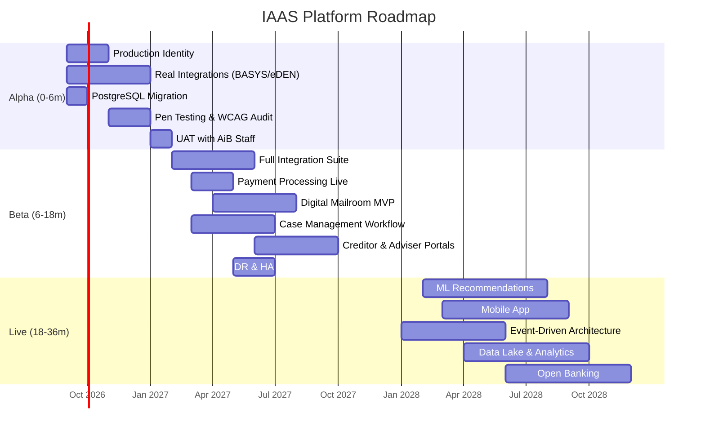

# IAAS Platform Roadmap

## POC Sprint Status

| Sprint | Focus | Status |
|--------|-------|--------|
| Sprint 1 | Core Platform — Forms, Services, Architecture | Complete |
| Sprint 2 | Integration — Credit Checks, Payments, Notifications | Complete |
| Sprint 3 | Admin Portal — Users, Orgs, RBAC, Digital Mailroom | Complete |
| Sprint 4 | Polish — Statistics, Security SOC, Correspondence, Search | Complete |
| Sprint 5 | Live Verification — PWA, Accessibility, Smoke Tests, API Docs | Complete |
| Sprint 6 | Scale & Security — MFA, Multi-language, Webhooks, API Keys | Complete |
| Sprint 7 | AI Showcase — Chatbot, Case Summary, Anomaly Detection, Quality Check, Predictions | Complete |
| Sprint 8 | Enterprise Polish — Account management, Data export, Batch processing, Admin hub (28 features) | Complete |
| Sprint 9 | Platform Completeness — Compliance, Training mode, Integration monitor, Performance metrics | Complete |
| Sprint 10 | Final Integration — Documentation suite, Demo readiness, Final polish | Complete |
| Sprint 11 | Alpha Preparation — Real identity provider (ScotAccount test), PostgreSQL migration | Planned |
| Sprint 12 | Integration Alpha — BASYS/eDEN test environment connections, GOV.UK Notify | Planned |
| Sprint 13 | UAT Readiness — Staff pilot onboarding, Accessibility audit, Pen test preparation | Planned |

---

## Overview

This roadmap outlines the evolution of IAAS from Proof of Concept through to a fully operational Enterprise Insolvency Platform. Capabilities are categorised into three horizons aligned with AiB's Digital Strategy 2026-2030.

---

## Near Term (0–6 Months) — Alpha / Private Beta

**Focus**: Stabilise core platform, connect real integrations, onboard pilot users.

| Capability | Description | Dependencies | Priority |
|-----------|-------------|--------------|----------|
| Production Identity Integration | Connect Keycloak to real ScotAccount + GOV.UK Login | Identity Provider agreements | Must |
| Real Credit Bureau Integration | Replace mock with Experian/Equifax sandbox then live | Data sharing agreement | Must |
| PostgreSQL Migration | Replace SQLite with managed PostgreSQL (AWS RDS) | Infrastructure provisioning | Must |
| BASYS Live Integration | Connect to real BASYS API for bankruptcy register lookups | AiB API gateway access | Must |
| eDEN Live Integration | Connect to real eDEN/DASH for DAS arrangement checks | eDEN team collaboration | Must |
| Document Storage (S3) | Replace local filesystem with AWS S3 + lifecycle policies | AWS account setup | Must |
| ClamAV Production Deployment | Deploy dedicated ClamAV cluster for virus scanning | Infrastructure | Should |
| Accessibility Audit | Full WCAG 2.1 AA audit with remediation | Accessibility specialist | Must |
| Penetration Testing | ITHC/pen test against production-candidate build | Security clearance | Must |
| Performance Testing | Load testing at 2x expected peak (500 concurrent users) | Test environment | Should |
| UAT with AiB Staff | Pilot with 5-10 case officers using real workflows | Training materials | Must |
| GOV.UK Notify Integration | Replace mock email with GOV.UK Notify for correspondence | GDS account | Should |
| Mobile Responsive Hardening | Ensure all screens work on 375px+ devices | UX testing | Should |
| CI/CD Pipeline Production | GitHub Actions → AWS ECS/Fargate deployment | AWS infrastructure | Must |

---

## Medium Term (6–18 Months) — Public Beta / Live

**Focus**: Full production deployment, advanced features, operational maturity.

| Capability | Description | Dependencies | Priority |
|-----------|-------------|--------------|----------|
| Full Integration Suite | All 6 AiB systems live (BASYS, eDEN, DAS, CFT, Moratorium, RoI) | Per-system agreements | Must |
| Payment Provider Integration | Real payment processing (GOV.UK Pay or equivalent) | Payment provider contract | Must |
| Digital Mailroom MVP | OCR via Azure Document Intelligence, basic NER, auto-routing | Azure AI Services | Should |
| Recommendation Engine v3 | Expand rules, add ML confidence calibration | Data science resource | Should |
| Case Management Workflow | Full case lifecycle management (assign, review, escalate, close) | Business process design | Must |
| Notification Service | Multi-channel alerts (email, SMS, in-app) via GOV.UK Notify | Notification preferences | Should |
| Reporting & Business Intelligence | Power BI / Grafana dashboards with real operational data | Data warehouse | Should |
| Creditor Portal | Self-service portal for creditors to submit/track claims | Creditor onboarding | Could |
| Money Adviser Portal | Dedicated workspace for authorised money advisers | Adviser registration | Should |
| Audit & Compliance Module | Full audit trail with tamper-proof logging, retention policies | Compliance review | Must |
| Disaster Recovery | Multi-AZ deployment, automated failover, RTO < 4h | AWS multi-AZ | Must |
| Service Level Management | SLA monitoring, automated alerting, escalation | Operations team | Should |
| Knowledge Hub Production | Full CMS with TinyMCE/ProseMirror, approval workflows | Content team | Could |
| API Catalogue (OpenAPI) | Published API documentation for third-party integrations | API governance | Should |

---

## Long Term (18–36 Months) — Enterprise Platform

**Focus**: Platform maturity, AI advancement, ecosystem expansion.

| Capability | Description | Dependencies | Priority |
|-----------|-------------|--------------|----------|
| Machine Learning Recommendations | Train models on historical case outcomes for predictive scoring | 2+ years case data | Could |
| Natural Language Processing | AI-powered document understanding beyond OCR/NER | Azure OpenAI / Claude | Could |
| Predictive Analytics | Forecast application volumes, processing bottlenecks, staffing needs | Data lake | Could |
| Digital Assistant / Chatbot | AI-powered citizen guidance before formal application | Conversational AI | Could |
| Omnichannel Support | Phone, chat, video, in-person with unified case context | Contact centre integration | Could |
| Mobile Native Application | iOS/Android app for citizens and advisers | Mobile development team | Could |
| Event-Driven Architecture | Replace polling with event bus (AWS EventBridge / Kafka) | Architecture evolution | Should |
| Data Lake & Analytics Platform | Centralised data platform for cross-system analytics | Data engineering | Should |
| Open Banking Integration | Automated income/expenditure from bank feeds (with consent) | Open Banking APIs | Could |
| Workflow Designer | Visual workflow builder for custom case processing rules | Low-code platform | Could |
| Partner API Ecosystem | Third-party integrations (debt charities, creditor systems) | API marketplace | Could |
| Enterprise Search | Elasticsearch-powered search across all case data | Search infrastructure | Should |
| Real-Time Collaboration | Multi-user case editing, comments, annotations | WebSocket infrastructure | Could |
| Automated Compliance Checking | Rules engine validates statutory compliance automatically | Legal team input | Should |
| Cross-Border Insolvency | Support for UK-wide cases (England/Wales/NI cooperation) | Legislative framework | Could |

---

## Roadmap Visualisation

---

## Success Metrics by Horizon

| Horizon | Key Metric | Target |
|---------|-----------|--------|
| Alpha | Successful end-to-end application submission | 100% of test scenarios pass |
| Alpha | Integration uptime (BASYS/eDEN) | > 95% |
| Beta | Citizen application completion rate | > 75% |
| Beta | Average processing time | < 5 working days |
| Beta | Auto-route accuracy (Digital Mailroom) | > 89% |
| Live | Recommendation acceptance rate | > 90% |
| Live | System availability | > 99.5% |
| Live | Citizen satisfaction (CSAT) | > 4.2/5.0 |

---

## Dependencies & Risks

| Risk | Mitigation | Owner |
|------|-----------|-------|
| Legacy system API availability | Early engagement with BASYS/eDEN teams; fallback to batch integration | Integration Lead |
| Identity provider onboarding delays | Parallel track: basic auth for Alpha, federated for Beta | Security Architect |
| Data migration complexity | Incremental migration with dual-running period | Data Engineer |
| Staff adoption resistance | Early UAT involvement, change management programme | Delivery Manager |
| Regulatory changes | Modular rules engine allows rapid policy updates | Policy Manager |
| Funding constraints | Phased delivery with clear value gates per horizon | Product Owner |

---

## Related Documents

- [Executive Summary](./executive-summary.md)
- [Options Analysis](./options-analysis.md)
- [Architecture](./architecture.md)
- [Business Requirements](./business-requirements.md)
