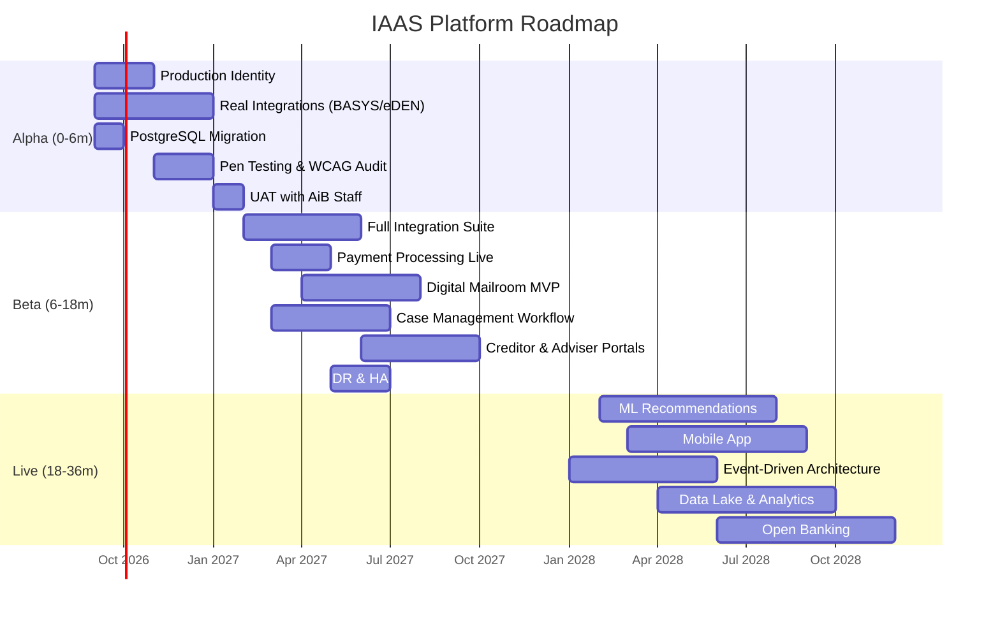

# IAAS Platform Roadmap

## POC Sprint Status

| Sprint | Focus | Status |
|--------|-------|--------|
| Sprint 1 | Core Platform — Forms, Services, Architecture | Complete |
| Sprint 2 | Integration — Credit Checks, Payments, Notifications | Complete |
| Sprint 3 | Admin Portal — Users, Orgs, RBAC, Digital Mailroom | Complete |
| Sprint 4 | Polish — Statistics, Security SOC, Correspondence, Search | Complete |
| Sprint 5 | Live Verification — PWA, Accessibility, Smoke Tests, API Docs | Complete |
| Sprint 6 | Scale & Security — MFA, Multi-language, Webhooks, API Keys | Complete |
| Sprint 7 | AI Showcase — Chatbot, Case Summary, Anomaly Detection, Quality Check, Predictions | Complete |
| Sprint 8 | Enterprise Polish — Account management, Data export, Batch processing, Admin hub (28 features) | Complete |
| Sprint 9 | Platform Completeness — Compliance, Training mode, Integration monitor, Performance metrics | Complete |
| Sprint 10 | Final Integration — Documentation suite, Demo readiness, Final polish | Complete |
| Sprint 11 | Test & Document — 102 new tests (423 total), onboarding guide, demo script, functionality breakdown | Complete |
| Sprint 12 | Operational Excellence — 78 Playwright regression tests (501 total), runbooks, security scan, load test, DR plan | Complete |
| Sprint 13 | Handover & Scale — ADRs, cost model, team scaling, vendor assessment, go-live checklist, API SDK guide | Complete |
| Sprint 14 | Stakeholder Value — Workflow engine, MI reports, secure messages, integration monitor, correspondence scheduler. Creditor portal and adviser workspace delivered as **interface demonstrations only** (synthetic data, no API calls, several controls disabled) — the working capability remains a Medium Term item below | Complete |
| Phase 14 | Organisation Service — Shared master data, creditor type-ahead, 54 seeded organisations across 8 types | Complete |
| Sprint 15 | Quality Assurance & Link Integrity — E2E link audit, basePath validation, navigation regression tests | Complete |
| Sprint 16 | Documentation Alignment — Sprint logs, roadmap, testing docs, README updated to current state | Complete |
| Sprint 17 | Test Infrastructure Expansion — 10 new link audit E2E scenarios, 658+ tests across 48 files | Complete |
| Sprint 18 | .NET Backend — .NET 9 Web API, MediatR/CQS, 11 endpoint modules, EF Core dual SQLite/PostgreSQL, Swagger, health checks | Complete |
| Sprint 19 | Enterprise Persistence — Neon PostgreSQL, programmatic 14-table schema, seed scripts, pooled SSL connection, one-command init | Complete |
| Sprint 20 | Live Deployment — .NET API on Render via Docker, dynamic PORT, Npgsql connection conversion, snake_case EF mapping, soft-delete/concurrency fields | Complete |
| Sprint 21 | Data Comes Alive — 100 seeded applications (SQLite + Neon), live search, wired case actions, backend toggle (Node/.NET/Mock) | Complete |
| Sprint 22 | Demo Enhancement — auto-scroll demo orchestration, sequential debts/assets/documents reveals, live recommendation, payment and PDF steps | Complete |
| Sprint 23 | Admin Functionality — report builder, user creation wired to API, editable data retention policies, dev docs C4 diagram | Complete |
| Sprint 24 | Interactive Admin — activity heatmap with drill-down, canvas digital signature with audit log, statistics time period filters | Complete |
| Sprint 25 | Polish & Safety — real logged-in admin user, health-checked backend selector, data export rewrite with search/sort/CSV/PDF | Complete |
| Sprint 26 | Real-Time & Notifications — toast system, notification bell with unread count, 30s dashboard auto-refresh, notifications polling hook | Complete |
| Sprint 27 | Casework Workflow — batch select with batch approve/reject, SLA timer column, select-all header | Complete |
| Sprint 28 | Production Polish — loading skeleton variants, API error boundary with retry, offline banner, service worker caching, useApiCall hook | Complete |
| Sprint 29 | Enterprise Showcase — API versioning page, monitoring and observability page (uptime monitors, tracing, alert history) | Complete |
| Sprint 30 | Security Remediation — close the 10 findings in `docs/security-known-gaps.md` (3 Critical, 4 High, 2 Medium, 1 Low) | **Planned — next sprint** |

---

## Overview

This roadmap outlines the evolution of IAAS from Proof of Concept through to a fully operational Enterprise Insolvency Platform. Capabilities are categorised into three horizons aligned with AiB's Digital Strategy 2026-2030.

---

## Sprint 30 (Next Sprint) — Security Remediation

**Focus**: Close the gap between the POC implementation and the documented security case.

An internal static code review on 24 August 2026 identified 10 security findings in the POC
codebase — 3 Critical, 4 High, 2 Medium, 1 Low — recorded in full with file-and-line evidence
in [Security Known Gaps](./security-known-gaps.md). An eleventh, GAP-011, was added on
25 August 2026: role-permission grants were defined three times over in the seed code and the
three copies disagreed, leaving three roles with no permissions on SQLite and every role with
none on PostgreSQL. The seeding and permission-vocabulary defects are already fixed; what
remains in this sprint is the modelling work in stage 2. Ten of the eleven block production.

GAP-011 is sequenced ahead of GAP-002 deliberately. Switching on default-deny while the grant
data is wrong produces a lockout rather than a security improvement, and the instinctive
response to a lockout — relaxing the check to restore access — ends up worse than having no
check at all.

**No real data is at risk today.** The POC operates exclusively on synthetic seed data, so the
confidentiality impact of every finding is currently theoretical. The findings are the distance
between a demonstration build and a service that could be trusted with OFFICIAL-SENSITIVE
information. **Every "Blocks production: Yes" finding must be closed before any environment
holds real debtor data.**

The sequencing below follows the dependency order in the register — fixing these in the wrong
order produces a false sense of progress, because authorisation cannot be trusted until
identity is.

| Stage | Ref | Capability | Severity | Priority |
|-------|-----|-----------|----------|----------|
| 1 | GAP-001 | Replace unsigned base64 tokens with signed JWTs (RS256/EdDSA), verified on every request | Critical | Must |
| 1 | GAP-003 | Verify passwords with Argon2id/bcrypt (cost ≥ 12); reject when no hash is stored | Critical | Must |
| 1 | GAP-007 | Integrate a real identity provider and enforce MFA as IdP policy | High | Must |
| 2 | GAP-011 | Model `documents.*` and `credit_check.*` permissions; drive the `/admin/users` RBAC matrix from the API rather than a hardcoded mock | Medium | Must |
| 2 | GAP-002 | Apply `authenticate` + `requirePermission` to every deployed route; default-deny | Critical | Must |
| 3 | GAP-005 | Add resource ownership checks on all application routes, including approve/reject | High | Must |
| 3 | GAP-006 | Derive audit actor from the verified token, not the request body; make ingestion internal | High | Must |
| 4 | GAP-008 | Per-account login rate limit, lockout with backoff, CAPTCHA friction | Medium | Must |
| 4 | GAP-010 | Server-side session validation on every request; short access-token lifetime | Low | Should |
| 5 | GAP-004 | Deploy real malware scanning; fail closed on `scanned: false` | High | Must |
| 5 | GAP-009 | Wire `packages/validation` Zod schemas into the request path as middleware | Medium | Must |

**Exit criteria**

| Criterion | Target |
|-----------|--------|
| Regression tests | One negative test per finding (tampered token rejected, wrong password rejected, 401 on every route unauthenticated, user A cannot read user B's application, token rejected after logout) |
| CI enforcement | Route-coverage assertion fails the build if a mounted router has no auth middleware, or a handler reads `req.body` without a validator |
| Re-review | Static re-review against source after stages 1–3, before any environment is loaded with real debtor data |
| Documentation | Security case documents reconciled to the delivered state; register updated to `Closed` per finding with the commit that closed it |

**Dependencies**: Identity provider agreement for GAP-007 (shared with the Near Term
"Production Identity Integration" item below — that item is the production-grade version of
this fix, and this sprint should adopt its target design rather than build a throwaway).

---

## Near Term (0–6 Months) — Alpha / Private Beta

**Focus**: Stabilise core platform, connect real integrations, onboard pilot users.

| Capability | Description | Dependencies | Priority |
|-----------|-------------|--------------|----------|
| Security Findings Closure | All 10 findings in [security-known-gaps.md](./security-known-gaps.md) closed and re-reviewed. **Hard gate: no environment may hold real debtor data until the nine production-blocking findings are closed.** | Sprint 30 | Must |
| Production Identity Integration | Connect Keycloak to real ScotAccount + GOV.UK Login. Supersedes the POC's local password path entirely (closes GAP-001, GAP-003, GAP-007 at production grade) | Identity Provider agreements | Must |
| Real Credit Bureau Integration | Replace mock with Experian/Equifax sandbox then live | Data sharing agreement | Must |
| PostgreSQL Migration | Replace SQLite with managed PostgreSQL (AWS RDS) | Infrastructure provisioning | Must |
| BASYS Live Integration | Connect to real BASYS API for bankruptcy register lookups | AiB API gateway access | Must |
| eDEN Live Integration | Connect to real eDEN/DASH for DAS arrangement checks | eDEN team collaboration | Must |
| Document Storage (S3) | Replace local filesystem with AWS S3 + lifecycle policies | AWS account setup | Must |
| ClamAV Production Deployment | Deploy dedicated ClamAV cluster for virus scanning | Infrastructure | Should |
| Accessibility Audit | Full WCAG 2.1 AA audit with remediation | Accessibility specialist | Must |
| Penetration Testing | Fresh ITHC/pen test against production-candidate build, scoped against the **deployed** topology. The August 2026 engagement tested a staging topology that differed from what deploys, which is why it missed the Critical findings — scope must be verified against `render.yaml` | Security clearance; Sprint 30 complete | Must |
| Performance Testing | Load testing at 2x expected peak (500 concurrent users) | Test environment | Should |
| UAT with AiB Staff | Pilot with 5-10 case officers using real workflows | Training materials | Must |
| GOV.UK Notify Integration | Replace mock email with GOV.UK Notify for correspondence | GDS account | Should |
| Mobile Responsive Hardening | Ensure all screens work on 375px+ devices | UX testing | Should |
| CI/CD Pipeline Production | GitHub Actions → AWS ECS/Fargate deployment | AWS infrastructure | Must |

---

## Medium Term (6–18 Months) — Public Beta / Live

**Focus**: Full production deployment, advanced features, operational maturity.

| Capability | Description | Dependencies | Priority |
|-----------|-------------|--------------|----------|
| Full Integration Suite | All 6 AiB systems live (BASYS, eDEN, DAS, CFT, Moratorium, RoI) | Per-system agreements | Must |
| Payment Provider Integration | Real payment processing (GOV.UK Pay or equivalent) | Payment provider contract | Must |
| Digital Mailroom MVP | OCR via Azure Document Intelligence, basic NER, auto-routing | Azure AI Services | Should |
| Recommendation Engine v3 | Expand rules, add ML confidence calibration | Data science resource | Should |
| Case Management Workflow | Full case lifecycle management (assign, review, escalate, close) | Business process design | Must |
| Notification Service | Multi-channel alerts (email, SMS, in-app) via GOV.UK Notify | Notification preferences | Should |
| Reporting & Business Intelligence | Power BI / Grafana dashboards with real operational data | Data warehouse | Should |
| Creditor Portal — working build-out | Replace the POC interface demonstration with real capability: claim submission wired to the API, proposal voting, dividend data from the case record, and record-level scoping so a creditor sees only its own cases. Needs a `claims` resource and `claims.*` permissions, neither of which exists today | Creditor onboarding, GAP-005 closed | Should |
| Money Adviser Portal — working build-out | Replace the POC interface demonstration with real capability: client caseload from the API, create-client, and submit-on-behalf carrying client context plus a declaration of authority (see UC-09) | Adviser registration, GAP-002/GAP-005 closed | Should |
| Audit & Compliance Module | Full audit trail with tamper-proof logging, retention policies | Compliance review | Must |
| Disaster Recovery | Multi-AZ deployment, automated failover, RTO < 4h | AWS multi-AZ | Must |
| Service Level Management | SLA monitoring, automated alerting, escalation | Operations team | Should |
| Knowledge Hub Production | Full CMS with TinyMCE/ProseMirror, approval workflows | Content team | Could |
| API Catalogue (OpenAPI) | Published API documentation for third-party integrations | API governance | Should |

---

## Long Term (18–36 Months) — Enterprise Platform

**Focus**: Platform maturity, AI advancement, ecosystem expansion.

| Capability | Description | Dependencies | Priority |
|-----------|-------------|--------------|----------|
| Machine Learning Recommendations | Train models on historical case outcomes for predictive scoring | 2+ years case data | Could |
| Natural Language Processing | AI-powered document understanding beyond OCR/NER | Azure OpenAI / Claude | Could |
| Predictive Analytics | Forecast application volumes, processing bottlenecks, staffing needs | Data lake | Could |
| Digital Assistant / Chatbot | AI-powered citizen guidance before formal application | Conversational AI | Could |
| Omnichannel Support | Phone, chat, video, in-person with unified case context | Contact centre integration | Could |
| Mobile Native Application | iOS/Android app for citizens and advisers | Mobile development team | Could |
| Event-Driven Architecture | Replace polling with event bus (AWS EventBridge / Kafka) | Architecture evolution | Should |
| Data Lake & Analytics Platform | Centralised data platform for cross-system analytics | Data engineering | Should |
| Open Banking Integration | Automated income/expenditure from bank feeds (with consent) | Open Banking APIs | Could |
| Workflow Designer | Visual workflow builder for custom case processing rules | Low-code platform | Could |
| Partner API Ecosystem | Third-party integrations (debt charities, creditor systems) | API marketplace | Could |
| Enterprise Search | Elasticsearch-powered search across all case data | Search infrastructure | Should |
| Real-Time Collaboration | Multi-user case editing, comments, annotations | WebSocket infrastructure | Could |
| Automated Compliance Checking | Rules engine validates statutory compliance automatically | Legal team input | Should |
| Cross-Border Insolvency | Support for UK-wide cases (England/Wales/NI cooperation) | Legislative framework | Could |

---

## Roadmap Visualisation

---

## Success Metrics by Horizon

| Horizon | Key Metric | Target |
|---------|-----------|--------|
| Alpha | Successful end-to-end application submission | 100% of test scenarios pass |
| Alpha | Integration uptime (BASYS/eDEN) | > 95% |
| Beta | Citizen application completion rate | > 75% |
| Beta | Average processing time | < 5 working days |
| Beta | Auto-route accuracy (Digital Mailroom) | > 89% |
| Live | Recommendation acceptance rate | > 90% |
| Live | System availability | > 99.5% |
| Live | Citizen satisfaction (CSAT) | > 4.2/5.0 |

---

## Dependencies & Risks

| Risk | Mitigation | Owner |
|------|-----------|-------|
| Legacy system API availability | Early engagement with BASYS/eDEN teams; fallback to batch integration | Integration Lead |
| Identity provider onboarding delays | Parallel track: basic auth for Alpha, federated for Beta | Security Architect |
| Data migration complexity | Incremental migration with dual-running period | Data Engineer |
| Staff adoption resistance | Early UAT involvement, change management programme | Delivery Manager |
| Regulatory changes | Modular rules engine allows rapid policy updates | Policy Manager |
| Funding constraints | Phased delivery with clear value gates per horizon | Product Owner |

---

## Related Documents

- [Executive Summary](./executive-summary.md)
- [Options Analysis](./options-analysis.md)
- [Architecture](./architecture.md)
- [Business Requirements](./business-requirements.md)
- [Security Known Gaps](./security-known-gaps.md) — findings register driving Sprint 30
- [Go-Live Checklist](./go-live-checklist.md) — security items reconciled against the register
