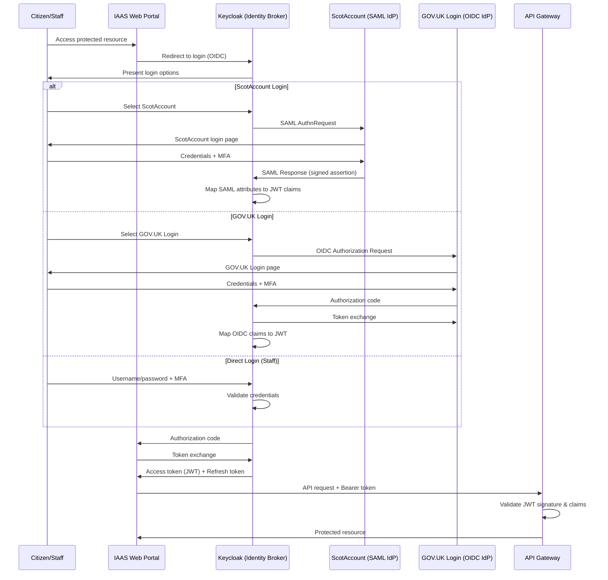
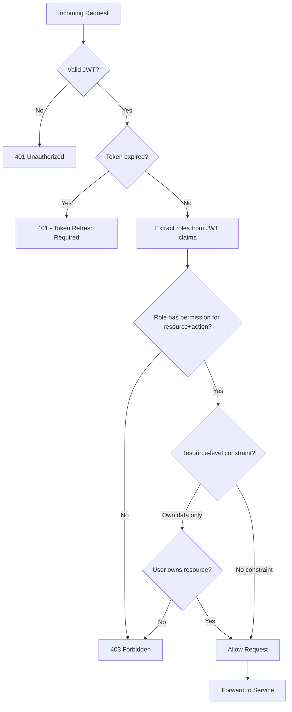

# Security Architecture Document

## AiB IAAS — Initial Application Advice Service

**Version:** 1.0
**Classification:** OFFICIAL
**Date:** August 2026
**Author:** AiB Digital Services

---

## 1. Security Architecture Overview

The AiB IAAS platform implements a defence-in-depth security architecture aligned with zero trust principles. Security controls are applied at every layer of the technology stack, from network perimeter through to application logic and data storage. The architecture recognises that no single security control is infallible and therefore employs overlapping, complementary controls to protect citizen data and ensure service integrity.

### Design Principles

- **Defence in Depth** — Multiple independent security layers ensure that compromise of any single control does not expose the system
- **Least Privilege** — Every user, service, and process operates with the minimum permissions required
- **Zero Trust Alignment** — No implicit trust based on network location; every request is authenticated and authorised
- **Secure by Default** — All components ship with restrictive configurations; access must be explicitly granted
- **Audit Everything** — All security-relevant events are logged with tamper-proof integrity
- **Data Minimisation** — Only data strictly necessary for the service function is collected and retained

---

## 2. Identity Architecture

The identity architecture uses Keycloak as a central identity broker, federating with ScotAccount (SAML 2.0) and GOV.UK Login (OpenID Connect) to provide citizens with familiar, trusted authentication paths.



### Token Management

| Token Type | Lifetime | Storage | Refresh |
|-----------|----------|---------|---------|
| Access Token (JWT) | 15 minutes | Memory only | Via refresh token |
| Refresh Token | 8 hours | HttpOnly secure cookie | Rotation on use |
| ID Token | 15 minutes | Memory only | Not refreshed |
| Session Cookie | 8 hours | HttpOnly, Secure, SameSite=Strict | Sliding window |

---

## 3. Authentication

### Login Flows

The platform supports three authentication paths:

1. **ScotAccount Federation (SAML 2.0)** — Primary path for Scottish citizens who already hold a ScotAccount identity. Single sign-on means users authenticate once and gain access to multiple Scottish Government services.

2. **GOV.UK Login Federation (OIDC)** — Alternative path for UK citizens who prefer their GOV.UK Login credentials. Implemented via standard OpenID Connect authorization code flow with PKCE.

3. **Direct Keycloak Authentication** — Used by AiB staff and money advisers who are provisioned directly within the Keycloak realm. Supports organisational directory integration via LDAP/AD.

### Multi-Factor Authentication (MFA)

MFA is enforced for all user roles. The platform supports three second-factor methods:

| Method | Implementation | Use Case |
|--------|---------------|----------|
| TOTP | RFC 6238, 30-second window | Primary — authenticator apps |
| SMS OTP | 6-digit code, 5-minute expiry | Fallback for accessibility |
| WebAuthn/FIDO2 | Platform/roaming authenticators | Strongest — hardware keys, biometrics |

Staff accounts (system_admin, aib_senior_officer, aib_case_officer, cyberops_analyst) require WebAuthn or TOTP; SMS-only is not permitted for privileged roles.

### Session Management

- Sessions are bound to client IP and user-agent fingerprint
- Idle timeout: 30 minutes
- Absolute timeout: 8 hours
- Concurrent session limit: 3 per user
- Session revocation propagates across all services within 60 seconds

---

## 4. Authorisation / RBAC

The platform implements role-based access control with 9 defined roles. Authorisation decisions are enforced at the API Gateway layer before requests reach downstream services.



### Permission Matrix

| Role | Applications | Recommendations | Documents | Users | Reports | Audit Logs | Rules | System Config |
|------|-------------|----------------|-----------|-------|---------|------------|-------|---------------|
| **system_admin** | View | View | View | CRUD | View/Export | View | View | CRUD |
| **aib_senior_officer** | View/Approve/Reject | View/Override | View/Download | View | View/Export | View | Edit/Approve | View |
| **aib_case_officer** | View/Edit/Assign | View | View/Download/Upload | — | View | View (own) | View | — |
| **money_adviser** | Create/View/Edit (own clients) | View (own) | Upload/View (own) | — | View (own) | — | — | — |
| **creditor** | View (relevant) | — | View (relevant) | — | View (own) | — | — | — |
| **supplier_trustee** | View (assigned) | View (assigned) | View/Upload (assigned) | — | View (assigned) | — | — | — |
| **debtor** | Create/View/Edit (own) | View (own) | Upload/View (own) | — | — | — | — | — |
| **statistician** | — | View (anonymised) | — | — | View/Export (anonymised) | — | — | — |
| **cyberops_analyst** | — | — | — | View | View (security) | View/Export | — | View |

*CRUD = Create, Read, Update, Delete*

### Role Hierarchy and Inheritance

Roles do not inherit permissions from other roles. Each role has an explicitly defined permission set to prevent privilege escalation through role composition. A user may hold multiple roles where business requirements demand it (e.g., an AiB officer who also performs statistical analysis), but dual-role assignments require senior officer approval.

---

## 5. Security Controls

| Control | Implementation | Layer | Configuration |
|---------|---------------|-------|---------------|
| HTTP Security Headers | Helmet.js middleware | Application | CSP, HSTS, X-Frame-Options, X-Content-Type-Options |
| CORS | Express CORS middleware | Application | Allowlist of permitted origins |
| Rate Limiting | express-rate-limit | Application | 100 requests per 15-minute window per IP |
| Input Validation | Zod schemas (shared FE/BE) | Application | Strict type coercion, max lengths, pattern matching |
| Virus Scanning | ClamAV integration | Infrastructure | All uploaded files scanned before storage |
| Transport Security | HTTPS/TLS 1.3 | Network | Certificate managed via Let's Encrypt / AWS ACM |
| CSRF Protection | Double-submit cookie pattern | Application | SameSite=Strict + CSRF token validation |
| SQL Injection Prevention | Parameterised queries | Data | No raw SQL string concatenation |
| XSS Prevention | React auto-escaping + CSP | Application | Strict CSP with nonce-based script allowlisting |
| Dependency Scanning | npm audit + Snyk | CI/CD | Automated on every PR, blocking on high/critical |
| Secret Management | Environment variables / Vault | Infrastructure | No secrets in source code or container images |
| Container Security | Distroless base images | Infrastructure | Non-root execution, read-only filesystem |

---

## 6. Audit Model

### What is Logged

Every security-relevant action generates an audit event. The following categories are captured:

- **Authentication events** — Login success/failure, MFA challenge, session creation/destruction
- **Authorisation events** — Permission grants, denials, role changes
- **Data access** — Who viewed which application, when, from where
- **Data modification** — All create/update/delete operations with before/after state
- **Administrative actions** — User provisioning, role assignment, configuration changes
- **Recommendation events** — Every recommendation generated, overrides applied, reasons given
- **Document events** — Upload, download, deletion, virus scan results

### Audit Event Schema

```json
{
  "eventId": "uuid-v4",
  "timestamp": "2026-08-19T10:30:00.000Z",
  "eventType": "APPLICATION_VIEWED",
  "actor": {
    "userId": "uuid",
    "role": "aib_case_officer",
    "sessionId": "uuid",
    "ipAddress": "192.168.1.100",
    "userAgent": "Mozilla/5.0..."
  },
  "resource": {
    "type": "application",
    "id": "APP-2026-001234",
    "action": "view"
  },
  "outcome": "success",
  "metadata": {
    "correlationId": "uuid",
    "serviceOrigin": "api-gateway",
    "durationMs": 45
  }
}
```

### Retention and Tamper-Proofing

- Audit logs are retained for 7 years in compliance with Scottish Government records management policy
- Logs are written to append-only storage; no service account has delete permissions
- Cryptographic hash chaining ensures tamper detection (each event includes the hash of the previous event)
- Logs are replicated to a separate security account inaccessible to application administrators

---

## 7. Threat Model — STRIDE Analysis

| Threat Category | Threat | Impact | Mitigation |
|----------------|--------|--------|------------|
| **Spoofing** | Attacker impersonates a citizen using stolen credentials | High — Unauthorised access to application data | MFA enforcement, session binding, anomaly detection |
| **Tampering** | Modification of application data in transit | High — Incorrect recommendations, financial harm | TLS 1.3, request signing, input validation, audit trail |
| **Repudiation** | Staff member denies approving/rejecting application | Medium — Accountability gap | Comprehensive audit logging with cryptographic integrity |
| **Information Disclosure** | Database exfiltration via SQL injection or misconfigured access | Critical — Bulk PII exposure | Parameterised queries, network segmentation, encryption at rest |
| **Denial of Service** | Volumetric attack overwhelming API Gateway | High — Service unavailability | Rate limiting, WAF, auto-scaling, CDN absorption |
| **Elevation of Privilege** | Attacker exploits RBAC flaw to gain admin access | Critical — Full system compromise | Explicit permission model, no role inheritance, principle of least privilege |

---

## 8. OWASP Top 10 Alignment

| # | Vulnerability | Mitigation in IAAS |
|---|--------------|-------------------|
| A01 | Broken Access Control | RBAC enforced at API Gateway; resource ownership validation; CORS strict mode |
| A02 | Cryptographic Failures | TLS 1.3 in transit; AES-256 at rest; no sensitive data in URLs or logs |
| A03 | Injection | Zod input validation; parameterised queries; CSP headers; React auto-escaping |
| A04 | Insecure Design | Threat modelling; security review in Definition of Done; abuse case testing |
| A05 | Security Misconfiguration | Helmet defaults; automated configuration scanning; infrastructure as code |
| A06 | Vulnerable Components | Automated dependency scanning (Snyk); npm audit in CI; patch SLA <72h critical |
| A07 | Authentication Failures | Keycloak (battle-tested); MFA mandatory; account lockout after 5 failures |
| A08 | Software and Data Integrity | Signed container images; CI/CD pipeline integrity; hash-chained audit logs |
| A09 | Logging and Monitoring | Structured audit logging; real-time alerting; SOC dashboard; 7-year retention |
| A10 | Server-Side Request Forgery | Allowlist for outbound requests; no user-controlled URLs in server-side fetches |

---

## 9. GDPR / Data Protection

### Data Minimisation

The platform collects only data strictly required for the insolvency recommendation process. Fields are categorised as:

- **Essential** — Required for recommendation (debt totals, income, expenditure)
- **Supporting** — Improves recommendation quality (employment status, asset details)
- **Optional** — User-volunteered context (additional notes)

No data beyond these categories is requested or stored.

### Consent Management

- Explicit consent captured at application start with granular options
- Consent records stored with timestamp, version of privacy notice shown, and IP address
- Consent is freely withdrawable; withdrawal triggers data minimisation workflow

### Right to Erasure

- Citizens may request erasure via their account or by contacting AiB
- Erasure is processed within 30 days (regulatory maximum)
- Statutory retention obligations override erasure requests where legally required (e.g., completed insolvency cases retained for 7 years)
- Erasure is logged in audit trail (without identifying the erased data)

### Data Retention Schedule

| Data Category | Retention Period | Legal Basis |
|--------------|-----------------|-------------|
| Active applications | Duration of case + 7 years | Legal obligation |
| Completed cases | 7 years from closure | Legal obligation |
| Abandoned applications | 6 months from last activity | Legitimate interest |
| Audit logs | 7 years | Legal obligation |
| Session data | 24 hours | Legitimate interest |
| Analytics (anonymised) | Indefinite | Public task |

---

## 10. Cyber Resilience

### Security Operations Dashboard

The cyberops_analyst role has access to a dedicated security operations dashboard providing:

- **Real-time threat indicators** — Failed authentication attempts, rate limit breaches, suspicious access patterns
- **User activity monitoring** — Concurrent sessions, geographic anomalies, privilege usage
- **System health** — Service availability, certificate expiry, dependency vulnerability status
- **Incident timeline** — Correlated security events with investigation tools

### Incident Response

The platform follows a structured incident response process:

1. **Detection** — Automated alerting from monitoring systems or manual report
2. **Triage** — Severity classification (P1-P4) based on data impact and service availability
3. **Containment** — Automated session revocation, service isolation, rate limit escalation
4. **Investigation** — Audit log analysis, correlation, root cause identification
5. **Recovery** — Service restoration, data integrity verification, communication
6. **Lessons Learned** — Post-incident review within 5 working days

### Security Monitoring

- Failed login attempts trigger progressive response (lockout at 5, alert at 3)
- Geographic impossibility detection (login from two distant locations within travel-impossible timeframe)
- Privilege escalation detection (role changes trigger immediate review)
- Data exfiltration indicators (bulk export, unusual query patterns)

---

## 11. Zero Trust Alignment

The IAAS architecture aligns with NCSC Zero Trust principles:

| Zero Trust Principle | IAAS Implementation |
|---------------------|---------------------|
| Know your architecture | Full service catalogue; documented data flows; infrastructure as code |
| Know your user/service identities | Keycloak identity broker; service-to-service mTLS; no anonymous access |
| Assess user behaviour | Session binding; anomaly detection; progressive authentication |
| Know the health of devices | (Future) Device posture assessment via Keycloak device policy |
| Use policies to authorise requests | RBAC at API Gateway; every request evaluated against policy |
| Authenticate and authorise everywhere | No trusted network zones; internal services require valid tokens |
| Focus monitoring on users/services | Comprehensive audit logging; user-centric security dashboard |
| Don't trust the network | TLS everywhere; no reliance on network perimeter for security |

---

## 12. Future Security Enhancements

The following security capabilities are planned for post-POC phases:

1. **Web Application Firewall (WAF)** — AWS WAF or Cloudflare WAF for Layer 7 protection, bot management, and virtual patching
2. **SIEM Integration** — Splunk or Azure Sentinel for cross-system correlation and advanced threat detection
3. **Automated Penetration Testing** — DAST integration in CI/CD pipeline using OWASP ZAP in automated mode
4. **Device Posture Assessment** — Endpoint compliance checking before granting access to sensitive resources
5. **Privileged Access Management** — Just-in-time access for administrative functions with time-bound elevation
6. **Data Loss Prevention** — Content inspection for outbound data, preventing accidental PII exposure
7. **Certificate Transparency Monitoring** — Alert on unauthorised certificate issuance for IAAS domains
8. **Supply Chain Security** — SBOM generation, Sigstore signing, SLSA Level 3 build provenance

---

*Document Control: This document is reviewed quarterly and updated following any significant architecture change or security incident.*
