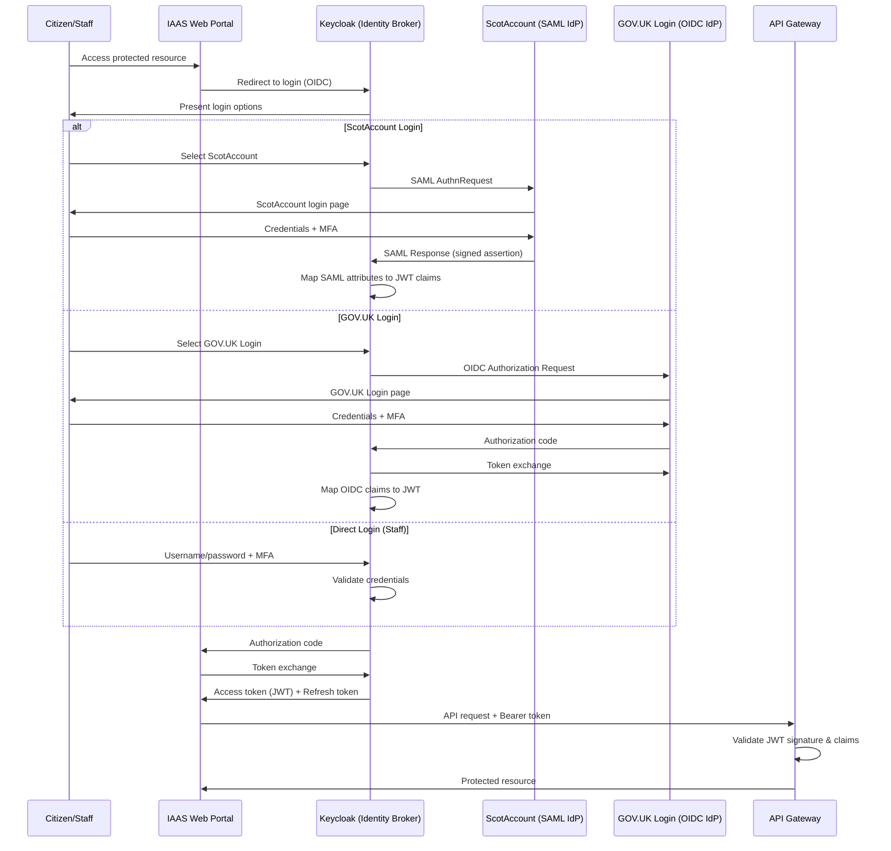
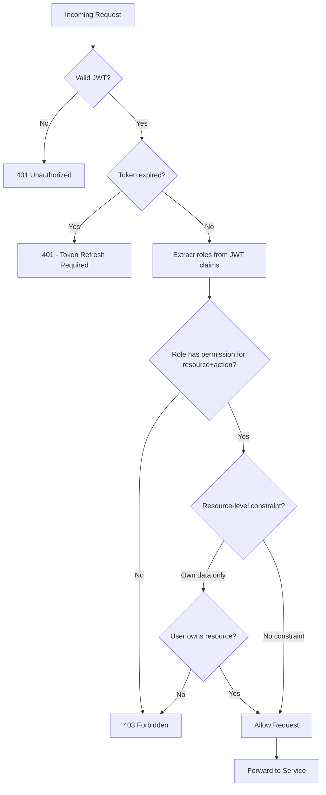

# Security Architecture Document

## AiB IAAS — Initial Application Advice Service

**Version:** 1.1
**Classification:** OFFICIAL
**Date:** August 2026 (v1.0); revised 24 August 2026 (v1.1)
**Author:** AiB Digital Services

---

> ## ⚠️ STATUS: TARGET-STATE ARCHITECTURE — NOT A DESCRIPTION OF THE POC AS BUILT
>
> **This document describes the intended production security architecture for IAAS. The
> system it describes is a proof of concept operating exclusively on synthetic data, and the
> majority of the controls described here are TARGET STATE — designed and specified, but not
> implemented in the POC codebase.**
>
> An internal static code review on 24 August 2026 identified **three Critical and four High**
> findings in the deployed source. In particular, and contrary to the descriptions in sections
> 2, 3, and 4 below:
>
> - There is **no Keycloak integration** and **no MFA** of any kind (§2, §3).
> - Tokens are **unsigned base64 JSON**, not signed JWTs; signatures are never verified (§2).
> - Login **accepts any password** (§3).
> - The deployed service applies **no authorisation checks to any route** (§4).
> - Audit records are **unauthenticated and forgeable**; hash chaining is not implemented (§6).
>
> **`docs/security-known-gaps.md` is authoritative on what the code does today.** Where it and
> this document disagree, the register is correct.
>
> Sections are marked with their implementation status. Controls verified as genuinely
> implemented — notably universal query parameterisation, CORS restriction, upload limits, and
> secret hygiene — are identified as such in §5, so this document remains usable as both a
> design specification and an honest statement of the delivered baseline.
>
> No real personal data is exposed today, because the POC holds none. The Critical and High
> findings are blockers for any environment holding real debtor data.

---

## 1. Security Architecture Overview

> 🎯 **TARGET STATE.** The principles below are the design intent. Two are materially not met
> by the POC: **"Zero Trust Alignment — every request is authenticated and authorised"** (the
> deployed service authenticates no request — GAP-002) and **"Secure by Default"** (the
> scanner and, prior to fixes, the auth path fail open — GAP-004). **"Audit Everything ... with
> tamper-proof integrity"** is partially met: events are recorded, but are forgeable and not
> integrity-protected (GAP-006).

The AiB IAAS platform implements a defence-in-depth security architecture aligned with zero trust principles. Security controls are applied at every layer of the technology stack, from network perimeter through to application logic and data storage. The architecture recognises that no single security control is infallible and therefore employs overlapping, complementary controls to protect citizen data and ensure service integrity.

### Design Principles

- **Defence in Depth** — Multiple independent security layers ensure that compromise of any single control does not expose the system
- **Least Privilege** — Every user, service, and process operates with the minimum permissions required
- **Zero Trust Alignment** — No implicit trust based on network location; every request is authenticated and authorised
- **Secure by Default** — All components ship with restrictive configurations; access must be explicitly granted
- **Audit Everything** — All security-relevant events are logged with tamper-proof integrity
- **Data Minimisation** — Only data strictly necessary for the service function is collected and retained

---

## 2. Identity Architecture

> 🎯 **TARGET STATE — NOT IMPLEMENTED.** The architecture in this section does not exist in the
> POC. There is no Keycloak deployment (`render.yaml` defines only `iaas-api` and
> `iaas-dotnet-api`), no Keycloak client or adapter in the source, no OIDC discovery, and no
> JWKS retrieval. No network call is ever made to any identity provider. The ScotAccount and
> GOV.UK Login federation endpoints (`services/identity-service/src/routes/federation.ts`)
> return synthetic responses and synthesise a `keycloakId` string; no SAML assertion or OIDC
> token exchange occurs.
>
> **What the POC actually does:** `POST /api/users/auth/login` matches an email address against
> the seeded user table and, if found and active, returns a base64-encoded JSON object
> containing the user's role, role level, and permission list
> (`services/user-service/src/routes/auth.ts:37-46`). The password is not checked. The token
> carries no signature.
>
> The sequence diagram below is therefore a design artefact. The step
> `API->>API: Validate JWT signature & claims` does not occur — the middleware decodes the
> payload and trusts it verbatim (`services/api-gateway/src/middleware/rbac.ts:31-49`).
> → **GAP-001, GAP-003, GAP-007**

The identity architecture uses Keycloak as a central identity broker, federating with ScotAccount (SAML 2.0) and GOV.UK Login (OpenID Connect) to provide citizens with familiar, trusted authentication paths.



### Token Management

🎯 **TARGET STATE.** Design intent:

| Token Type | Lifetime | Storage | Refresh |
|-----------|----------|---------|---------|
| Access Token (JWT) | 15 minutes | Memory only | Via refresh token |
| Refresh Token | 8 hours | HttpOnly secure cookie | Rotation on use |
| ID Token | 15 minutes | Memory only | Not refreshed |
| Session Cookie | 8 hours | HttpOnly, Secure, SameSite=Strict | Sliding window |

**As built in the POC:**

| Token Type | Lifetime | Storage | Refresh | Integrity |
|-----------|----------|---------|---------|-----------|
| Session token (unsigned base64 JSON) | 8 hours | Client-held, sent as `Authorization: Bearer` | None — no refresh mechanism exists | **None.** No signature; payload is attacker-editable, including `exp` and `role` |

There is no access/refresh token split, no rotation, and no ID token. Validity is checked only
by comparing the `exp` value *inside the token* against the current time, so an attacker sets
their own expiry. Logout deletes the server-side session row
(`services/user-service/src/routes/auth.ts:100-107`) but token validation never consults it,
so the token remains accepted for its full lifetime. → **GAP-001, GAP-010**

---

## 3. Authentication

> 🎯 **TARGET STATE — NOT IMPLEMENTED.** None of the three login flows, no MFA method, and none
> of the session-management properties described in this section exist in the POC.
>
> **What the POC actually does:** a single local login path that matches an email address and
> ignores the submitted password entirely (`services/user-service/src/routes/auth.ts:9-22` —
> `password` is destructured and never referenced again; the deliberate POC comment at line 18
> records this). No second factor is challenged. No session binding, idle timeout, concurrent
> session limit, or revocation propagation is implemented. → **GAP-003, GAP-007, GAP-008,
> GAP-010**
>
> The MFA method table below is a specification for the production identity provider. It should
> be read as a requirement, not a statement of capability.

### Login Flows

The platform supports three authentication paths:

1. **ScotAccount Federation (SAML 2.0)** — Primary path for Scottish citizens who already hold a ScotAccount identity. Single sign-on means users authenticate once and gain access to multiple Scottish Government services.

2. **GOV.UK Login Federation (OIDC)** — Alternative path for UK citizens who prefer their GOV.UK Login credentials. Implemented via standard OpenID Connect authorization code flow with PKCE.

3. **Direct Keycloak Authentication** — Used by AiB staff and money advisers who are provisioned directly within the Keycloak realm. Supports organisational directory integration via LDAP/AD.

### Multi-Factor Authentication (MFA)

MFA is enforced for all user roles. The platform supports three second-factor methods:

| Method | Implementation | Use Case |
|--------|---------------|----------|
| TOTP | RFC 6238, 30-second window | Primary — authenticator apps |
| SMS OTP | 6-digit code, 5-minute expiry | Fallback for accessibility |
| WebAuthn/FIDO2 | Platform/roaming authenticators | Strongest — hardware keys, biometrics |

Staff accounts (system_admin, aib_senior_officer, aib_officer, cyberops_analyst) require WebAuthn or TOTP; SMS-only is not permitted for privileged roles.

### Session Management

- Sessions are bound to client IP and user-agent fingerprint
- Idle timeout: 30 minutes
- Absolute timeout: 8 hours
- Concurrent session limit: 3 per user
- Session revocation propagates across all services within 60 seconds

---

## 4. Authorisation / RBAC

> ⚠️ **PARTIAL — MODEL DEFINED, NOT ENFORCED ON THE DEPLOYED SERVICE.**
>
> **What is genuinely built:** the 9-role model and permission matrix are defined
> (`packages/shared-types/src/rbac.ts`), and the enforcing middleware — `authenticate`,
> `requirePermission`, `requireAnyPermission`, `requireRoleLevel` — is written and unit-tested
> (`services/api-gateway/src/middleware/rbac.ts`, with tests in
> `services/api-gateway/src/__tests__/rbac.test.ts`). The permission matrix below is a real
> design asset.
>
> **What is not:** the middleware is applied in exactly one place repository-wide —
> `services/api-gateway/src/index.ts:48` — which is a **different service** from the deployment
> target. The deployed service (`services/consolidated-api`, per `render.yaml:6-9`) mounts all
> 13 routers with no authentication or permission middleware
> (`services/consolidated-api/src/index.ts:259-288`). Every endpoint is reachable
> unauthenticated. → **GAP-002**
>
> Two further gaps in this section specifically:
>
> - The flowchart's **`Valid JWT?`** decision does not occur — tokens are decoded, not verified
>   (GAP-001).
> - The flowchart's **`Resource-level constraint? / User owns resource?`** branch is **not
>   implemented at all.** Every parameterised applications route resolves by `req.params.id`
>   with no ownership predicate, including `PATCH /:id/status`, which approves or rejects cases.
>   The "(own)", "(assigned)", and "(relevant)" qualifiers throughout the permission matrix
>   below are therefore design intent only. → **GAP-005**

The platform implements role-based access control with 9 defined roles. Authorisation decisions are enforced at the API Gateway layer before requests reach downstream services.



### Permission Matrix

| Role | Applications | Recommendations | Documents | Users | Reports | Audit Logs | Rules | System Config |
|------|-------------|----------------|-----------|-------|---------|------------|-------|---------------|
| **system_admin** | View | View | View | CRUD | View/Export | View | View | CRUD |
| **aib_senior_officer** | View/Approve/Reject | View/Override | View/Download | View | View/Export | View | Edit/Approve | View |
| **aib_officer** | View/Edit/Assign | View | View/Download/Upload | — | View | View (own) | View | — |
| **money_adviser** | Create/View/Edit (own clients) | View (own) | Upload/View (own) | — | View (own) | — | — | — |
| **creditor** | View (relevant) | — | View (relevant) | — | View (own) | — | — | — |
| **supplier** | View (assigned) | View (assigned) | View/Upload (assigned) | — | View (assigned) | — | — | — |
| **debtor** | Create/View/Edit (own) | View (own) | Upload/View (own) | — | — | — | — | — |
| **statistician** | — | View (anonymised) | — | — | View/Export (anonymised) | — | — | — |
| **cyberops_analyst** | — | — | — | View | View (security) | View/Export | — | View |
| **aib_readonly** | View | View | View | — | View | View | View | — |

*CRUD = Create, Read, Update, Delete*

**Two caveats on reading this table.** It groups capabilities for review purposes; it is not the enforcement surface. The authoritative grants are the 20 permission codes in `packages/database/src/seed-data/permissions.json`, mapped to these 10 roles by `role-permissions.json` — the Documents, Recommendations and Rules columns above have no corresponding permission resource yet. Second, the per-row scoping qualifiers ("own", "assigned", "relevant") describe the target model: every seeded permission is currently unscoped, and no organisation or ownership predicate is applied at the point of check. See GAP-005.

### Role Hierarchy and Inheritance

Roles do not inherit permissions from other roles. Each role has an explicitly defined permission set to prevent privilege escalation through role composition. A user may hold multiple roles where business requirements demand it (e.g., an AiB officer who also performs statistical analysis), but dual-role assignments require senior officer approval.

---

## 5. Security Controls

> **Status key:** ✅ **POC** = implemented and verified in the POC codebase today.
> ⚠️ **PARTIAL** = partially implemented. 🎯 **TARGET** = specified, not implemented.

| Control | Implementation | Layer | Status | Actual position in POC |
|---------|---------------|-------|--------|------------------------|
| SQL Injection Prevention | Parameterised queries | Data | ✅ **POC** | **Verified genuine — a real strength.** Every query uses `?` placeholders with all user values bound. Dynamic `WHERE` fragments are assembled only from hardcoded literals selected by code-controlled branches; no user string reaches SQL text. No injection vector identified anywhere in the codebase. |
| CORS | Express CORS middleware | Application | ✅ **POC** | **Verified genuine.** Fixed origin allowlist on the deployed service (`services/consolidated-api/src/index.ts:64`), driven by `CORS_ORIGIN` set to a single origin (`render.yaml:29-30`). No wildcard. |
| Secret Management | Environment variables / Vault | Infrastructure | ✅ **POC** | **Verified genuine** (environment variables; no Vault). `.env.example` contains placeholders only; `render.yaml:48-49` uses `sync: false` for `DATABASE_URL` so it is injected at deploy time. No committed secrets. |
| Dependency Scanning | npm audit + Dependabot | CI/CD | ✅ **POC** | Configured in CI with `package-lock.json` committed. (Snyk is not integrated; Dependabot is.) CI workflow hygiene independently verified: `pull_request` triggers rather than `pull_request_target`, no script-injection sinks, Azure auth via OIDC. |
| Upload Restrictions | multer size limit + extension allowlist | Application | ✅ **POC** | **Verified genuine.** 10MB size limit and a fixed extension allowlist both enforced (`services/document-service/src/routes/documents.ts:10,27,28-36`); stored filenames regenerated as UUIDs (`documents.ts:19-22`), preventing traversal via `originalname`. |
| Transport Security | HTTPS/TLS | Network | ⚠️ **PARTIAL** | HTTPS **is** enforced (Render.com and GitHub Pages managed TLS). TLS 1.3-only and HSTS are not configured. |
| HTTP Security Headers | Helmet.js middleware | Application | ⚠️ **PARTIAL** | Helmet **is** applied (`services/consolidated-api/src/index.ts:60`), giving X-Frame-Options and X-Content-Type-Options. **CSP is explicitly disabled** (`contentSecurityPolicy: false`). HSTS is not set. |
| Rate Limiting | express-rate-limit | Application | ⚠️ **PARTIAL** | Implemented, but at **500** requests per 15 minutes (not 100), applied globally to all traffic including login. Correct 429 envelope with `RateLimit-*` and `Retry-After` headers. No authentication-specific limit and no account lockout. → **GAP-008** |
| XSS Prevention | React auto-escaping + CSP | Application | ⚠️ **PARTIAL** | React automatic escaping **is** in effect and is the operative control. CSP is disabled, so the "strict CSP with nonce-based script allowlisting" described is not present. |
| Input Validation | Zod schemas (shared FE/BE) | Application | 🎯 **TARGET** | **Not wired in.** `packages/validation` has zero importers outside its own tests — dead code. Handlers read `req.body` directly. Note that injection resistance does not depend on this, being delivered by query parameterisation. → **GAP-009** |
| Virus Scanning | ClamAV integration | Infrastructure | 🎯 **TARGET** | **Not implemented; fails open twice.** No ClamAV service in `render.yaml`, so the factory falls back to a placeholder that infers infection from the **filename** without reading contents (`scanner/index.ts:29-46`, `scanner/placeholder.ts:32`). ClamAV errors and timeouts also resolve to `{scanned:false, infected:false}` (`clamav.ts:152-178`), recorded as `clean` (`documents.ts:118`). → **GAP-004** |
| CSRF Protection | Double-submit cookie pattern | Application | 🎯 **TARGET** | **Not implemented.** No CSRF token generation or validation exists. Note that the API is bearer-token based rather than cookie based, which limits classic CSRF exposure, but the specified control is absent. |
| Container Security | Distroless base images | Infrastructure | 🎯 **TARGET** | Not implemented as described; standard Node base image, no read-only filesystem enforcement. |

---

## 6. Audit Model

### What is Logged

Every security-relevant action generates an audit event. The following categories are captured:

- **Authentication events** — Login success/failure, MFA challenge, session creation/destruction
- **Authorisation events** — Permission grants, denials, role changes
- **Data access** — Who viewed which application, when, from where
- **Data modification** — All create/update/delete operations with before/after state
- **Administrative actions** — User provisioning, role assignment, configuration changes
- **Recommendation events** — Every recommendation generated, overrides applied, reasons given
- **Document events** — Upload, download, deletion, virus scan results

### Audit Event Schema

```json
{
  "eventId": "uuid-v4",
  "timestamp": "2026-08-19T10:30:00.000Z",
  "eventType": "APPLICATION_VIEWED",
  "actor": {
    "userId": "uuid",
    "role": "aib_officer",
    "sessionId": "uuid",
    "ipAddress": "192.168.1.100",
    "userAgent": "Mozilla/5.0..."
  },
  "resource": {
    "type": "application",
    "id": "APP-2026-001234",
    "action": "view"
  },
  "outcome": "success",
  "metadata": {
    "correlationId": "uuid",
    "serviceOrigin": "api-gateway",
    "durationMs": 45
  }
}
```

### Retention and Tamper-Proofing

> 🎯 **TARGET STATE — NOT IMPLEMENTED.** None of the four properties below is implemented. More
> significantly, the integrity problem in the POC is **upstream** of storage: audit records are
> untrustworthy at the point of writing, so protecting them afterwards would not help.
>
> `POST /api/audit/events` is unauthenticated (mounted with no middleware at
> `services/consolidated-api/src/index.ts:270`) and takes `actorId`, `actorName`, and
> `actorType` **directly from the request body**
> (`services/audit-service/src/routes/audit.ts:9-16`) with no cross-check against an
> authenticated principal. Anyone can post an event attributing any action to any named
> officer. The audit trail therefore cannot support non-repudiation, and could not be relied
> upon to establish what happened after an incident. → **GAP-006**
>
> The event schema above is well designed and the recorded detail is genuinely useful; the
> defect is attribution, not structure.

- Audit logs are retained for 7 years in compliance with Scottish Government records management policy — 🎯 TARGET (no retention enforcement implemented)
- Logs are written to append-only storage; no service account has delete permissions — 🎯 TARGET (standard mutable table)
- Cryptographic hash chaining ensures tamper detection (each event includes the hash of the previous event) — 🎯 TARGET (not implemented)
- Logs are replicated to a separate security account inaccessible to application administrators — 🎯 TARGET (not implemented)

---

## 7. Threat Model — STRIDE Analysis

> ⚠️ **The "Mitigation" column describes target-state controls.** Against the POC as built, four
> of the six threat categories are **unmitigated**:
>
> | Threat | Stated mitigation | Actual position |
> |--------|------------------|-----------------|
> | **Spoofing** | MFA enforcement, session binding, anomaly detection | ❌ **Unmitigated.** No MFA (GAP-007), no session binding, no anomaly detection. Spoofing requires no stolen credential at all — login ignores passwords (GAP-003) and tokens are forgeable (GAP-001). |
> | **Tampering** | TLS 1.3, request signing, input validation, audit trail | ⚠️ **Partial.** TLS is in place. No request signing; input validation not wired in (GAP-009); audit trail forgeable (GAP-006). |
> | **Repudiation** | Audit logging with cryptographic integrity | ❌ **Unmitigated.** Actor identity is taken from the request body and hash chaining is not implemented (GAP-006). Repudiation is trivially available: any actor can deny an action, and any action can be attributed to any actor. |
> | **Information Disclosure** | Parameterised queries, network segmentation, encryption at rest | ⚠️ **Partial.** Parameterised queries are **genuinely and completely effective** against the SQL injection vector named here — verified. However bulk disclosure is available by a simpler route: unauthenticated API access (GAP-002). No segmentation or encryption at rest. |
> | **Denial of Service** | Rate limiting, WAF, auto-scaling, CDN | ⚠️ **Partial.** Global rate limiting present (500/15min). No WAF, CDN, or auto-scaling. |
> | **Elevation of Privilege** | Explicit permission model, no role inheritance, least privilege | ❌ **Unmitigated.** The permission model is well designed and inheritance-free as described, but it is not enforced on the deployed service (GAP-002), and role/permission claims are attacker-supplied (GAP-001). Escalation to `system_admin` requires only base64-encoding a JSON object. |

| Threat Category | Threat | Impact | Mitigation (target state) |
|----------------|--------|--------|------------|
| **Spoofing** | Attacker impersonates a citizen using stolen credentials | High — Unauthorised access to application data | MFA enforcement, session binding, anomaly detection |
| **Tampering** | Modification of application data in transit | High — Incorrect recommendations, financial harm | TLS 1.3, request signing, input validation, audit trail |
| **Repudiation** | Staff member denies approving/rejecting application | Medium — Accountability gap | Comprehensive audit logging with cryptographic integrity |
| **Information Disclosure** | Database exfiltration via SQL injection or misconfigured access | Critical — Bulk PII exposure | Parameterised queries, network segmentation, encryption at rest |
| **Denial of Service** | Volumetric attack overwhelming API Gateway | High — Service unavailability | Rate limiting, WAF, auto-scaling, CDN absorption |
| **Elevation of Privilege** | Attacker exploits RBAC flaw to gain admin access | Critical — Full system compromise | Explicit permission model, no role inheritance, principle of least privilege |

---

## 8. OWASP Top 10 Alignment

| # | Vulnerability | Mitigation in IAAS (target state) | Status in POC |
|---|--------------|-------------------|---------------|
| A01 | Broken Access Control | RBAC enforced at API Gateway; resource ownership validation; CORS strict mode | ❌ **Not mitigated.** CORS strict mode is genuinely in place, but RBAC is not enforced on the deployed service (GAP-002) and ownership validation does not exist (GAP-005). |
| A02 | Cryptographic Failures | TLS 1.3 in transit; AES-256 at rest; no sensitive data in URLs or logs | ⚠️ **Partial.** TLS in transit is in place and no sensitive data appears in URLs. No encryption at rest. Tokens have no integrity protection (GAP-001). |
| A03 | Injection | Zod input validation; parameterised queries; CSP headers; React auto-escaping | ⚠️ **Mitigated by two of the four named controls.** Parameterised queries (verified, complete) and React auto-escaping are effective. Zod is dead code (GAP-009); CSP is disabled. **The mitigation is genuine even though half the stated mechanism is absent.** |
| A04 | Insecure Design | Threat modelling; security review in Definition of Done; abuse case testing | ⚠️ **Partial.** Threat modelling was performed (§7). The fail-open scanner (GAP-004) is an insecure-design defect under this heading. |
| A05 | Security Misconfiguration | Helmet defaults; automated configuration scanning; infrastructure as code | ⚠️ **Partial.** Helmet applied but CSP disabled; no configuration scanning; no IaC-managed cloud estate. |
| A06 | Vulnerable Components | Automated dependency scanning; npm audit in CI; patch SLA <72h critical | ✅ **Mitigated.** Dependabot and `npm audit` in CI, lockfile committed. (Snyk not integrated; patch SLA is a target-state process.) |
| A07 | Authentication Failures | Keycloak; MFA mandatory; account lockout after 5 failures | ❌ **Not mitigated.** No Keycloak, no MFA (GAP-007); any password accepted (GAP-003); forgeable tokens (GAP-001); no lockout (GAP-008). |
| A08 | Software and Data Integrity | Signed container images; CI/CD pipeline integrity; hash-chained audit logs | ⚠️ **Partial.** **CI/CD pipeline integrity is verified sound** — `pull_request` triggers, no script-injection sinks, OIDC-federated cloud auth, no committed secrets. Container images are unsigned; audit logs are not hash-chained and are forgeable (GAP-006). |
| A09 | Logging and Monitoring | Structured audit logging; real-time alerting; SOC dashboard; 7-year retention | ❌ **Not mitigated.** Structured events are recorded but are unauthenticated and forgeable (GAP-006). No alerting, no SOC, no retention enforcement. |
| A10 | Server-Side Request Forgery | Allowlist for outbound requests; no user-controlled URLs in server-side fetches | ✅ **Mitigated.** No user-controlled URLs reach server-side fetches; outbound calls target fixed mock endpoints. |

**Summary: 2 mitigated, 5 partially mitigated, 3 not mitigated.**

---

## 9. GDPR / Data Protection

> 🎯 **TARGET STATE.** The POC processes **no real personal data** — all data is synthetic seed
> data — so the mechanisms below are design intent and cannot currently be exercised. Consent
> capture, erasure workflow, and retention enforcement are not implemented. This section
> describes the intended production data-protection posture.

### Data Minimisation

The platform collects only data strictly required for the insolvency recommendation process. Fields are categorised as:

- **Essential** — Required for recommendation (debt totals, income, expenditure)
- **Supporting** — Improves recommendation quality (employment status, asset details)
- **Optional** — User-volunteered context (additional notes)

No data beyond these categories is requested or stored.

### Consent Management

- Explicit consent captured at application start with granular options
- Consent records stored with timestamp, version of privacy notice shown, and IP address
- Consent is freely withdrawable; withdrawal triggers data minimisation workflow

### Right to Erasure

- Citizens may request erasure via their account or by contacting AiB
- Erasure is processed within 30 days (regulatory maximum)
- Statutory retention obligations override erasure requests where legally required (e.g., completed insolvency cases retained for 7 years)
- Erasure is logged in audit trail (without identifying the erased data)

### Data Retention Schedule

| Data Category | Retention Period | Legal Basis |
|--------------|-----------------|-------------|
| Active applications | Duration of case + 7 years | Legal obligation |
| Completed cases | 7 years from closure | Legal obligation |
| Abandoned applications | 6 months from last activity | Legitimate interest |
| Audit logs | 7 years | Legal obligation |
| Session data | 24 hours | Legitimate interest |
| Analytics (anonymised) | Indefinite | Public task |

---

## 10. Cyber Resilience

> ⚠️ **PARTIAL — UI EXISTS, DETECTION DOES NOT.** A security operations dashboard **is** built in
> the frontend and displays the categories described below. However the detection capabilities
> it implies are not implemented: there is no alerting pipeline, no geographic-impossibility
> detection, no privilege-escalation detection, and no exfiltration detection. The "Security
> Monitoring" subsection below is entirely target state — in particular **"lockout at 5, alert
> at 3" does not exist** (no lockout of any kind — GAP-008), and the incident-response process
> described has no operational rota behind it for the POC.
>
> Note also that a monitoring capability built on the current audit trail would be unreliable
> regardless, since audit events are forgeable and attacker-attributable (GAP-006).

### Security Operations Dashboard

The cyberops_analyst role has access to a dedicated security operations dashboard providing:

- **Real-time threat indicators** — Failed authentication attempts, rate limit breaches, suspicious access patterns
- **User activity monitoring** — Concurrent sessions, geographic anomalies, privilege usage
- **System health** — Service availability, certificate expiry, dependency vulnerability status
- **Incident timeline** — Correlated security events with investigation tools

### Incident Response

The platform follows a structured incident response process:

1. **Detection** — Automated alerting from monitoring systems or manual report
2. **Triage** — Severity classification (P1-P4) based on data impact and service availability
3. **Containment** — Automated session revocation, service isolation, rate limit escalation
4. **Investigation** — Audit log analysis, correlation, root cause identification
5. **Recovery** — Service restoration, data integrity verification, communication
6. **Lessons Learned** — Post-incident review within 5 working days

### Security Monitoring

- Failed login attempts trigger progressive response (lockout at 5, alert at 3)
- Geographic impossibility detection (login from two distant locations within travel-impossible timeframe)
- Privilege escalation detection (role changes trigger immediate review)
- Data exfiltration indicators (bulk export, unusual query patterns)

---

## 11. Zero Trust Alignment

> 🎯 **TARGET STATE.** The POC does **not** align with NCSC Zero Trust principles. Three
> principles are directly contradicted by the implementation:
>
> - **"Know your user/service identities — no anonymous access"** — the deployed service permits
>   entirely anonymous access to every route (GAP-002). No service-to-service mTLS exists.
> - **"Use policies to authorise requests — every request evaluated against policy"** — no
>   request is evaluated against any policy on the deployed service (GAP-002).
> - **"Authenticate and authorise everywhere — internal services require valid tokens"** — no
>   internal service requires a token, and tokens would not be verifiable if they did (GAP-001).
>
> "Know your architecture" is genuinely satisfied — the service catalogue and data flows are
> well documented. "Don't trust the network / TLS everywhere" is satisfied at the edge.

The IAAS architecture is designed to align with NCSC Zero Trust principles as follows:

| Zero Trust Principle | IAAS Implementation (target state) |
|---------------------|---------------------|
| Know your architecture | Full service catalogue; documented data flows; infrastructure as code |
| Know your user/service identities | Keycloak identity broker; service-to-service mTLS; no anonymous access |
| Assess user behaviour | Session binding; anomaly detection; progressive authentication |
| Know the health of devices | (Future) Device posture assessment via Keycloak device policy |
| Use policies to authorise requests | RBAC at API Gateway; every request evaluated against policy |
| Authenticate and authorise everywhere | No trusted network zones; internal services require valid tokens |
| Focus monitoring on users/services | Comprehensive audit logging; user-centric security dashboard |
| Don't trust the network | TLS everywhere; no reliance on network perimeter for security |

---

## 12. Future Security Enhancements

> **Sequencing note.** The enhancements below are genuine post-POC roadmap items, but they are
> *additional* hardening layers. They must not be started ahead of the foundational
> remediation in `docs/security-known-gaps.md` — deploying a WAF or SIEM in front of a service
> that authenticates no requests and accepts any password would add cost and monitoring noise
> without closing the actual exposure. The required order is:
>
> 1. Close GAP-001, GAP-003, GAP-007 (trustworthy identity: signed tokens, real password
>    verification, MFA).
> 2. Close GAP-002 (enforce auth/authz on every deployed route, default-deny).
> 3. Close GAP-005, GAP-006 (ownership checks, server-derived audit attribution).
> 4. Close GAP-008, GAP-010, GAP-004, GAP-009.
> 5. Then the enhancements below.

The following security capabilities are planned for post-POC phases:

1. **Web Application Firewall (WAF)** — AWS WAF or Cloudflare WAF for Layer 7 protection, bot management, and virtual patching
2. **SIEM Integration** — Splunk or Azure Sentinel for cross-system correlation and advanced threat detection
3. **Automated Penetration Testing** — DAST integration in CI/CD pipeline using OWASP ZAP in automated mode
4. **Device Posture Assessment** — Endpoint compliance checking before granting access to sensitive resources
5. **Privileged Access Management** — Just-in-time access for administrative functions with time-bound elevation
6. **Data Loss Prevention** — Content inspection for outbound data, preventing accidental PII exposure
7. **Certificate Transparency Monitoring** — Alert on unauthorised certificate issuance for IAAS domains
8. **Supply Chain Security** — SBOM generation, Sigstore signing, SLSA Level 3 build provenance

---

## Document History

| Version | Date | Author | Changes |
|---------|------|--------|---------|
| 1.0 | August 2026 | AiB Digital Services | Initial security architecture document. |
| 1.1 | 24 August 2026 | Leidos Delivery (internal) | Added target-state status banner. Annotated §1-§4, §6, §7, §9-§11 to distinguish target-state design from POC implementation. Rewrote §5 controls table and §8 OWASP table with per-control implementation status, identifying verified genuine controls (query parameterisation, CORS, secret hygiene, upload limits, CI/CD integrity) and absent ones (Keycloak/MFA, JWT verification, password verification, route-level authorisation, Zod validation, ClamAV, CSRF). Added remediation sequencing note to §12. Cross-referenced `docs/security-known-gaps.md` throughout. |

---

*Document Control: This document is reviewed quarterly and updated following any significant architecture change or security incident.*

*This document describes the target-state security architecture for IAAS together with the
implementation status of each control in the proof of concept as at 24 August 2026. The POC
operates on synthetic data only. `docs/security-known-gaps.md` is authoritative on current
implementation state and must be read alongside this document.*
