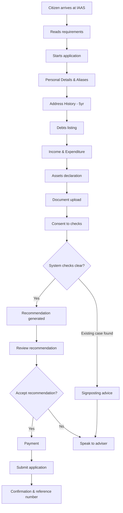
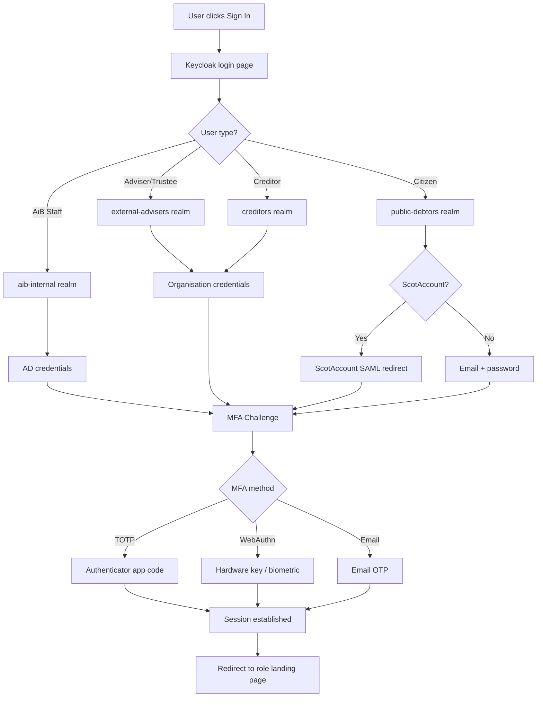
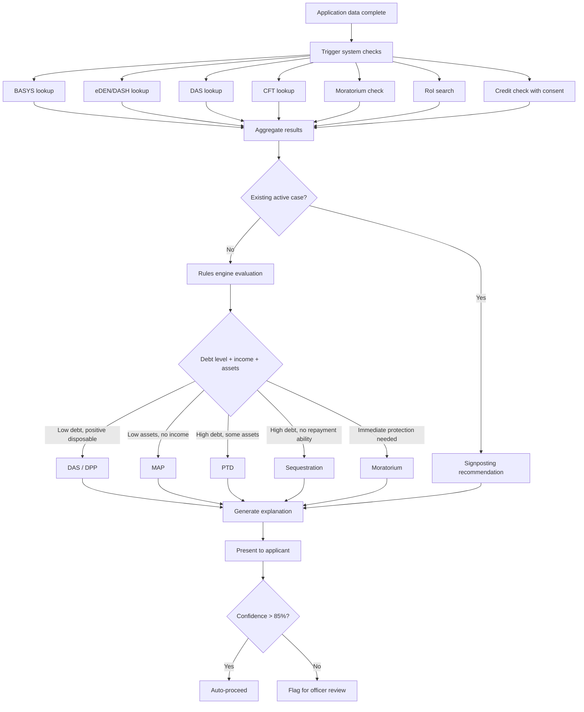
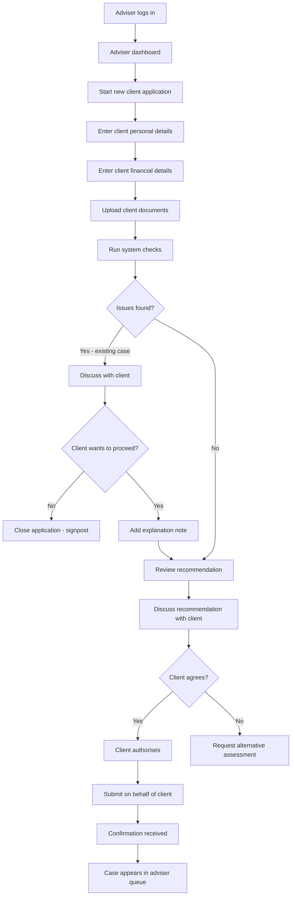
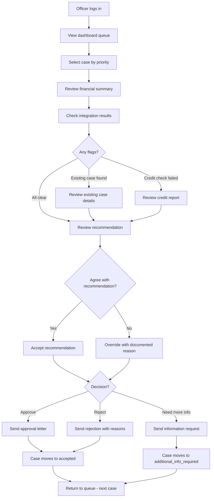
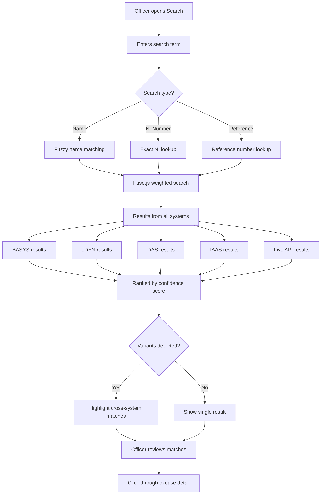
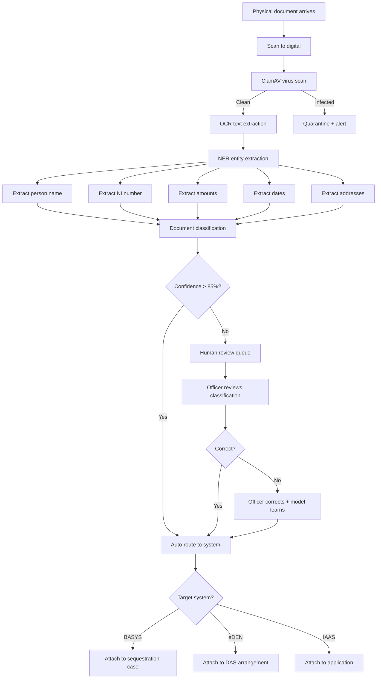
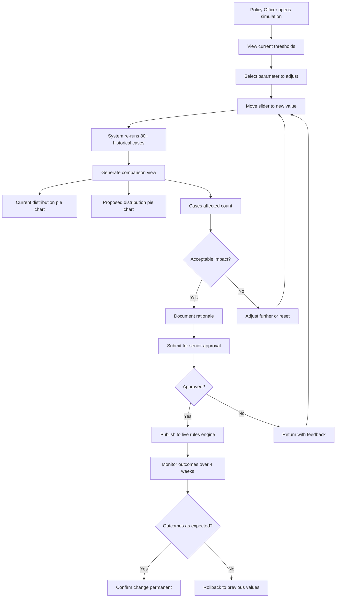
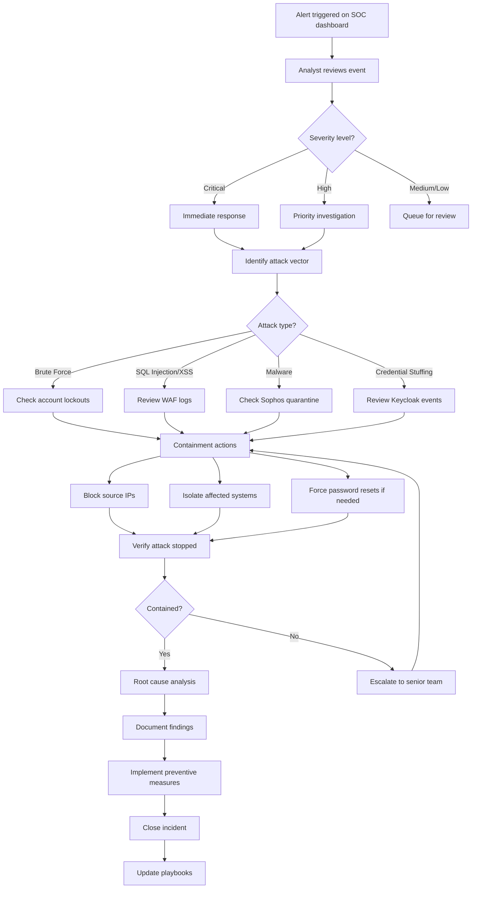
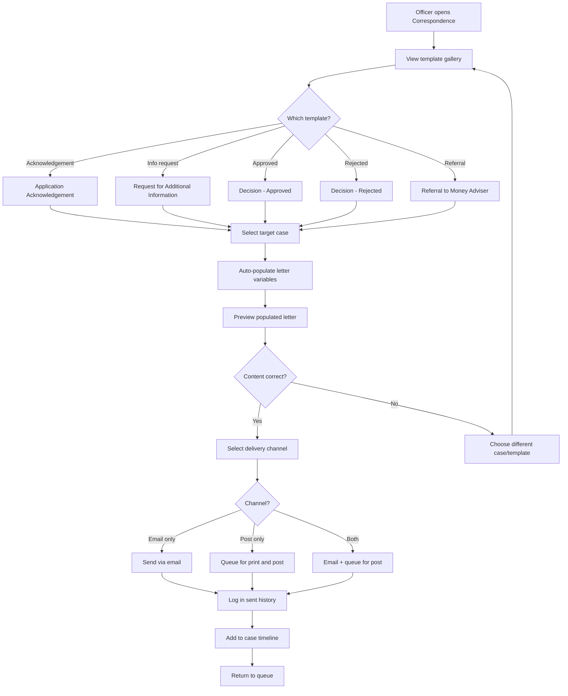

# AiB IAAS — User Journey Maps

**Version:** 1.0  
**Date:** August 2026  
**Classification:** Internal — POC Documentation  
**Owner:** AiB Digital Transformation Programme

---

## Document Purpose

This document maps 10 core user journeys through the IAAS system, capturing the step-by-step experience from the actor's perspective. Each journey includes a stage-by-stage map, a Mermaid process flow diagram, and identification of pain points with corresponding IAAS solutions.

---

## Journey 1: Citizen Self-Service Application

**Actor:** Debtor (citizen in financial difficulty) | **Goal:** Complete a full debt solution application online | **Duration:** 15-25 minutes

### Journey Map

| Stage | Action | System | Emotion | Touchpoint |
|-------|--------|--------|---------|------------|
| 1 | Arrives at IAAS home page via gov.scot | Web Portal | 😐 Apprehensive | Home page (`/`) |
| 2 | Reads "Before you start" requirements list | Web Portal | 😐 Preparing | Home page info panel |
| 3 | Clicks "Start your application" | Web Portal | 😐 Committed | Apply page (`/apply`) |
| 4 | Enters personal details and aliases | Web Portal | 😐 Routine | Step 1: Personal Details |
| 5 | Enters 5-year address history with postcode lookup | Web Portal | 😊 Assisted | Step 2: Address History |
| 6 | Lists all debts with creditor names and amounts | Web Portal | 😟 Difficult | Step 3: Debts |
| 7 | Enters monthly income and expenditure | Web Portal | 😟 Complex | Step 4: Income & Expenditure |
| 8 | Declares assets (property, vehicles, savings) | Web Portal | 😐 Straightforward | Step 5: Assets |
| 9 | Uploads supporting documents (optional) | Web Portal | 😊 Empowered | Step 6: Documents |
| 10 | Consents to and views system check results | Web Portal | 😟 Anxious | Step 7: System Checks |
| 11 | Receives product recommendation with explanation | Web Portal | 😊 Relieved | Step 8: Recommendation |
| 12 | Makes payment and submits application | Web Portal | 😊 Accomplished | Step 9: Payment & Submit |

### Process Flow

### Pain Points & Opportunities

- **Previous:** Paper forms taking 2-3 weeks to process, double-keying errors → **IAAS:** Digital self-service with instant validation and auto-save
- **Previous:** No guidance on which debt solution fits → **IAAS:** Automated recommendation with transparent explanation
- **Previous:** Applicants unaware of existing cases in other systems → **IAAS:** Cross-system checks surface conflicts immediately
- **Previous:** Document submission by post only → **IAAS:** Digital upload with virus scanning and instant receipt

---

## Journey 2: Identity Verification

**Actor:** Any user (debtor, adviser, staff) | **Goal:** Authenticate and access role-appropriate services | **Duration:** 30-60 seconds

### Journey Map

| Stage | Action | System | Emotion | Touchpoint |
|-------|--------|--------|---------|------------|
| 1 | Navigates to IAAS or clicks "Sign in" | Web Portal | 😐 Routine | Header sign-in button |
| 2 | Redirected to Keycloak login | Identity Service | 😐 Familiar | Login page (`/login`) |
| 3 | Realm auto-detected from email domain | Keycloak | 😊 Seamless | Realm indicator |
| 4 | Enters credentials (or redirected to ScotAccount) | Keycloak/ScotAccount | 😐 Standard | Credential form |
| 5 | MFA challenge presented | Keycloak | 😐 Expected | MFA step |
| 6 | Selects MFA method (TOTP/WebAuthn/Email) | Keycloak | 😊 Choice | Method selector |
| 7 | Enters verification code | Keycloak | 😐 Brief pause | Code input |
| 8 | Session established, JWT issued | Keycloak | 😊 Complete | Success animation |
| 9 | Redirected to role-appropriate landing page | Web Portal | 😊 Personalised | Dashboard/Portal |

### Process Flow

### Pain Points & Opportunities

- **Previous:** Separate logins for BASYS, eDEN, DAS, CFT, RoI → **IAAS:** Single Keycloak SSO grants access to all systems
- **Previous:** No MFA on legacy systems → **IAAS:** Mandatory MFA meets NCSC Cyber Essentials Plus
- **Previous:** Citizens need different credentials per government service → **IAAS:** ScotAccount federation enables reuse of existing identity
- **Previous:** Role changes require IT ticket → **IAAS:** Centralised role management with instant propagation

---

## Journey 3: Recommendation Generation

**Actor:** System (automated) / Case Officer (review) | **Goal:** Determine the most suitable debt solution | **Duration:** 3-5 seconds (automated) + officer review time

### Journey Map

| Stage | Action | System | Emotion | Touchpoint |
|-------|--------|--------|---------|------------|
| 1 | Application reaches "System Checks" step | Web Portal | 😐 Waiting | Apply step 7 |
| 2 | Parallel queries sent to 6 AiB systems | Integration Orchestrator | 😐 Automated | Background process |
| 3 | Credit check executed (with consent) | Credit Check Service | 😐 Automated | Background process |
| 4 | Results aggregated (matches, score, flags) | Integration Orchestrator | 😐 Automated | Data aggregation |
| 5 | Financial data + check results sent to engine | Recommendation Service | 😐 Automated | API call |
| 6 | Rules engine evaluates against 7 products | Recommendation Service | 😐 Automated | Rules execution |
| 7 | Recommendation generated with confidence score | Recommendation Service | 😊 Decisive | Recommendation card |
| 8 | Explanation text generated | Recommendation Service | 😊 Transparent | Explanation panel |
| 9 | Officer reviews recommendation (if flagged) | Web Portal | 😐 Careful | Case detail page |
| 10 | Officer accepts or overrides with reason | Web Portal | 😊 Resolved | Decision action |

### Process Flow

### Pain Points & Opportunities

- **Previous:** Subjective officer judgement with inconsistent outcomes → **IAAS:** Rules-based engine ensures consistent, auditable decisions
- **Previous:** No visibility into why a product was recommended → **IAAS:** Full explanation with contributing factors and confidence score
- **Previous:** Weeks of manual cross-system checking → **IAAS:** Parallel automated checks complete in seconds
- **Previous:** No mechanism to detect recommendation bias → **IAAS:** AI Governance dashboard monitors fairness metrics

---

## Journey 4: Money Adviser Submission

**Actor:** Money Adviser (accredited debt adviser) | **Goal:** Submit application on behalf of client | **Duration:** 10-15 minutes (client details pre-gathered)

### Journey Map

| Stage | Action | System | Emotion | Touchpoint |
|-------|--------|--------|---------|------------|
| 1 | Logs in via external-advisers realm | Keycloak | 😐 Routine | Login page |
| 2 | Arrives at adviser-specific dashboard | Web Portal | 😊 Familiar | Dashboard (adviser view) |
| 3 | Clicks "New Application" for client | Web Portal | 😐 Starting | Apply page |
| 4 | Enters client details (gathered in face-to-face) | Web Portal | 😊 Efficient | Steps 1-5 |
| 5 | Uploads client-provided documents | Web Portal | 😊 Complete | Step 6 |
| 6 | Reviews system check results with client | Web Portal | 😐 Careful | Step 7 |
| 7 | Discusses recommendation with client | Web Portal | 😊 Informative | Step 8 |
| 8 | Client authorises submission | Face-to-face | 😊 Confident | Verbal consent |
| 9 | Submits application on client's behalf | Web Portal | 😊 Accomplished | Step 9 |
| 10 | Receives confirmation; case appears in queue | Web Portal | 😊 Organised | Portal work queue |

### Process Flow

### Pain Points & Opportunities

- **Previous:** Advisers complete paper forms, post to AiB, wait weeks for acknowledgement → **IAAS:** Instant digital submission with immediate reference number
- **Previous:** Advisers cannot see application progress after submission → **IAAS:** Real-time status tracking in adviser work queue
- **Previous:** Client documents photocopied and posted → **IAAS:** Digital upload during appointment
- **Previous:** No visibility of existing cases until AiB manually checks → **IAAS:** Instant cross-system check during appointment

---

## Journey 5: Case Officer Review

**Actor:** AiB Case Officer | **Goal:** Review submitted application, validate recommendation, and make decision | **Duration:** 10-20 minutes per case

### Journey Map

| Stage | Action | System | Emotion | Touchpoint |
|-------|--------|--------|---------|------------|
| 1 | Logs in, arrives at operational dashboard | Web Portal | 😐 Routine | Dashboard (`/dashboard`) |
| 2 | Sees new cases in queue sorted by priority | Web Portal | 😐 Focused | Application table |
| 3 | Selects highest-priority case | Web Portal | 😐 Engaged | Case row click |
| 4 | Reviews applicant financial summary | Web Portal | 😐 Analytical | Case detail (`/case/[ref]`) |
| 5 | Checks system integration results | Web Portal | 😐 Careful | System checks panel |
| 6 | Reviews credit check outcome | Web Portal | 😐 Thorough | Credit section |
| 7 | Reads recommendation with explanation | Web Portal | 😊 Clear | Recommendation page |
| 8 | Reviews case timeline/audit trail | Web Portal | 😐 Diligent | Timeline component |
| 9 | Makes decision (approve/reject/request info) | Web Portal | 😊 Decisive | Action buttons |
| 10 | Sends correspondence to applicant | Web Portal | 😊 Complete | Correspondence page |

### Process Flow

### Pain Points & Opportunities

- **Previous:** Paper files circulated between desks, risk of loss → **IAAS:** Digital case file accessible instantly from any workstation
- **Previous:** Officer manually checks 6 systems → **IAAS:** All checks pre-completed and results presented
- **Previous:** No audit trail of decision reasoning → **IAAS:** Every action logged with timestamp and actor attribution
- **Previous:** Letter templates in Word, manually populated → **IAAS:** Pre-populated correspondence templates with one-click send

---

## Journey 6: Cross-System Search

**Actor:** AiB Case Officer / Senior Officer | **Goal:** Find a debtor across all AiB systems despite spelling variations | **Duration:** 30 seconds - 2 minutes

### Journey Map

| Stage | Action | System | Emotion | Touchpoint |
|-------|--------|--------|---------|------------|
| 1 | Navigates to Search page | Web Portal | 😐 Purposeful | Search page (`/search`) |
| 2 | Types debtor name (or partial/misspelled) | Web Portal | 😐 Searching | Search input |
| 3 | Fuzzy matching returns cross-system results | Web Portal | 😊 Powerful | Results list |
| 4 | Reviews confidence scores per result | Web Portal | 😐 Evaluating | Confidence badges |
| 5 | Identifies same person across systems (variant spellings) | Web Portal | 😊 Insightful | Source system badges |
| 6 | Clicks through to relevant case | Web Portal | 😊 Found | Case detail link |

### Process Flow

### Pain Points & Opportunities

- **Previous:** Manual search of each system individually (6 logins, 6 searches) → **IAAS:** Single search across all systems simultaneously
- **Previous:** Spelling variations cause missed matches → **IAAS:** Fuzzy matching catches "Jhon Smith" when searching "John Smith"
- **Previous:** Deliberate evasion (different names on different applications) undetected → **IAAS:** NI number cross-reference and phonetic matching
- **Previous:** No confidence indication — binary match/no-match → **IAAS:** Percentage confidence scores enable judgement calls

---

## Journey 7: Digital Mailroom Processing

**Actor:** AiB Operations staff / System (AI pipeline) | **Goal:** Process inbound physical document from scan to routed digital record | **Duration:** 2-5 minutes (automated) + human review if needed

### Journey Map

| Stage | Action | System | Emotion | Touchpoint |
|-------|--------|--------|---------|------------|
| 1 | Physical document arrives at AiB mailroom | Physical | 😐 Routine | Postal delivery |
| 2 | Document scanned to digital format | Scanner | 😐 Mechanical | Scanning station |
| 3 | Virus scan checks for malware | ClamAV | 😐 Automated | Background process |
| 4 | OCR extracts text content | Document Intelligence | 😐 Automated | OCR engine |
| 5 | NER identifies entities (names, NI, amounts, dates) | AI Model | 😊 Intelligent | Entity extraction |
| 6 | PII detected and flagged for handling | AI Model | 😐 Compliant | PII layer |
| 7 | Document classified by type (income proof, etc.) | AI Model | 😊 Accurate | Classification engine |
| 8 | Routing decision made (which system/case) | Rules Engine | 😊 Efficient | Routing rules |
| 9 | Low-confidence items sent for human review | Admin Portal | 😐 Careful | Human review queue |
| 10 | Document attached to correct case/system | Target System | 😊 Complete | Digital Mailroom dashboard |

### Process Flow

### Pain Points & Opportunities

- **Previous:** Manual opening, reading, categorising, and routing of every document → **IAAS:** AI pipeline automates 85%+ of document processing
- **Previous:** Misrouted documents cause delays and lost paperwork → **IAAS:** NER-based intelligent routing with case reference matching
- **Previous:** No way to search document content → **IAAS:** Full-text OCR enables content search
- **Previous:** PII visible to all handlers → **IAAS:** Automated PII detection enables access control

---

## Journey 8: Policy Change Simulation

**Actor:** Policy Officer | **Goal:** Model impact of threshold adjustment before implementation | **Duration:** 5-10 minutes

### Journey Map

| Stage | Action | System | Emotion | Touchpoint |
|-------|--------|--------|---------|------------|
| 1 | Logs into admin portal | Admin Portal | 😐 Routine | Admin login |
| 2 | Navigates to Policy Simulation | Admin Portal | 😐 Purposeful | Policy Simulation page |
| 3 | Reviews current parameter values | Admin Portal | 😐 Baseline | Parameter cards |
| 4 | Adjusts threshold slider (e.g., MAP debt ceiling) | Admin Portal | 😊 Experimental | Slider control |
| 5 | Sees immediate impact on case distribution | Admin Portal | 😊 Insightful | Comparison charts |
| 6 | Reviews which cases would migrate between products | Admin Portal | 😐 Analytical | Migration table |
| 7 | Tests multiple scenarios | Admin Portal | 😊 Thorough | Reset and adjust |
| 8 | Documents preferred configuration | Admin Portal | 😊 Decided | Notes/export |
| 9 | Submits change for approval | Admin Portal | 😐 Process | Approval workflow |
| 10 | Change approved and published to live rules | Admin Portal | 😊 Implemented | Rules engine update |

### Process Flow

### Pain Points & Opportunities

- **Previous:** Policy changes made without empirical impact modelling → **IAAS:** Instant simulation against historical case corpus
- **Previous:** Unintended consequences discovered only after implementation → **IAAS:** Pre-implementation impact assessment with case-level detail
- **Previous:** No way to compare scenarios side-by-side → **IAAS:** Interactive comparison with current vs proposed distribution
- **Previous:** Weeks of manual case review to estimate impact → **IAAS:** Instant re-calculation across full historical dataset

---

## Journey 9: Security Incident Response

**Actor:** CyberOps Analyst | **Goal:** Detect, investigate, contain, and resolve a security incident | **Duration:** Variable (minutes to hours depending on severity)

### Journey Map

| Stage | Action | System | Emotion | Touchpoint |
|-------|--------|--------|---------|------------|
| 1 | Sees critical alert on Security dashboard | Web Portal | 😟 Alert | Security page (`/security`) |
| 2 | Reviews event details (source, IP, severity) | Web Portal | 😐 Focused | Event feed |
| 3 | Checks attack timeline for patterns | Web Portal | 😐 Analytical | Timeline chart |
| 4 | Identifies coordinated attack (multiple IPs) | Web Portal | 😟 Concerned | Correlation |
| 5 | Checks vulnerability status of affected systems | Web Portal | 😐 Systematic | Vulnerability panel |
| 6 | Initiates containment (block IPs, isolate system) | External tools | 😐 Decisive | WAF/firewall |
| 7 | Documents incident timeline | Web Portal | 😐 Diligent | Audit trail |
| 8 | Verifies containment successful | Web Portal | 😊 Relieved | Event rate drop |
| 9 | Conducts root cause analysis | External tools | 😐 Thorough | Investigation |
| 10 | Closes incident with lessons learned | Web Portal | 😊 Resolved | Incident closure |

### Process Flow

### Pain Points & Opportunities

- **Previous:** Security events scattered across CloudWatch, Sophos, Sysmon, Keycloak → **IAAS:** Unified SOC dashboard correlating all sources
- **Previous:** No real-time visibility of attack patterns → **IAAS:** Live attack timeline with hourly aggregation
- **Previous:** Vulnerability data in separate Tenable portal → **IAAS:** Integrated vulnerability overview in same dashboard
- **Previous:** Incident response relies on memory and ad-hoc communication → **IAAS:** Structured event feed with severity classification and audit trail

---

## Journey 10: Correspondence Workflow

**Actor:** AiB Case Officer | **Goal:** Select, populate, preview, and send a formal letter to an applicant | **Duration:** 2-3 minutes

### Journey Map

| Stage | Action | System | Emotion | Touchpoint |
|-------|--------|--------|---------|------------|
| 1 | Navigates to Correspondence page | Web Portal | 😐 Routine | Correspondence (`/correspondence`) |
| 2 | Reviews available letter templates (5 types) | Web Portal | 😐 Selecting | Template gallery |
| 3 | Selects appropriate template for situation | Web Portal | 😐 Decided | Template card click |
| 4 | Chooses target case from dropdown | Web Portal | 😐 Identifying | Case selector |
| 5 | Previews fully populated letter | Web Portal | 😊 Satisfied | Letter preview panel |
| 6 | Reviews variable fields (name, ref, date, details) | Web Portal | 😐 Checking | Preview content |
| 7 | Selects delivery channel (email, post, both) | Web Portal | 😐 Choosing | Channel selector |
| 8 | Sends correspondence | Web Portal | 😊 Complete | Send button |
| 9 | Confirmation displayed with timestamp | Web Portal | 😊 Recorded | Success message |
| 10 | Letter appears in sent log with full audit | Web Portal | 😊 Accountable | Sent history table |

### Process Flow

### Pain Points & Opportunities

- **Previous:** Officers manually type letters in Word, risking errors and inconsistency → **IAAS:** Pre-approved templates with automatic variable population
- **Previous:** No central record of what was sent to whom → **IAAS:** Complete sent log with timestamp, officer, channel, and template used
- **Previous:** Letters not linked to case audit trail → **IAAS:** Correspondence automatically recorded in case timeline
- **Previous:** Physical-only correspondence (days for delivery) → **IAAS:** Email delivery with print-and-post backup for accessibility

---

## Appendix: Journey Coverage Matrix

| Journey | Primary Persona | Portal | Key Features Used |
|---------|----------------|--------|-------------------|
| 1. Citizen Application | Debtor | Web | F-01, F-06, F-07, F-08, F-05, F-09 |
| 2. Identity Verification | All users | Web | F-02, F-03, F-04 |
| 3. Recommendation Generation | System / Officer | Web | F-05, F-07, F-06 |
| 4. Money Adviser Submission | Money Adviser | Web | F-01, F-04, F-11 |
| 5. Case Officer Review | AiB Case Officer | Web | F-12, F-15, F-16, F-17, F-18 |
| 6. Cross-System Search | AiB Staff | Web | F-10 |
| 7. Digital Mailroom | Operations / AI | Admin | F-19, F-08 |
| 8. Policy Simulation | Policy Officer | Admin | F-22, F-21 |
| 9. Security Incident | CyberOps Analyst | Web | F-13 |
| 10. Correspondence | Case Officer | Web | F-18, F-16 |

---

*End of User Journey Maps*
